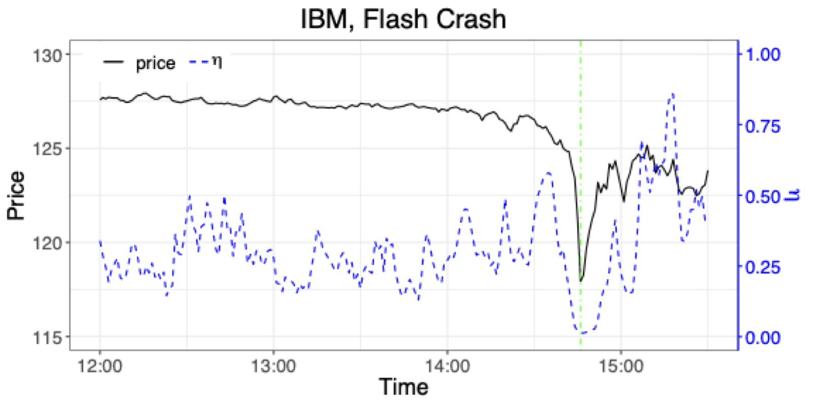
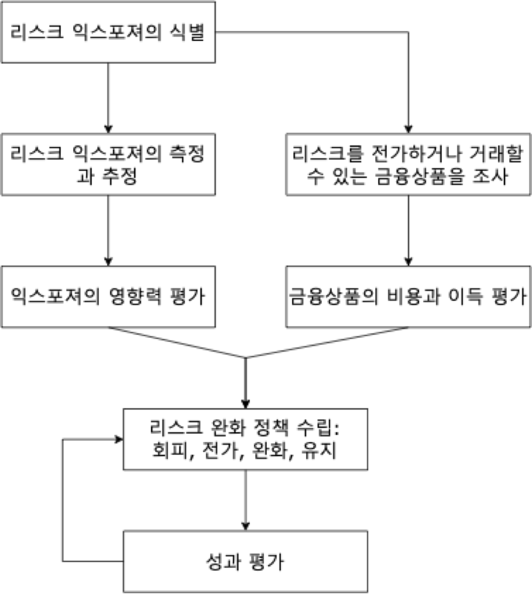

# 위험관리 개요

## 개요

금융위험관리의 기본 개념과 금융통계학에서 다루는 주요 문제를 소개한다.

## 학습 목표

- 금융위험의 기본 개념을 이해한다.
- 금융시장에서 통계적 모형이 필요한 이유를 설명한다.
- 이후 장에서 다룰 위험 측정과 가격 결정 문제의 큰 흐름을 파악한다.

## 리스크

### 리스크 관리의 역사

일상생활에서 리스크 혹은 위험^[이 웹북에서는 리스크와 위험이라는 용어를 혼용하여 사용한다.]이라는 용어는 바람직하지 않은 사건이 발생할 가능성을 말한다. 좀 더 엄밀히 말하면, 리스크는 손실이 발생할 가능성과 그 손실의 크기를 모두 포함하는 개념이다.

태고부터 현재까지 인간은 야생 동물의 습격, 기아, 홍수, 전쟁에서부터 교통사고에 이르기까지 다양한 리스크를 인식하고 관리하기 위해 노력해 왔다. 상당히 복잡한 형태의 리스크 관리 사례는 이미 오래전부터 존재했다. 이는 리스크 관리가 현대 금융이나 보험업의 전유물이 아니라 인류 문명과 함께 발전해 온 보편적 활동임을 보여준다.

예를 들어 고대 해양 무역 상인들은 상선이 안전하게 도착했을 때에만 무역 자금으로 빌린 대금과 이자를 상환했다. 기원전 1750년경에 작성된 함무라비 법전에 따르면, 상인이 선적 자금을 마련하기 위해 대출을 받을 때 대출 제공자에게 일정 금액을 추가로 지불했다. 이는 선박이 침몰하거나 도난당할 경우 대출을 탕감해 주겠다는 보증에 대한 대가였다. 이러한 방식은 현대 보험의 원형으로 볼 수 있으며, 불확실한 미래의 손실 가능성을 확정적인 현재의 비용인 보험료로 전환하는 핵심 원리가 이미 적용되고 있었다.

이러한 제도는 해상 무역이 활발했던 로마 시대에도 계속되었다. 상인들에게 자금을 대여한 사람들이 일종의 보험 업무를 함께 맡은 것이다. 오늘날의 관점에서 보면 대출과 보험이 결합된 복합 금융상품이라 할 수 있다.

이 메커니즘은 투자자들에게도 유리했다. 당시 가톨릭과 이슬람 법은 대출 이자를 받는 것을 금지했으나, 이러한 복합적 방식은 그 금지를 우회할 수 있었다. 선박 손실이라는 리스크를 부담하는 대가로 받는 보상금은 단순한 이자가 아니라 위험 프리미엄으로 정당화될 수 있었기 때문이다. 또한 리스크가 분산되면서 더 많은 상인이 해상 무역에 참여할 수 있었고, 이는 경제 활동의 확대로 이어졌다.

14세기에 이르러 제노바에서는 자금 대여와 보험이 분리된 독립적인 보험 계약이 등장했다. 이는 금융의 전문화와 분업화를 나타내는 중요한 이정표이며, 보험업이 독립적인 산업으로 자리 잡기 시작했음을 의미한다. 이후 수학의 발달, 특히 17세기 확률론의 발전과 함께 점차 정교한 리스크 관리 방법론이 도입되었다. 파스칼과 페르마의 확률 이론, 베르누이의 기댓값 개념, 가우스의 정규분포 등은 현대 리스크 관리의 수학적 기초를 제공했다.

그럼에도 불구하고 리스크 관리는 누구나 자연스럽게 체득할 수 있는 능력이 아니다. 사람들이 가진 사회적·심리적 편향은 중요한 리스크를 간과하게 만들고, 식별된 리스크를 과소평가하거나 적절하게 관리하지 못하게 한다 [@Kaplan2016]. 예를 들어 확증 편향(confirmation bias)은 자신이 믿고 싶은 정보만 선택적으로 받아들이게 하며, 정상성 편향(normalcy bias)은 과거에 일어나지 않았던 재난을 과소평가하게 만든다. 또한 가용성 휴리스틱(availability heuristic)은 최근에 발생했거나 언론에 많이 보도된 사건의 확률을 실제보다 높게 평가하게 한다.

따라서 리스크가 무엇인지, 그것을 어떻게 측정하고 관리할 수 있는지 체계적으로 학습할 필요가 있다. 직관이나 경험에만 의존하는 것이 아니라 데이터 기반의 정량적 분석과 검증된 방법론을 활용하는 것이 중요하다.

### 금융 관련 리스크

#### 시장 위험(market risk)

시장 위험은 금융 자산의 시장 가격과 변동성의 변화에 따라 발생하는 리스크이다.

- 주요 요소: 주식, 이자율, 환율, 원자재 가격 등
- 원인: 경기 침체, 정치적 혼란, 금리 변화, 자연재해 및 테러 공격 등 다양한 거시경제적·지정학적 요인

시장 위험은 이 강의노트에서 주로 살펴볼 대상으로서, 위험을 줄일 수 있도록 적절하게 분산된 포트폴리오를 구성하거나 헷징 등의 과정을 통해 관리한다.

헷징은 금융상품을 보유한 포트폴리오의 위험을 줄이는 방법이다. 일반적으로 헷징 대상 상품의 수익률과 음의 상관관계를 가지는 다른 금융상품을 매입하는 방식으로 이루어진다. 예를 들어 주식 포트폴리오를 보유한 투자자가 풋옵션을 매입하거나, 수출 기업이 환율 변동 위험을 줄이기 위해 선물환 계약을 체결하는 것이 대표적인 헷징 전략이다.

시장 위험은 금융 위험의 일부이지만, 그 자체로도 상당히 광범위한 분야이다. 또한 시장 위험을 다루는 기법은 다른 종류의 리스크를 다루는 데 확장되어 응용되기도 한다. 예를 들어 [위험가치(Value at Risk, VaR)](../../concepts/glossary.qmd#value-at-risk)와 같은 시장 위험 측정 도구는 신용 위험이나 운영 위험의 측정에도 활용된다.

시장 위험은 시장 가격이나 이자율 변화와 관련된 위험으로, 신용 위험이나 운영 위험과 구분하여 사용한다. 그러나 궁극적으로 시장 위험을 다른 위험과 완전히 분리하기는 어렵다. 예를 들어 부도와 같은 신용 사건은 주식 등 다른 자산의 시장 가격에 영향을 준다. 2008년 리먼 브라더스의 파산이라는 신용 사건이 전 세계 주식 시장의 급락이라는 시장 위험을 촉발한 것이 대표적인 사례이다.

시장 위험은 상대적으로 정량적 분석이 용이하다. 금융 시장에서 발생하는 여러 현상과 금융상품의 시장 가격 변화는 오랜 기간 거의 실시간으로 전 세계에서 관찰되어 왔으며, 이에 따라 방대한 양의 데이터가 축적되어 있다. 수많은 시장 참여자의 경험과 함께 오랜 기간 발전한 금융 이론과 수학적 도구는 시장 위험의 정량적 성질에 대한 이해를 높여 왔다.

그러나 시장 위험의 측정이 항상 간단한 것은 아니다. 미래의 불확실성을 과거 자료만으로 온전히 추론할 수 없으며, 시장 위험의 평가는 시장을 설명할 때 어떤 모형을 사용하는지에 따라 달라진다. 이를 모형 위험(model risk)이라고 한다. 잘못된 모형을 선택하거나 모형의 한계를 인식하지 못하는 것 자체가 또 다른 리스크의 원천이 된다.

시장 위험은 다음과 같이 더 세분화할 수 있다.

##### 주식 리스크(equity price risk)

주식 시장은 변동성이 높으므로 주식에 투자하면 주식 리스크에 노출된다. 주식과 연계된 파생상품에 투자하는 경우에도 주식 리스크에 노출된다.

이후에 살펴볼 현대 포트폴리오 이론(Modern Portfolio Theory, MPT)에 따르면 주식 리스크는 체계적 리스크(systematic risk)와 비체계적 리스크(unsystematic risk 또는 idiosyncratic risk)로 구분할 수 있다. 비체계적 리스크는 분산 투자를 통해 제거할 수 있지만, 체계적 리스크는 그렇지 않다.

::: {.callout-note title="사례: 2010년 플래시 크래시"}
2010년 5월 6일 미국 주식 시장은 고빈도 매매 알고리즘의 영향으로 다우존스 지수가 약 1,000포인트(약 9%) 급락했다가 수분 내에 회복하는 극단적인 변동성을 경험했다. 이 사건은 2010년 플래시 크래시(flash crash)로 불린다.

Waddell & Reed의 E-Mini S&P 500 선물 대량 매도 주문과 뒤이은 고빈도 금융거래 알고리즘의 연쇄 작용이 원인 중 하나로 지목되었다. 다만 규제기관 보고서는 단일 원인으로 단정하기 어려우며 여러 요인의 상호작용이 중요하다고 설명한다. 당시 약 36분 동안 S&P 500 지수는 약 6% 하락했으며, 일부 개별 주식은 순간적으로 거의 0에 가까운 가격으로 거래되기도 했다.

이 사건은 시장의 취약성과 고빈도 자동 알고리즘 매매의 위험성을 부각했다. 이후 금융 규제 당국은 시장 안정성을 강화하기 위해 서킷 브레이커(circuit breaker) 등의 조치를 도입했다. 서킷 브레이커는 주가가 일정 수준 이상 급락하면 거래를 일시 정지하여 시장 참여자가 상황을 판단할 시간을 제공하는 장치이다.
:::

##### 이자율 리스크(interest rate risk)

기업의 자본 조달에서 가장 큰 비중을 차지하는 것은 채권 발행이나 금융기관으로부터의 대출이다. 채권 가격과 대출 이자는 이자율의 영향을 받는다. 이자율은 대출 만기에 따라 달라지는 만기 구조(term structure 또는 수익률 곡선, yield curve)를 가지며 시간에 따라 변동한다.

일반적으로 만기가 길수록 이자율이 높은 정상 수익률 곡선(normal yield curve)이 나타난다. 그러나 경제 상황에 따라 역전 수익률 곡선(inverted yield curve)이 나타날 수도 있으며, 이는 종종 경기 침체의 신호로 해석된다. 이자율과 채권 가격은 역의 관계에 있으므로 이자율이 상승하면 기존 채권의 가격은 하락한다.

::: {.callout-note title="사례: 1994년 채권시장 충격"}
1994년 미국 연방준비제도의 공격적인 금리 인상으로 채권 가격이 급락하면서 글로벌 채권 시장의 가치가 크게 감소했고 많은 금융기관이 막대한 손실을 입었다. 당시 기준금리는 약 1년에 걸쳐 3%에서 5.5%로 총 7차례 인상되었다.

특히 미국 오렌지 카운티(Orange County)는 잘못된 이자율 베팅으로 약 16억 달러의 손실을 입고 파산했다. 이 사건은 이자율 리스크 관리의 중요성을 보여주었으며, 금융기관이 금리 변동에 대한 민감도를 줄이기 위해 이자율 스왑과 금리 선물 등 다양한 파생상품을 활용하는 계기가 되었다.
:::

이자율 리스크는 듀레이션(duration)과 컨벡시티(convexity) 등의 지표로 측정한다.

##### 환 리스크(foreign exchange risk)

해외에서 자금을 조달하거나 해외에 투자할 때는 국내 통화와 외국 통화 사이의 환전이 이루어진다. 환율은 계속 변동하므로 이러한 활동은 환 리스크에 노출된다. 환율 관련 파생상품에 투자하는 경우에도 환 리스크가 발생한다.

국내외 이자율도 환율 변화에 영향을 미친다. 이는 이자율 평가 이론(interest rate parity)으로 설명할 수 있으며, 국가 간 이자율 차이는 환율의 기대 변화율로 조정된다는 원리이다.

::: {.callout-note title="사례: 1997년 아시아 금융위기"}
1997년 아시아 금융위기는 태국이 1997년 7월 2일 고정환율제를 포기하면서 바트화 가치가 급격히 하락한 데서 시작되었다. 이후 인도네시아, 한국, 말레이시아 등 여러 아시아 국가의 통화 가치가 하락하고 경제적 혼란이 발생했다.

한국은 원·달러 환율이 달러당 약 800원에서 2,000원에 가까운 수준까지 상승하는 등 극심한 환율 변동을 겪었다. 여러 국가는 국제통화기금(IMF)의 구제금융을 받고 경제 구조조정을 진행했다.

특히 단기 외화 부채에 과도하게 의존했던 기업과 금융기관은 환율 상승으로 부채 상환 부담이 급증하면서 도산 위험에 직면했다. 이 사건은 환 리스크 관리의 중요성을 보여주는 대표적인 사례이다.
:::

##### 원자재 리스크(commodity price risk)

원자재 리스크는 곡물, 금속, 원유, 천연가스, 전기 등 원자재 가격의 변화에 따라 발생하는 위험이다. 금융 시장에서는 원자재를 기초자산으로 하는 선물 가격의 불확실성이 이에 해당한다.

원자재 공급은 OPEC, 주요 산유국, 광산 보유국 등 특정 공급자에게 의존하는 경향이 있다. 따라서 전쟁, 금수 조치, 자연재해로 인한 공급 중단처럼 높은 가격 변동성과 불연속적인 가격 변화가 나타날 수 있다. 또한 원자재 가격은 재고 보유 비용(storage cost)과 계절적 요인의 영향도 받는다.

::: {.callout-note title="사례: 2007–2008년 원유 가격 변동"}
글로벌 금융위기 동안 원유 가격은 급등하여 2008년 7월 배럴당 약 147달러에 도달했다. 그러나 경제 침체로 수요가 급감하면서 같은 해 하반기에는 약 30달러대로 하락했다. 이는 약 6개월 만에 80% 가까이 하락한 것으로, 금융 시장 역사에서 매우 큰 원자재 가격 변동 사례에 해당한다.

이러한 가격 변동은 산유국 경제와 에너지 산업에 큰 영향을 미쳤으며, 원자재 시장의 투기적 거래가 금융 시장의 변동성을 증폭할 수 있음을 보여주었다. 또한 항공사와 운송업체 등 에너지 집약적 산업이 원자재 가격 변동에 얼마나 취약한지도 드러냈다.
:::

#### 신용 위험(credit risk)

신용 위험은 계약 상대방이 계약상의 의무를 이행하지 않거나 이행할 수 없게 되거나, 이행할 수 없을 가능성이 높아지면서 발생하는 위험이다. 신용 위험은 흔히 거래상대방 위험(counterparty risk)이라고도 불린다.

대표적으로, 채무자가 이자 혹은 원금을 상환하지 못하는 경우가 있다. 또한, 상대방의 신용 등급이 하락하여 신용 관련 증권(credit-linked security)의 가치가 하락하는 경우가 해당된다.

신용 위험에 따른 손실의 분포는 정규분포에서 크게 벗어난 경우가 많으며, 시장 위험보다 분석이 까다롭다. 이는 신용 사건(credit event)이 비대칭적이고 극단적인 특성을 가지기 때문이다. 즉, 대부분의 경우 손실이 없거나 미미하지만, 일단 채무 불이행이 발생하면 큰 손실이 발생하는 구조를 가진다.

::: {.callout-note title="팻 테일 분포(fat-tailed distribution)"}
이러한 분포를 팻 테일 분포(fat-tailed distribution)라고 하며, 극단적 손실의 가능성이 정규분포가 예측하는 것보다 훨씬 높다.
:::

##### 신용 위험의 유형

신용 위험은 채무 불이행 위험(default risk), 파산 위험(bankruptcy risk), 신용 등급 하락 위험(downgrade risk), 정산 위험(settlement risk)으로 구분하기도 한다.

- **채무 불이행 위험(default risk)**: 채무자가 원리금을 상환하지 못하는 위험이다.
- **파산 위험(bankruptcy risk)**: 채무자가 법적으로 파산 절차에 들어가는 위험이다.
- **신용 등급 하락 위험(downgrade risk)**: 신용평가기관(S&P, Moody's, Fitch 등)이 채무자의 신용 등급을 낮추면서 보유 증권의 가치가 하락하는 위험이다.
- **정산 위험(settlement risk)**: 거래 결제 과정에서 한쪽은 의무를 이행했으나 상대방이 이행하지 않는 위험이다.

##### 신용 위험의 크기를 결정하는 요소

신용 리스크의 크기를 결정하는 요소는 다음과 같다.

**채무자나 계약 당사자(counterparty)의 채무 불이행 확률(Probability of Default, PD)**: 채무자의 재무 상태, 영업 실적 등 개별적 특성뿐만 아니라 거시 경제적 상황에도 영향을 받는다. 예를 들어, 경기 침체기에는 전반적인 부도 확률이 상승하는 경향이 있다. 기업이나 국가의 신용 등급(credit rating)을 통해 어느 정도 유추할 수 있다. 신용등급은 일반적으로 AAA(최우량)에서 D(채무불이행)까지의 척도로 표시된다.

**익스포저(Exposure at Default, EAD)**: 부도 시점에서 리스크에 처한 총액, 혹은 노출된 잠재적 손실의 총액을 의미한다.

- **예**: 채권의 액면가, 대출의 잔액, 파생상품의 시가평가 가격(marked-to-market value)
- 파생상품의 경우 익스포저가 시간에 따라 변동하며, 특히 옵션의 경우 기초자산 가격에 따라 익스포저가 크게 달라질 수 있다.

**부도 후 회수율(Recovery Rate, RR)**: 채무 불이행 시 법적 절차(청산, 구조조정 등)에 따라 원금과 밀린 이자의 전부 혹은 일부를 회수할 수 있으며, 회수율은 액면가에 대한 비율로 표현한다.

회수율은 상품 유형(선순위 채권이 후순위 채권보다 회수율이 높음), 담보 여부, 채무자의 특성 및 거시 경제 상황과 같은 여러 요인의 영향을 받기 때문에 매우 다양한 값을 가질 수 있는 확률 변수이다.

손실되는 총액은 부도시 손실률(LGD, Loss Given Default)이라고 하며, 회수율과 다음 관계를 가진다.

$$
\text{LGD} = 1 - \text{RR}
$$

역사적으로 선순위 무담보 채권의 평균 회수율은 약 40%, 후순위 채권은 약 20% 수준으로 알려져 있다.

##### 기대 손실(Expected Loss, EL)

신용 위험의 총 기대 손실(Expected Loss, EL)은 다음과 같이 계산된다.

$$
\text{EL} = \text{PD} \times \text{EAD} \times \text{LGD}
$$

##### 신용 위험이 증가하는 상황

또한, 다음의 상황에서 신용 위험은 더욱 증가한다.

**집중 위험(concentration risk)**: 적은 수의 큰 대출은 많은 수의 적은 대출보다 위험하다. 이는 분산의 효과를 얻지 못하기 때문이다. 예를 들어, 전체 대출 포트폴리오의 20%를 차지하는 한 건의 대출이 부도가 나면 큰 타격을 받지만, 같은 금액이 100건으로 나뉘어 있다면 일부 부도가 발생해도 전체 포트폴리오에 미치는 영향은 제한적이다.

**상관관계 위험(correlation risk)**: 대출들의 수익 혹은 부도 위험이 양의 상관관계를 가질 때 위험이 증가한다.

::: {.callout-note title="상관관계 위험의 사례"}
채무자들이 모두 동일한 산업 분야에서 종사하거나 동일한 지역에 거주하는 경우가 이에 해당한다. 2008년 금융위기 당시 미국의 서브프라임 모기지 대출들이 부동산 시장 침체로 동시 다발적으로 부도가 발생한 것이 대표적 사례이다.

따라서 대출 포트폴리오를 산업, 지역, 채무자 특성 등 다양한 차원에서 효율적으로 분산할 필요가 있다.
:::

**잘못된 방향 위험(wrong-way risk)**: 익스포저, 부도 확률, 부도 시 손실액이 양의 상관관계를 가질 때 위험이 극대화된다.

::: {.callout-warning title="잘못된 방향 위험의 사례"}
예를 들어, 항공사에 대한 대출에서 유가 파생상품으로 담보를 받는 경우, 유가 상승 시 항공사의 부도 확률이 높아지는 동시에 담보 가치도 항공사에 불리하게 변동하여 회수율이 낮아질 수 있다.
:::

::: {.callout-important title="사례: 2008년 리먼 브라더스 파산"}
역사적으로 중요한 신용 위험 사례로는 2008년 리먼 브라더스의 파산을 들 수 있다.

1850년에 설립되어 158년의 역사를 가진 미국 4위의 투자은행이었던 리먼 브라더스는 2008년 9월 15일 파산 신청을 했으며, 이는 미국 역사상 최대 규모의 기업 파산이었다.

서브프라임 모기지 관련 자산에 과도하게 노출되어 있던 리먼 브라더스의 파산은 전 세계 금융 시장에 신용 경색을 초래했고, 글로벌 금융 위기를 촉발했다.

이 사건은 거대 금융기관의 신용 위험이 시스템 전체로 파급될 수 있는 시스템 리스크(systemic risk)의 전형적 사례로 기록되고 있다.
:::

#### 유동성 위험(liquidity risk)

유동성은 자산 또는 유가 증권이 시장 가격에 크게 영향을 주지 않고 현금으로 쉽게 전환될 수 있는 정도를 말한다. 즉, 유동성이 높은 자산은 필요할 때 빠르게 매각할 수 있으며, 매각 과정에서 가격 손실이 적다. 반대로 유동성이 낮은 자산은 매각하는 데 시간이 오래 걸리거나, 급하게 매각할 경우 큰 가격 할인(discount)을 감수해야 한다.

유동성 위험에 대한 많은 연구가 지속적으로 이루어지고 있음에도, 정량적 측정에는 여전히 어려움이 산재하여 있다. 이는 유동성이 시장 상황, 거래 규모, 투자자 심리 등 다양한 요인에 의해 급격하게 변할 수 있기 때문이다. 유동성 위험은 크게 자금 유동성 위험과 시장(거래) 유동성 위험으로 나누어 살펴볼 수 있다.

##### 자금 유동성 위험(funding liquidity risk)

기업이나 금융기관이 필요한 자금을 적시에 조달하지 못하는 경우 발생한다. 미래 수익이 확실함에도 당장의 지급 의무를 이행하기 위한 현금 확보가 어려운 경우도 이에 해당한다. 이는 흔히 현금 흐름 문제(cash flow problem)로 나타난다.

금융 기관에서의 자금 유동성 위험은 채무의 만기에 이르러서도 상환 자금을 조달하지 못할 경우이며, 대표적으로는 장기 대출과 단기 예금 간의 만기 불일치(maturity mismatch)로 인해 발생할 수 있다. 은행은 단기 예금을 받아 장기 대출을 실행하는 만기 변환(maturity transformation) 기능을 수행하는데, 예금자들이 갑자기 대규모로 인출을 요구하는 뱅크런(bank run) 상황이 발생하면 심각한 유동성 위기에 직면할 수 있다.

##### 시장(거래) 유동성 위험(market liquidity risk, trading liquidity risk)

시장에 유동성이 축소되어 주식 등의 금융 자산을 실제 가치보다 비정상적으로 낮은 가격에 매도하거나, 비싼 가격에 매수하게 되는 위험을 말한다. 이는 매수-매도 호가 스프레드(bid-ask spread)의 확대, 거래량 감소, 시장 충격 비용(market impact cost) 증가 등으로 나타난다.

주식 시장의 경우 일반적으로 높은 유동성을 가지기 때문에 시장 유동성 위험에 빠지게 될 가능성은 적지만, 그림 @fig-flash-crash^[@lee2023modeling]에서처럼 2010년 5월 6일 플래시 크래시(flash crash)와 같은 사건 발생 시에는 순간적으로 유동성이 급격히 축소되기도 하였다. 이 사건에서는 많은 고빈도 거래(HFT) 알고리즘들이 동시에 거래를 중단하면서 시장에서 유동성 공급자가 사라졌고, 일부 주식은 매수 호가 자체가 존재하지 않는 극단적 상황에 이르렀다.

{#fig-flash-crash width=80%}

### 비금융 리스크

비금융 리스크는 금융시장 가격 변동과 직접적으로 관련되지는 않지만, 기업의 성과와 존속에 중대한 영향을 미칠 수 있는 위험 요인을 의미한다. 이러한 리스크는 금융 리스크를 증폭시키거나 위기로 전이될 수 있어 리스크 관리 관점에서 중요하다.

#### 운영 위험(operational risk)

운영 위험^[이 강의노트에서는 운영 리스크에 대해 자세히 다루지 않기 때문에, 자세한 내용은 @operational 등을 참고하라.]은 회사를 운영함에 있어서 부적절한 내부 프로세스, 임직원의 실수 및 부정행위, 시스템의 실패, 내부통제 미비, 또는 외부 사건(법률 리스크 포함)으로 인해 발생하는 손실에 대한 위험을 일컫는다.

바젤 은행감독위원회(Basel Committee on Banking Supervision)는 운영 위험을 “부적절하거나 실패한 내부 프로세스, 사람, 시스템 또는 외부 사건으로 인한 손실 위험”으로 정의하고 있다.

::: {.callout-note title="사례: UBS 무단 거래 사건"}
예를 들어 직원이 높은 보너스를 목적으로 내부 시스템을 조작하여 자신에게 유리한 거래 포지션을 만들고 회사를 위험에 빠뜨렸다면 운영 리스크에 해당한다.

실제로 2011년 스위스 UBS 은행의 런던 지점에서 델타 원(Delta One) 데스크의 트레이더였던 콰쿠 아도볼리(Kweku Adoboli)가 직위를 남용하여 대규모 고위험 무단 거래(unauthorized trading)를 감행하여 은행에 약 23억 달러의 손실을 입혔다.

그는 내부 통제 시스템을 우회하여 자신의 거래 포지션을 숨겼으며, 이 사건으로 UBS의 신용등급도 악화되는 등 재무적·비재무적 손실을 야기했다. 아도볼리는 사기 혐의로 7년 형을 선고받았다.
:::

::: {.callout-note title="사례: 베어링스 은행 붕괴"}
이와 유사한 더 큰 규모의 사건으로 1995년 베어링스 은행(Barings Bank) 붕괴 사건이 있다.

1762년에 설립된 영국의 명문 상업은행이었던 베어링스는 싱가포르 지점의 트레이더 닉 리슨(Nick Leeson)의 무단 파생상품 거래로 약 14억 달러(당시 8억 2,700만 파운드)의 손실을 입고 파산했다.

리슨은 오사카와 싱가포르 거래소에서 니케이 225 선물 거래를 하면서 손실을 은폐하기 위해 가짜 계정(88888 에러 계정)을 만들었고, 손실을 만회하려는 과정에서 손실이 눈덩이처럼 불어났다.

233년의 역사를 가진 은행이 한 명의 트레이더로 인해 붕괴한 이 사건은 운영 위험의 심각성을 일깨운 대표적 사례이다.
:::

특히 파생상품 거래는 레버리지가 높고 복잡한 구조로 인해 운영 위험이 수반될 수 있음이 알려져 있다. 운영 위험은 사람의 실수나 고의적 행동에 따른 인간 요인 리스크(human factor risk)와 컴퓨터 고장, 사이버 공격 등 기술적 문제에 따른 기술 리스크(technology risk)로 구분하기도 한다.

최근에는 사이버 위험(cyber risk)이 운영 위험의 주요 범주로 부상하고 있다. 예를 들어, 2017년 에퀴팩스(Equifax) 데이터 유출 사건에서는 약 1억 4,700만 명의 개인정보가 해킹으로 노출되어 회사는 약 14억 달러의 합의금을 지불해야 했다.

한편, 운영 위험은 구체적인 계량화 방법에 많은 이슈가 존재하며, 일부 전문가들은 완전한 계량화 자체가 불가능하다고 주장하기도 한다. 이는 운영 위험이 저빈도-고충격(low frequency, high severity) 특성을 가지며, 사건의 발생 패턴이 불규칙하고 예측하기 어렵기 때문이다.

그럼에도 불구하고 바젤 II 협약 이후 금융기관들은 운영 위험에 대한 자기자본을 적립하도록 요구받고 있으며, 이를 위해 기본지표법(Basic Indicator Approach), 표준법(Standardized Approach), 고급측정법(Advanced Measurement Approach) 등의 방법론을 사용한다.

#### 그 외의 리스크

비즈니스, 전략, 평판 리스크는 기업이나 조직이 직면할 수 있는 다양한 유형의 리스크로, 각각 다른 원인과 영향을 가지고 있다. 이들은 앞서 다룬 금융 리스크나 운영 리스크와는 달리 계량화가 더욱 어렵지만, 기업의 생존과 성장에 결정적인 영향을 미칠 수 있다.

- **비즈니스 리스크(business risk)**: 사업을 수행함에 있어 전통적으로 존재해 온 리스크를 말하며, 고객 수요와 가격 결정, 비용에 대한 불확실성, 산업 내 경쟁, 공급업체 협상 및 제품 혁신 관리 등과 관련된 위험을 말한다. 비즈니스 리스크는 재무 레버리지와 무관하게 기업의 영업 활동 자체에서 발생하는 위험이라는 점에서 재무 리스크(financial risk)와 구분된다. 예를 들어, 원자재 가격 변동, 소비자 선호도 변화, 계절적 수요 변동 등이 비즈니스 리스크에 해당한다.

- **전략 리스크(strategic risk)**: 자본, 인적 자원 및 경영 평판과 관련된 대규모 투자와 함께 회사의 장기적 방향에 대한 중대한 결정과 관련된 위험이다. 전략 리스크는 잘못된 전략 수립, 전략 실행 실패, 환경 변화에 대한 부적절한 대응 등에서 발생한다. 예를 들어, 새로운 스마트폰 시장이나 전기차 시장에 진출할 것인가, 기존 사업을 유지할 것인가에 대한 결정에 따른 위험이 여기에 해당한다. M&A(인수합병) 결정, 신시장 진출, 사업 구조조정 등도 중요한 전략 리스크 요인이다.

- **평판 리스크(reputation risk)**: 시장 지위나 브랜드 가치의 하락과 관련된 리스크이다. 대중으로부터의 평판 하락으로 고객 이탈, 자금 조달 어려움, 우수 인재 확보 실패 등의 문제를 겪게 되는 경우를 포함한다. 평판 리스크는 다른 리스크들(운영 리스크, 규제 위반 등)의 2차적 결과로 나타나는 경우가 많지만, 그 영향은 원인이 된 사건보다 훨씬 클 수 있다. 소셜 미디어의 발달로 평판 리스크는 과거보다 훨씬 빠르게 확산되고 관리하기 어려워졌다.

::: {.callout-note title="비즈니스 리스크 사례: Palm"}
Palm 회사는 1990년대와 2000년대 초반에 PDA(개인 휴대 정보 단말기)로 불리는 현대 스마트폰의 전신 격인 개인 휴대용 컴퓨터를 생산하며 성장한 회사이다. Palm Pilot 시리즈는 당시 혁신적인 제품으로 평가받았으며, 1990년대 후반 PDA 시장의 약 70%를 점유했다.

이 회사는 2000년에 기록적인 성장을 기록하였는데, 2001년에 이르러 성장세가 둔화되었다. 이에 Palm 회사의 경영진은 m500이라는 새로운 모델을 출시하기로 발표한다. 소비자들에게는 2주 후에 모델이 출시될 것이라고 하였지만, 실제 출시에는 6주 이상이 걸렸다. 새 모델의 출시를 기다리던 소비자들은 이전 모델 구매를 미뤘고, 그 결과 기존 모델의 재고는 팔리지 않았다.

설상가상으로 새 모델에 대한 품질검사를 충분히 하지 못하여, 출시된 이후에도 화면 문제, 배터리 수명 등에 대한 큰 불만이 발생했다. 회사의 주식 가격은 급락했으며, 2001년 6월 회사는 대량의 직원을 감축해야만 했다. 이 사례는 제품 출시 타이밍 실패, 품질 관리 부실, 재고 관리 실패 등 복합적인 비즈니스 리스크의 전형적 예로 소개된다.
:::

::: {.callout-note title="전략 리스크 사례: Nokia"}
전략 리스크의 대표적 사례로 Nokia를 들 수 있다. Nokia는 1990년대 후반부터 2000년대 초반까지 세계 최대의 휴대전화 제조업체로, 2000년경 전 세계 시장의 약 30%를 점유했다. 이 시기 Nokia는 스마트폰 개발과 소프트웨어 역량 강화를 추진하며 Microsoft를 잠재적 경쟁자로 인식했으나, 실제 시장에서는 저가 피처폰이 주류를 이루었고 삼성전자 등 후발 주자가 빠르게 성장하였다. 2003년 이후 Nokia의 시장 점유율은 하락세로 전환되었으며 스마트폰 부문에서도 뚜렷한 성과를 내지 못했다.

2007년 아이폰 출시로 스마트폰 시장이 급변했음에도 불구하고, Nokia는 Symbian 운영체제에 대한 기존 전략을 고수하며 터치 기반 생태계 전환에 실패했다. 이후 2011년 Microsoft와 전략적 제휴를 통해 Windows Phone을 도입했으나 시장 경쟁력을 확보하지 못했고, 결국 2013년 휴대전화 사업부를 약 72억 달러에 Microsoft에 매각하였다. 이는 시장 변화에 대한 오판과 기술 전환 실패가 기업 가치에 치명적일 수 있음을 보여주는 사례이다.
:::

::: {.callout-note title="평판 리스크 사례: Volkswagen 디젤게이트"}
독일의 자동차 회사인 Volkswagen의 배출가스 조작 장치(defeat device) 사건은 평판 리스크와 관련된 대표적 사례이다. 이 사건은 “디젤게이트(Dieselgate)”라고 불린다.

2015년 9월 미국 환경보호국(EPA)은 Volkswagen이 디젤 엔진 차량에 배출가스 검사 시에만 작동하는 소프트웨어를 설치하여 질소산화물(NOx) 배출량을 실제보다 최대 40배까지 낮게 측정되도록 조작했다고 발표하였다. 이 조작 장치는 약 1,100만 대의 차량에 설치되어 있었으며, 2009년부터 2015년까지 판매된 TDI(Turbocharged Direct Injection) 디젤 엔진 차량들이 포함되었다.

이 사건으로 Volkswagen은 국제적으로 이미지와 명성이 크게 손상되었다. 환경 친화적이고 클린 디젤을 표방했던 회사가 실제로는 조직적으로 배출가스 규제를 속였다는 사실이 드러나면서 소비자들의 신뢰는 크게 추락했다. 또한 이 사건으로 인해 Volkswagen은 다양한 국제 규제 기관과 법률 당국의 조사 대상이 되었으며, 미국에서만 약 250억 달러 이상의 벌금과 손해배상을 지불해야 했다. 전 세계적으로는 총 300억 유로 이상의 비용이 발생한 것으로 추정된다.

주가는 사건 발표 직후 40% 가까이 급락했으며, CEO인 마틴 빈터코른(Martin Winterkorn)은 사임했다. 여러 임원들이 형사 기소되었고, 일부는 징역형을 선고받았다. 이 사건은 기업의 이미지와 명성이 얼마나 중요하며, 한 번 손상된 평판을 회복하는 데 얼마나 많은 비용과 시간이 필요한지를 보여주는 대표적인 평판 리스크 사례이다. 또한 운영 리스크(내부통제 실패)가 평판 리스크로 증폭되어 기업에 치명적 타격을 줄 수 있음을 보여준다.
:::

## 리스크 관리

리스크는 보상과 이익을 추구하는 과정에서 필연적으로 발생하며, 특히 높은 시장 위험이나 신용 위험은 높은 보상으로 이어질 수도 있다. 이는 금융 이론의 핵심 원칙 중 하나인 위험-수익 상쇄 관계(risk-return tradeoff)를 반영한다. 반면, 운영 위험의 경우는 특별히 보상으로 이어지지 않는 경우가 많기 때문에 최소화하는 것이 상책이다. 운영 위험은 순수 위험으로, 손실만 발생하고 이익의 가능성은 없다는 점에서 투기적 위험인 시장 위험과 구분된다.

무위험 투자도 존재하지만 그런 경우는 무위험 수익률이라고 불리는 낮은 수익률을 얻는다. 일반적으로 미국 국채나 한국의 국고채와 같은 우량 국가의 단기 국채가 무위험자산의 대리 변수로 사용된다. 리스크는 낮추고 이익은 극대화하기 위해 리스크 관리 과정이 필요하다. 리스크 관리에 대한 체계적인 연구가 진행되면서 리스크 관리자들은 보통 다음의 과정을 거치게 됨을 알게 되었다: (1) 리스크 식별, (2) 리스크 분석과 측정, (3) 충격 평가, (4) 리스크 관리.

### 리스크 식별(identify risk)

리스크 식별 작업은 투자 혹은 기업의 미래에 있어 부정적인 영향을 미칠 사건과 요인을 지속적으로 파악하는 것이다. 리스크의 일부는 비즈니스 과정에서 자연스럽게 발생하는 내재적 리스크이고, 일부는 외부적 요인으로 인해 발생하는 외생적 리스크이다. 프로젝트 중에 발생할 수 있는 리스크가 어떤 종류가 있는지, 어떤 성격을 가지고 있는지 판별하여야 리스크 분석과 측정 단계로 넘어갈 수 있다.

주의할 점은 경우에 따라 모든 종류의 발생 가능한 리스크를 식별하기 어려울 수 있다는 것이다. 특히 저빈도-고충격 사건이나 전례 없는 위험은 식별 자체가 어렵다. 이러한 관점에서 리스크 관리자들은 발생 가능한 리스크 혹은 불확실성들에 대해 다음과 같이 구분하기도 한다.

- **예상손실(Expected Loss, EL)**: 손실에 대한 기댓값을 의미한다. 예상손실은 리스크 요소들을 식별하고 여러 핵심 요소들을 추정함으로써 계산할 수 있다. 위험을 유발하는 사건들의 발생 확률, 위험 사건들에 대한 회사의 위험 노출 정도(exposure), 위험 사건이 발생하였을 때 입는 손실의 정도(severity)를 추정하여 예상손실을 계산하는 데 활용한다.

    예를 들어, 신용카드를 발급한 카드 회사는 카드 사용자의 채무 불이행에 따른 손해의 위험이 있지만, 불특정 다수에게 신용카드를 발급함으로써 대수의 법칙(law of large numbers)이 작동하여 각 사용자당 예상 평균 손실액만을 고려하면 된다. 잘 관리된 예상손실은 사업 비용으로 간주되어 상품이나 서비스의 가격에 포함된다. 예를 들어, 신용카드 회사의 연회비나 가맹점 수수료에는 예상되는 연체 및 부도 손실이 반영되어 있다.
    
- **비예상손실(Unexpected Loss, UL)**: 손실을 확률변수의 관점에서 보면, 예상손실이 손실의 기댓값이라면 비예상손실은 실제 손실액이 확률 변동으로 인해 기댓값으로부터 벗어나 발생할 수 있는 추가적인 손실을 의미한다. 통계적으로는 손실 분포의 표준편차나 더 극단적인 꼬리 부분(tail)의 손실을 나타낸다.

    따라서 비예상손실을 파악하기 위해서는 손실의 분포적 성질에 대해 이해하여야 한다. 비예상손실을 관리하기 위한 주요 개념으로 [8장](../08-var-multiperiod/index.qmd)에서 공부할 VaR(Value at Risk)와 경제적 자본(economic capital)이 있다. 경제적 자본은 금융 기관이 예상치 못한 손실을 감당하기 위해 보유해야 하는 자본의 양을 의미하며 VaR과 같은 기술을 통해 측정될 수 있다.
    
    또한 시장과 경제 상황의 변화에 따라 예상손실과 비예상손실은 지속적으로 변하고 있음을 인지해야 한다. 예를 들어, 경기 침체기에는 부도율이 상승하여 예상손실이 증가하고, 시장 변동성 확대로 비예상손실도 함께 증가하는 경향이 있다.
    
- **나이트 불확실성(Knightian Uncertainty)**: 경제학자 프랭크 나이트(Frank Knight)는 그의 1921년 저서 『위험, 불확실성, 그리고 이윤(Risk, Uncertainty, and Profit)』[@Knight1921]에서 리스크와 불확실성을 구분해야 한다고 주장하였다. 리스크는 확률 이론과 실증 자료를 이용하여 정량화가 가능한 요소라면, 나이트 불확실성은 확률적 추정이 불가능한 위험을 지칭한다. 이는 흔히 ‘known unknowns’로 설명되기도 하나, 보다 정확히는 확률 분포 자체를 정의할 수 없는 상황을 지칭한다.

    예를 들어, 핵전쟁 발발은 인류에 심각한 위험이지만 발생 확률을 객관적으로 추정하기는 매우 어렵다. 기후 변화의 장기적 영향, 새로운 규제의 도입, 혁신적 기술의 등장 시기 등도 나이트 불확실성의 예이다.
    
    한편, 과학과 기술의 발달과 데이터의 축적에 따라 이전에는 측정 불가능한 불확실성이었던 것이 측정 가능한 리스크로 전환되기도 한다. 예를 들어 방사선이 처음 발견되었을 때(1895년 뢴트겐의 X선 발견)는 인체에 미치는 위험의 정도에 대해 거의 인지하지 못하였지만, 관련 연구가 진행됨에 따라 방사선이 미치는 위험의 정도는 정밀하게 파악 가능하게 되었다. 현재는 방사선 노출량에 따른 건강 위험을 시버트(Sievert) 단위로 정량화하여 관리하고 있다.
    
- **미지의 미지(Unknown Unknowns)**: 위 항목에서 더 나아가 우리가 전혀 알지 못하는 위험을 이 카테고리에 분류하기도 한다. 이는 도널드 럼스펠드(Donald Rumsfeld) 전 미국 국방장관이 2002년 국방부 브리핑에서 사용하여 유명해진 개념이다.

    극단적인 예로는 외계인의 침공 같은 것이 여기에 해당할 것이다. 하지만 이 카테고리에 속하는 것이 항상 위 예처럼 극단적인 것만은 아니다. 새로운 기술의 발전과 제도의 변화에 따라 인류는 항상 새로운 현상들을 맞닥뜨린다. 지나고 보면 너무나 당연해 보이는 위험 요소들도 막상 닥칠 때에는 전혀 파악하지 못해 미지의 미지일 경우가 많다.
    
    2007-2008년의 서브프라임 모기지 사태로 촉발된 금융 위기^[물론 지속적으로 위험을 경고한 사람들도 있었다. 예를 들어, 헤지펀드 매니저 존 폴슨(John Paulson)과 경제학자 누리엘 루비니(Nouriel Roubini) 등은 위기를 예측했다.]가 이에 해당할 수 있다. 금융 위기는 일부 측면에서는 미지의 미지로 인식되었으며, 동시에 복잡한 금융상품의 위험이 체계적으로 과소평가된 사례이기도 하다. 많은 금융 기관들이 CDO(Collateralized Debt Obligation)와 같은 복잡한 구조화 상품의 위험을 제대로 파악하지 못했고, 주택 가격이 전국적으로 하락할 가능성을 거의 고려하지 않았다. 이를 두고 Bank of England의 금융정책위원회 부위원장이었던 알렉스 브라지어(Alex Brazier)는 “Moonwalking bears and underwater icebergs(문워킹하는 곰과 수중 빙산)”라고 표현하였다.^[<https://www.bankofengland.co.uk/speech/2018/alex-brazier-london-business-school-asset-management-conference-2018>]
    
    문워킹하는 곰(Moonwalking bear)의 이야기는 사람의 선택적 주의(selective attention) 능력을 테스트하는 실험 동영상^[<https://www.youtube.com/watch?v=xNSgmm9FX2s>]으로부터 기원한다. 이 동영상은 하버드 대학의 심리학자 다니엘 사이먼스(Daniel Simons)와 크리스토퍼 채브리스(Christopher Chabris)가 수행한 “보이지 않는 고릴라(Invisible Gorilla)” 실험의 변형이다. 이 동영상에서는 10여 명의 사람들이 등장해 두 개의 농구공을 서로 패스하는데, 실험의 참가자들은 패스의 횟수를 정확히 세도록 주문받는다. 주고받는 공의 움직임에 집중한 많은 실험 참가자들은 이 사람들 사이를 지나가며 문워킹하는 곰 분장을 한 사람을 인지하지 못한다.
    
    문워킹하는 곰은 이처럼 우리가 다른 것에 집중한 나머지 미처 알지 못하는 사이 다가오는 위험을 비유한다. 금융 위기 이전 많은 기관들이 단기 수익 극대화에 집중한 나머지, 시스템 전체의 레버리지 축적이나 유동성 위험과 같은 근본적 위험을 간과한 것이 이에 해당한다. 수중 빙산은 수면 위로 드러난 부분(약 10%)보다 수면 아래 숨겨진 부분(약 90%)이 훨씬 크다는 점에서, 겉으로 보이는 위험보다 숨겨진 위험이 훨씬 클 수 있음을 비유한다.
    
    이러한 미지의 미지에 대응하기 위해서는 시나리오 분석(scenario analysis), 스트레스 테스트(stress test), 그리고 견고성(robustness)을 강조하는 리스크 관리 접근법이 필요하다. 또한 조직 문화적으로 “이럴 리 없다”는 확신을 경계하고, 다양한 관점에서 잠재적 위험을 탐색하는 자세가 중요하다.
    
불확실성(uncertainty)이라는 용어는 사용하는 사람에 따라 다른 의미로 사용된다. 어떤 사람들은 확실하지 않은 모든 것을 불확실성이라고 하기도 하고, 어떤 사람들은 확실하지 않은 것들 중에서도 정량화하기 힘든 것들만 꼽아 불확실성이라고 부르기도 한다. 이 노트에서는 정량화하기 힘든 불확실성을 지칭할 때는 나이트의 불확실성(Knightian uncertainty)이라고 하겠다.

### 리스크 분석과 측정

프로젝트 진행 과정 중 발생할 수 있는 위험 요인에 대해 파악하였다면, 리스크의 크기를 측정하는 일이 다음 단계에 해당한다. 이 강의노트에서는 주로 확률적·통계적 방법을 이용하여 리스크의 크기를 측정하는 다양한 방법에 대해 공부한다.

우리는 리스크의 양적 측정 방법에 대해 공부하겠지만, 주의할 점은 리스크의 형태에 따라 양적 측정이 어려운 경우들도 많다는 것이다. 특히 앞서 언급한 나이트 불확실성이나 미지의 미지와 같은 경우는 확률적 추정 자체가 불가능하거나 매우 어렵다. 또한 평판 리스크나 전략 리스크와 같이 정성적 요소가 강한 리스크들은 정량화에 한계가 있다.

이 강의노트에서 집중적으로 살펴볼 내용 중의 하나는 확률, 통계, 수학적 방법을 이용한 리스크의 양적 측정이다. 양적 리스크 측정에 있어, @holton2003[]은 다음의 용어를 구분하였다.^[다른 문헌이나 일부 책들의 경우 특별히 구분하지 않을 수 있으며, 우리 자료에서도 이 차이점을 크게 중요하게 여기지는 않는다.]

- **리스크 메트릭(risk metric)**: 측정되는 위험의 속성으로 정량적 성질을 지니는 것. 즉, “무엇을 측정할 것인가”에 해당하는 위험의 특성이나 차원을 의미한다.
- **리스크 측도(risk measure)**: 리스크 혹은 리스크 메트릭에 값을 부여하는, 혹은 측정하는 특정한 방법. 즉, “어떻게 측정할 것인가”에 해당하는 구체적인 계산 방법론을 의미한다.

채권 부도율(default rate)은 측정 가능한 채권 위험의 속성으로서 리스크 메트릭이다. 리스크 메트릭의 또 다른 예는 파생금융상품인 옵션의 델타(delta)^[기초 자산 가격 변화에 따른 옵션 가격 변화의 민감도], 주식 등 증권의 베타(beta)^[체계적 위험을 측정하는 지표로, 시장 전체의 수익률 변화에 대한 개별 증권 수익률 변화의 민감도를 나타낸다.], 채권의 듀레이션(duration)^[이자율 변화에 따른 채권 가격 변화의 민감도. 맥컬레이 듀레이션(Macaulay duration)은 채권의 현금흐름까지의 가중평균 시간을 의미하며, 수정 듀레이션(modified duration)은 이자율 변화에 대한 가격 탄력성을 나타낸다.] 등이 있다.

동일한 리스크 메트릭에 대해서 여러 리스크 측정 방법이 있을 수 있다. 예를 들어, 옵션의 델타를 계산하는 방법에는 @black1973pricing[]의 블랙-숄즈 공식(Black-Scholes formula)을 이용하는 방법이나 @Heston[]의 확률적 변동성 모형(stochastic volatility model)에 기반한 방법 등이 있으며, 각각은 델타라는 단일 리스크 메트릭에 대한 서로 다른 리스크 측정 방법이 된다. 블랙-숄즈 모형은 변동성이 일정하다고 가정하는 반면, 헤스턴 모형은 변동성 자체가 확률적으로 변한다고 가정한다는 점에서 차이가 있다.

또한 주식이라는 금융 자산에는 자산 수익률 분포의 변동성(volatility)이라는 리스크 메트릭이 있고, 이를 측정하기 위한 표준편차 방법(historical volatility), EWMA(exponentially weighted moving average) 방법, GARCH(generalized autoregressive conditional heteroskedasticity) 모형, 내재 변동성(implied volatility) 추정 방법 등이 있을 수 있는데, 이 절차들을 정의한 계산적 방법론을 리스크 측도라고 부른다.

각 방법은 서로 다른 가정과 데이터를 사용하여 동일한 메트릭(변동성)에 대해 서로 다른 추정치를 제공할 수 있다.

@Holton2004[]에 따르면, 리스크에는 크게 두 가지 구성 요소가 있다.

- **익스포저(exposure)**: 특정 활동이나 이벤트로 인해 발생하는 잠재적 미래 손실의 크기이다. 이는 “최악의 경우 얼마나 잃을 수 있는가?”라는 질문에 대한 답이다.
- **불확실성(uncertainty)**: 미래 손실의 발생 가능성에 대한 것이다. 이는 “그러한 손실이 실제로 발생할 확률은 얼마인가?”라는 질문에 대한 답이다.

리스크 메트릭은 일반적으로 다음 세 가지 형태 중 하나를 띤다.

- **익스포저를 정량화하는 것**: 손실의 크기에만 초점을 맞춘다.
- **불확실성을 정량화하는 것**: 발생 확률에만 초점을 맞춘다.
- **익스포저와 불확실성을 결합하여 정량화하는 것**: 크기와 확률을 모두 고려한다.

예를 들어 비가 올 확률은 불확실성만을 정량화한다. 비가 옴으로써 발생하는 피해 노출에 대해서는 다루지 않는다. 거래상대방이 채무 불이행할 경우 발생하는 손해액(익스포저, EAD)은 익스포저만 정량화하는 리스크 메트릭이나, 불이행 여부에 대한 불확실성은 다루지 않는다. 반면, 불이행 확률(PD)과 불이행 시의 손해액을 모두 곱하여 계산하는 예상손실($EL = PD \times EAD \times LGD$)은 위의 마지막 항목에 해당하며, 익스포저와 불확실성을 모두 반영한다.

불확실성을 정량화하는 리스크 메트릭은 확률 기반인 경우가 많으며, 표준편차, 분산, 왜도(skewness), 첨도(kurtosis)와 같은 확률 분포의 모수(parameter)를 통해 위험을 요약한다. 특히 표준편차나 분산은 불확실성의 크기를 나타내는 가장 기본적인 척도이다.

그러나 표준편차만으로는 분포의 비대칭성이나 극단적 사건(fat tail)을 포착하기 어렵기 때문에, VaR(Value at Risk), ES(Expected shortfall), 최대손실(maximum loss) 등 다양한 리스크 측도들이 개발되어 왔다.

이 강의노트에서도 확률론을 바탕으로 리스크를 정량화하는 작업들에 대해 집중적으로 공부할 것이다. 특히 확률 분포, 통계적 추정, 시계열 분석, 몬테카를로 시뮬레이션 등의 도구들을 사용하여 다양한 금융 리스크를 측정하고 관리하는 방법을 다룬다.

### 충격 평가(assess impact)

손실이 발생할 때 미치는 영향을 평가하는 것으로, 리스크 측정 과정과 유사하지만 기업이나 투자자에게 발생할 수 있는 연쇄적·파급적 효과에 대한 분석을 포함한다.

리스크 측정이 “얼마나 큰 손실이 발생할 수 있는가”에 초점을 맞춘다면, 충격 평가는 “그 손실이 조직 전체에 어떤 영향을 미칠 것인가”를 분석한다.

충격 평가는 조직이 리스크의 2차적·시스템적 효과를 포괄적으로 이해하고 효과적인 대응 전략을 개발하는 데 필수적이며, 다음과 같은 영향들을 고려한다.

- **재정적 영향(Financial Impact)**: 직접적인 금전적 손실로, 매출 감소, 비용 증가, 벌금 및 제재, 자산 가치 하락, 주가 하락 등이 포함된다.
- **운영적 영향(Operational Impact)**: 조직의 일상적 운영에 미치는 영향으로, 생산성 저하, 공급망 차질, 시스템 중단 등이 해당된다. 2011년 동일본 대지진은 자동차 부품 공급망을 마비시켜 전 세계 자동차 제조업체의 생산 중단으로 이어졌다.
- **평판적 영향(Reputational Impact)**: 조직의 이미지와 명성에 미치는 영향으로, 고객 신뢰도 하락, 브랜드 가치 손상을 초래한다. Volkswagen의 디젤게이트 사건처럼 평판 손상은 직접적 재무 손실보다 오래 지속되고 회복하기 어렵다.
- **법적 영향(Legal Impact)**: 소송, 규제 위반, 법적 제재 등을 포함한다. 2017년 에퀴팩스 데이터 유출 사건은 약 7억 달러 규모의 합의금을 초래했다.
- **전략적 영향(Strategic Impact)**: 장기적 목표와 전략적 계획에 미치는 영향으로, 시장 진입 기회 상실, 경쟁력 약화 등을 포함한다. Nokia의 스마트폰 전환 실패는 휴대전화 시장 리더십의 완전한 상실로 이어졌다.

충격 평가를 수행하는 주요 방법론으로는 시나리오 분석(최선/기본/최악 시나리오), 비즈니스 영향 분석(BIA), 민감도 분석, 스트레스 테스트 등이 있다. 이를 통해 조직은 리스크 완화 계획을 수립하고 위험 감내도(risk tolerance)를 강화할 수 있다.

충격 평가는 리스크 관리 전략의 핵심 요소로, 조직이 불확실한 환경에서 지속가능성을 유지하는 데 기여한다.

### 리스크 관리

리스크를 식별하고 측정·평가한 후에는 이를 관리하기 위한 구체적인 전략을 수립해야 한다.

리스크 관리의 주요 전략은 다음과 같이 요약될 수 있다.

- **리스크 회피(Avoid Risk)**: 때로는 리스크 자체를 회피하는 것이 최선의 선택일 수 있다. 리스크 수준이 감당할 수 없다고 판단되는 경우 아예 관련 거래를 중단하거나, 위험자산을 매각하거나, 오프쇼어링(off-shoring)을 통해 국외 생산을 하여 정치적 혹은 환율 위험 등을 최소화하는 방법 등이 있다.

  예를 들어, 정치적으로 불안정한 국가에서의 사업을 철수하거나, 규제 리스크가 높은 산업 분야에 진입하지 않는 결정이 여기에 해당한다. 금융기관이 특정 고위험 파생상품 거래를 중단하거나, 신용등급이 매우 낮은 채무자에 대한 대출을 거부하는 것도 리스크 회피 전략이다.

  리스크 허용 수준을 지속적으로 점검하고 리스크 요소를 모니터링하는 것이 핵심이다.

- **리스크 유지(Retain Risk)**: 기업이 리스크를 감당할 수 있다고 판단하면 그대로 리스크를 유지할 수 있다. 어느 정도의 리스크를 수용할지는 회사의 이사회에서 수립하는 리스크 성향(risk appetite)에 의해 결정된다. 리스크 성향은 조직이 전략적 목표를 달성하기 위해 기꺼이 감수할 수 있는 리스크의 양과 유형을 의미한다.

  이윤을 추구하는 과정에서 리스크를 감수하는 것은 필연적이기 때문에, 회사가 감당 가능한 리스크의 수준을 정확히 파악하는 것이 중요하다. 리스크 자본(risk capital) 또는 경제적 자본(economic capital)을 설정하여 위험 대비 자산을 축적하거나, 자가보험(self-insurance), 자회사 보험(captive insurance)과 같은 방법을 통해 리스크를 감당할 수 있다.

  자회사 보험은 기업이 자체적으로 설립한 보험회사를 통해 자신의 리스크를 보험화하는 방식으로, 보험료 절감과 세제 혜택을 누릴 수 있다.

- **리스크 완화(Mitigate Risk)**: 익스포저, 위험 노출 빈도, 위험의 심각도를 줄임으로써 리스크를 완화할 수 있다. 리스크를 완전히 제거하지는 못하지만 그 영향을 감소시키는 전략이다.

  적절한 포트폴리오 구성을 통한 시장 위험 완화(분산투자), 담보 확보나 신용보강(credit enhancement)을 통한 신용 위험 완화, 운영 시스템의 개선과 내부통제 강화를 통한 운영 위험 완화 등의 예가 있다.

  손실 예방 교육, 이중 승인 시스템(dual control), 직무 분리(segregation of duties) 등 회사 내부적인 리스크 통제를 통해서도 리스크를 완화할 수 있다.

  헷징(hedging)도 리스크 완화의 중요한 방법으로, 파생상품을 이용하여 보유 포지션의 위험을 줄이는 전략이다.

  예를 들어, 수출 기업이 선물환 계약을 체결하여 환율 변동 위험을 줄이거나, 항공사가 유가 선물을 매수하여 연료비 상승 위험을 완화하는 것이 해당된다.

- **리스크 이전(Transfer Risk)**: 파생상품이나 구조화 상품의 거래, 보험 상품 가입, 프리미엄 지불 등을 통해 제3자에게 리스크를 전부 또는 일부 이전하는 과정이다. 다양한 파생상품의 발달로 리스크 이전 시장의 규모는 매우 크게 확대되었다.

  예를 들어 신용부도스왑(Credit Default Swap, CDS)의 거래는 제3자에게 채권 발행자의 부도 위험을 전가할 수 있다. CDS 매입자는 일정한 프리미엄을 지불하고, 채무불이행 사건 발생 시 보상을 받는다.

  전통적인 보험도 리스크 이전의 대표적 수단으로, 화재, 도난, 배상책임 등의 위험을 보험회사로 이전한다.

  반면, 리스크 이전 시장의 발달은 거래상대방 위험(counterparty risk)을 증가시키기도 하였다. 2008년 금융위기 당시 AIG가 발행한 CDS가 부실화되면서 시스템 위기로 확산된 것이 대표적 사례이다.

  이를 해결하기 위해 중앙청산소(Central Counterparty, CCP)와 같은 시스템이 설립되었다. CCP는 거래 당사자 사이에서 매도자와 매수자 역할을 동시에 수행하여 거래상대방 위험을 줄이고, 증거금(margin) 제도를 통해 리스크를 관리한다.

실무에서는 이러한 전략들을 조합하여 사용하는 경우가 많다.

- **리스크 완화(Mitigate Risk)**: 익스포저, 위험 노출 빈도, 위험의 심각도를 줄임으로써 리스크를 완화할 수 있다. 리스크를 완전히 제거하지는 못하지만 그 영향을 감소시키는 전략이다.

  적절한 포트폴리오 구성을 통한 시장 위험 완화(분산투자), 담보 확보나 신용보강(credit enhancement)을 통한 신용 위험 완화, 운영 시스템의 개선과 내부통제 강화를 통한 운영 위험 완화 등의 예가 있다. 손실 예방 교육, 이중 승인 시스템(dual control), 직무 분리(segregation of duties) 등 회사 내부적인 리스크 통제를 통해서도 리스크를 완화할 수 있다.

  헷징(hedging)도 리스크 완화의 중요한 방법으로, 파생상품을 이용하여 보유 포지션의 위험을 줄이는 전략이다. 예를 들어, 수출 기업이 선물환 계약을 체결하여 환율 변동 위험을 줄이거나, 항공사가 유가 선물을 매수하여 연료비 상승 위험을 완화하는 것이 해당된다.

- **리스크 이전(Transfer Risk)**: 파생상품이나 구조화 상품의 거래, 보험 상품 가입, 프리미엄 지불 등을 통해 제3자에게 리스크를 전부 또는 일부 이전하는 과정이다. 다양한 파생상품의 발달로 리스크 이전 시장의 규모는 매우 크게 확대되었다.

  예를 들어 신용부도스왑(Credit Default Swap, CDS)의 거래는 제3자에게 채권 발행자의 부도 위험을 전가할 수 있다. CDS 매입자는 일정한 프리미엄을 지불하고, 채무불이행 사건 발생 시 보상을 받는다. 전통적인 보험도 리스크 이전의 대표적 수단으로, 화재, 도난, 배상책임 등의 위험을 보험회사로 이전한다.

  반면, 리스크 이전 시장의 발달은 거래상대방 위험(counterparty risk)을 증가시키기도 하였다. 2008년 금융위기 당시 AIG가 발행한 CDS가 부실화되면서 시스템 위기로 확산된 것이 대표적 사례이다. 이를 해결하기 위해 중앙청산소(Central Counterparty, CCP)와 같은 시스템이 설립되었다. CCP는 거래 당사자 사이에서 매도자와 매수자 역할을 동시에 수행하여 거래상대방 위험을 줄이고, 증거금(margin) 제도를 통해 리스크를 관리한다.

실무에서는 이러한 전략들을 조합하여 사용하는 경우가 많다. 예를 들어, 어떤 리스크는 일부는 유지하고(deductible), 일부는 보험으로 이전하며, 동시에 내부통제를 강화하여 완화하는 방식이다.

리스크 관리의 일반적인 과정은 다음 그림에 요약되어 있다. (@fig-risk)

{#fig-risk width=40%}

하지만 실제 세상에서 교과서의 내용대로 모든 일이 순탄하게 흘러갈 것이라고 생각해서는 안 된다. 때로는 리스크를 식별하는 행위 자체가 매우 어려운 작업일 수도 있고(미지의 미지), 리스크를 이전하기 위한 마땅한 수단이 없을 수도 있다.

또한 그림에서 표현한 과정들이 반드시 화살표의 흐름대로 순차적으로 진행되는 것이 아니라, 리스크 식별, 측정, 평가, 관리 전략 수립 등의 모든 과정이 매 순간 끊임없이 반복되고 상호작용하는 동적 프로세스(dynamic process)라고 이해해야 한다. 리스크 환경은 지속적으로 변화하며, 새로운 리스크가 출현하고 기존 리스크의 성격이 바뀔 수 있으므로, 리스크 관리는 일회성 활동이 아닌 지속적인 모니터링과 개선을 필요로 하는 순환 과정이다.
