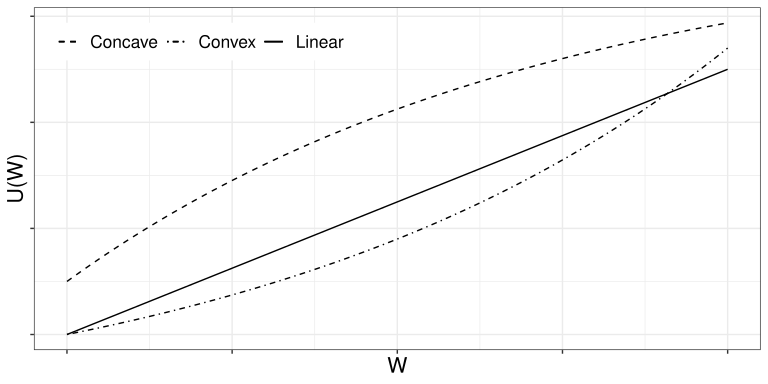
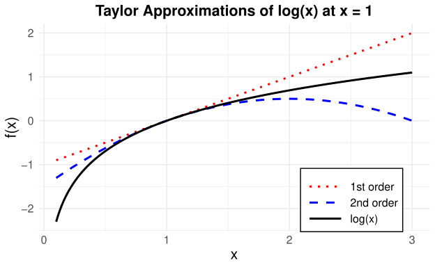
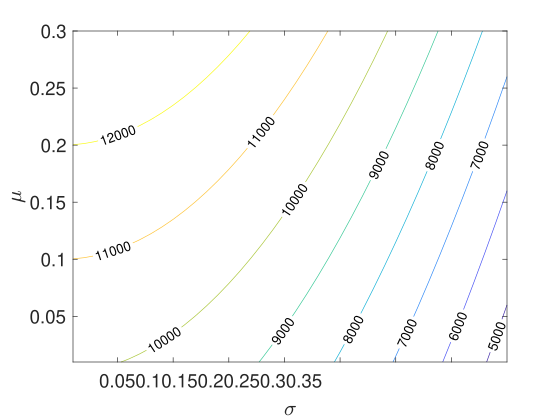
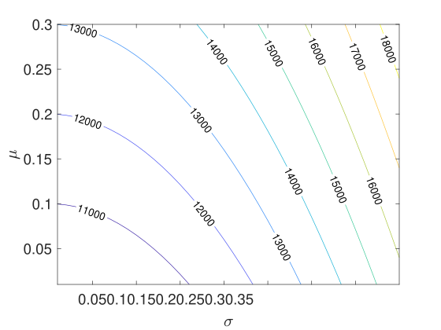
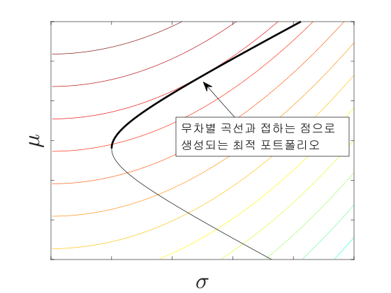
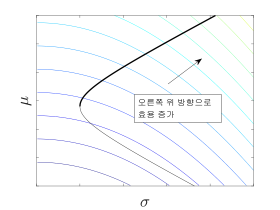

# 효용함수

## 개요

투자자의 선호와 위험회피를 효용함수를 통해 설명한다.

## 학습 목표

- 기대효용의 의미를 이해한다.
- 위험회피와 확실성 등가를 설명한다.
- 포트폴리오 선택 문제와 효용함수의 연결을 이해한다.

## 효용 함수, 기대 효용, 확실성 등가

### 효용 함수의 도입

[2장 현대 포트폴리오 이론](../02-modern-portfolio-theory/index.qmd)에서 이성적인 투자자의 포트폴리오 선택 문제를 살펴보았다. 무위험자산이 존재하지 않는다면 이성적인 투자자들은 효율적 투자선 위에서 자신의 위험 선호도에 맞는 포트폴리오를 선택할 것이다. 무위험자산이 존재한다면 시장 포트폴리오와 무위험자산을 적절히 조합하여 자신의 위험 성향에 맞도록 선택할 것이다.

그렇다면 효율적 포트폴리오 중 하나를 선택하는 과정은 개개인의 위험 선호도와 맞물려 어떻게 이루어질까? 이 장에서는 개별 투자자들의 포트폴리오 선택을 보다 자세히 살펴보며, 이를 효용 함수(utility function)를 바탕으로 설명한다.

경제학에서 효용(utility)은 소비자가 재화나 서비스를 소비한 대가로 얻는 만족이나 즐거움을 나타낸다. 효용 함수는 일련의 재화와 서비스에 대한 소비자의 선호도를 측정한다.

이 단원에서 효용 함수는 온전히 금융 자산에 대한 선호도를 측정하는 데 활용되며, 이를 위해 수학적 내용을 최대한 간단하게 구성한다.

### 상트페테르부르크 역설

투자자는 위험자산의 가치를 단순히 미래 페이오프(payoff)의 기댓값만으로 평가하지 않는다. 스위스 수학자 Nicolaus Bernoulli는 1713년 상트페테르부르크 역설(St. Petersburg paradox)로 알려진 다음 문제를 제시했다.

> 이 게임의 참가자는 공정한 동전을 던져 앞면이 나오면 2 ducat을 받고, 뒷면이 나오면 돈을 받지 못한 채 게임이 종료된다. ducat은 중세부터 19세기까지 유럽에서 사용된 금화의 일종이다.
>
> 앞면이 나오면 계속해서 동전을 던진다. 연속으로 앞면이 나오면 상금은 두 배씩 늘어나고, 언제든 뒷면이 나오면 게임이 종료된다.
>
> 이 게임에 참가하기 위해 얼마를 지불할 것인가?

위 게임에서 얻는 총 상금을 $W$라고 하면, $W$는 확률변수이며 그 기댓값은 다음과 같이 무한대이다.

$$
\mathbb{E}[W]
=0.5\times 2+0.5^2\times 2^2+0.5^3\times 2^3+\cdots
=1+1+1+\cdots
=\infty
$$

하지만 이 게임의 기댓값이 무한하다고 해서 게임에 참가하기 위해 무한대에 가까운 돈을 참가비로 지불하려는 사람은 없을 것이다. 이처럼 어떤 자산의 미래 가치에 대한 기댓값은 그 자산을 구매할 때 고려하는 유일한 평가 요소가 아니다. 그렇다면 개별 투자자가 위험자산을 구입할 때 추가로 고려하는 요소는 무엇인가?

이를 이해하기 위해 효용 함수의 개념이 도입되었다. 마코위츠도 포트폴리오 선택에 관한 연구에서 개별 투자자의 최적 포트폴리오를 투자자의 위험 선호도를 나타내는 효용 함수의 개념으로 설명하였다.

::: {.callout-note title="CAPM과 위험자산의 현재 가격"}
[2장 현대 포트폴리오 이론](../02-modern-portfolio-theory/index.qmd)에서 CAPM하 위험자산의 현재 가격이 미래 페이오프 $S(T)$의 단순한 기댓값이 아님을 살펴보았다.

증권시장선에 따르면 다음과 같다.

$$
\mu_i=r_F+\beta_i(\mu_M-r_F)
$$

이를 다시 쓰면 다음과 같다.

$$
\frac{\mathbb{E}[S_i(T)]}{S_i(0)}-1
=r_F+\beta_i(\mu_M-r_F)
$$

따라서 위험자산의 현재 가격은 다음과 같이 나타낼 수 있다.

$$
S_i(0)
=
\frac{\mathbb{E}[S_i(T)]}
{1+r_F+\beta_i(\mu_M-r_F)}
$$

즉, 자산의 가격은 미래 가치의 단순한 기댓값 $\mathbb{E}[S_i(T)]$이나 이를 무위험이자율로 할인한 값이 아니라, 위험 $\beta_i$에 따른 프리미엄이 반영된 할인율로 조정한 가치이다.
:::

효용 함수는 개별 투자자의 리스크에 대한 태도를 설명한다. 이 장에서는 효용 함수 $U$를 투자자의 부(wealth) $W$에 대한 함수로 표현한다.^[이 표현이 가능한 조건은 [@alexander2008market1]을 참고하라.]

여기서 $W$는 어떤 자산이나 포트폴리오에 투자한 결과를 나타내는 확률변수이다. 이 장에서는 시점 0과 $T$ 사이의 단일 기간만을 고려하므로, 보다 자세하게는 $W(T)$로 표현하지만 혼동의 여지가 없을 때에는 간단히 $W$로 표현한다.

게임 이론에서는 투자 결과가 무작위인 자산을 로터리(lottery)라고도 한다.

### 기대 효용

확률측도 $\mathbb{P}$와 효용 함수 $U$를 이용하여 기대 효용(expected utility)을 다음과 같이 정의한다.

$$
\mathbb{E}[U(W)]
$$

투자자는 단순히 $W$의 기댓값이 아니라 기대 효용을 투자의 기준으로 삼는다.

효용 함수에 관한 설명은 Nicolaus Bernoulli의 사촌인 Daniel Bernoulli가 1738년에 발표한 논문에서도 찾아볼 수 있다.^[영어로 번역되어 재출판된 [@bernoulli1954exposition]을 참고하라.]

> The determination of the value of an item must not be based on its price, but rather on the **utility** it yields. The price of the item is dependent only on the thing itself and is equal for everyone; the utility, however, is dependent on the particular circumstances of the person making the estimate. Thus there is no doubt that a gain of one thousand ducats is more significant to a pauper than to a rich man though both gain the same amount.

Daniel Bernoulli는 부의 한계 효용 감소(diminishing marginal utility of wealth) 원리를 제안하였다.

한계 효용은 효용 함수의 기울기를 나타내며, 재화를 한 단위 더 소비하거나 획득할 때 추가로 얻는 효용을 의미한다. 일반적으로 재화의 소비량이나 획득한 부의 크기가 증가할수록 한계 효용은 감소하는 경향이 있다.

이러한 관점은 상트페테르부르크 역설의 해결 방안을 제시한다. 예를 들어 어떤 개인의 효용 함수가 다음과 같다고 하자.

$$
U(x)=\sqrt{x}
$$

이때 위 게임 결과의 기대 효용은 다음과 같이 계산할 수 있다.

$$
\mathbb{E}[U(W)]
=
\sum_{i=1}^{\infty}
\frac{1}{2^i}\sqrt{2^i}
\approx 2.414
$$

현재 재산이 $W(0)=0$이라고 가정하면, 이 투자자는 게임에 참여하는 것과 2.414 ducat의 제곱인 5.827 ducat을 한 번에 지급받는 것을 동일한 효용으로 평가한다.

5.827 ducat에 제곱근 효용 함수를 적용하면 게임의 기대 효용과 같은 값이 되기 때문에 제곱을 취한 것이다.

효용 함수는 개인마다 다르며, 개인의 효용을 수학적 함수로 완전히 표현하는 것은 실제와 정확히 일치하지 않는다. 그러나 효용 함수를 수학적으로 표현하면 개인의 위험 선호를 보다 체계적이고 직관적으로 분석할 수 있다.

### 대표적인 효용 함수

자주 사용되는 대표적인 효용 함수는 다음과 같다.

- 로그 효용 함수(logarithmic utility function)

  $$
  U(x)=\log(x)
  $$

- 거듭제곱 효용 함수(power utility function)

  $$
  U(x)=x^a,\qquad a\neq 0
  $$

  또는

  $$
  U(x)=(1+bx)^a,\qquad a<1,\quad b>0
  $$

- 선형 효용 함수(linear utility function)

  $$
  U(x)=a+bx,\qquad b>0
  $$

- 지수 효용 함수(exponential utility function)

  $$
  U(x)=-\exp(-\gamma x)
  $$

  또는

  $$
  U(x)=\frac{1-\exp(-\gamma x)}{\gamma}
  $$

::: {.callout-tip title="예제: 효용 함수에 따른 투자 선택"}
두 시나리오 $\omega_1,\omega_2\in\Omega$에 대하여 다음과 같이 가정한다.

$$
\mathbb{P}(\{\omega_1\})=0.6,
\qquad
\mathbb{P}(\{\omega_2\})=0.4
$$

두 자산의 초기 가격은 다음과 같다.

$$
S_1(0)=S_2(0)=100
$$

만기 시점의 자산 가격은 다음과 같이 주어진다.

$$
S_1(\omega_1,T)=120,
\qquad
S_1(\omega_2,T)=90
$$

$$
S_2(\omega_1,T)=140,
\qquad
S_2(\omega_2,T)=70
$$

초기 자산 $W(0)=100$을 가진 투자자의 효용 함수가 다음과 같은 제곱근 효용 함수라고 하자.

$$
U(x)=\sqrt{x}
$$

투자자가 자산 $S_1$에 전부 투자하는 경우와 자산 $S_2$에 전부 투자하는 경우의 기대 효용은 각각 다음과 같다.

$$
\sqrt{120}\times0.6+\sqrt{90}\times0.4
=10.3674
$$

$$
\sqrt{140}\times0.6+\sqrt{70}\times0.4
=10.4459
$$

따라서 이 투자자는 자산 $S_2$에 전부 투자하는 경우를 더 선호한다.

한편 다른 투자자의 효용 함수가 다음과 같은 로그 효용 함수라고 하자.

$$
U(x)=\log(x)
$$

두 투자안의 기대 효용은 각각 다음과 같다.

$$
\log(120)\times0.6+\log(90)\times0.4
=4.6724
$$

$$
\log(140)\times0.6+\log(70)\times0.4
=4.6644
$$

따라서 이 투자자는 자산 $S_1$에 전부 투자하는 경우를 더 선호한다.
:::

::: {.callout-tip title="예제: 초기 자본과 투자 선호"}
앞의 예제에서 투자자의 초기 자본이 $W(0)=1{,}000$이고, 초기 자본에서 차지하는 비율이 앞의 예제와 같도록 $S_1$ 또는 $S_2$를 구매한다고 하자. 각 투자 전략에서는 $S_1$ 또는 $S_2$를 10개씩 구매한다.

제곱근 효용 함수를 가진 투자자의 기대 효용은 각각 다음과 같다.

$$
\sqrt{1200}\times0.6+\sqrt{900}\times0.4
=32.7841
$$

$$
\sqrt{1400}\times0.6+\sqrt{700}\times0.4
=33.0330
$$

따라서 이 투자자는 여전히 자산 $S_2$에 전부 투자하는 경우를 더 선호한다.

로그 효용 함수를 가진 투자자의 기대 효용은 각각 다음과 같다.

$$
\log(1200)\times0.6+\log(900)\times0.4
=6.9750
$$

$$
\log(1400)\times0.6+\log(700)\times0.4
=6.9670
$$

따라서 이 투자자는 여전히 자산 $S_1$에 전부 투자하는 경우를 더 선호한다.

제곱근 효용 함수나 로그 효용 함수를 가진 투자자는 동일한 비율로 투자할 때 초기 자본의 크기가 달라져도 투자 대안의 선호 순위가 변하지 않았다. 이처럼 상대적 위험 회피도가 일정한 효용 함수에서는 동일한 비율로 투자할 때 초기 자본의 규모가 투자 대안의 선호 순위에 영향을 미치지 않는다.
:::

::: {.callout-tip title="예제: 지수 효용 함수와 초기 자본"}
이번에는 $\gamma=0.002$인 지수 효용 함수를 고려한다. 앞의 예제와 마찬가지로 동일한 비율로 $S_1$ 또는 $S_2$를 구매하는 두 투자 전략을 비교한다.

먼저 초기 자본이 $W(0)=100$인 경우 두 투자 전략의 기대 효용은 각각 다음과 같다.

$$
-\exp(-0.002\times120)\times0.6
-\exp(-0.002\times90)\times0.4
\approx-0.806
$$

$$
-\exp(-0.002\times140)\times0.6
-\exp(-0.002\times70)\times0.4
\approx-0.801
$$

따라서 이 투자자는 자산 $S_2$에 전부 투자하는 경우를 더 선호한다.

초기 자본이 $W(0)=1{,}000$인 경우 두 투자 전략의 기대 효용은 각각 다음과 같다.

$$
-\exp(-0.002\times1200)\times0.6
-\exp(-0.002\times900)\times0.4
\approx-0.121
$$

$$
-\exp(-0.002\times1400)\times0.6
-\exp(-0.002\times700)\times0.4
\approx-0.135
$$

따라서 자산 $S_1$에 전부 투자하는 경우를 더 선호한다.

이 경우에는 초기 자본이 투자 선호도의 순위에 영향을 미친다. 이는 지수 효용 함수가 절대적 위험 회피도가 일정한(CARA) 효용 함수이기 때문에, 부의 수준이 변함에 따라 위험에 대한 상대적 평가가 달라지기 때문이다.
:::

### 효용 함수의 양의 아핀 변환

효용 함수는 양의 아핀(affine) 변환을 하여도 동치이다. 즉, 상수 $a,b$에 대하여 다음 두 효용 함수 $U_1$과 $U_2$는 동치이다.

$$
U_1(x)=a+bU_2(x),
\qquad b>0
$$

이는 기대 효용 극대화 문제에서는 효용의 절대적인 크기가 아니라 투자 대안 사이의 선호 순위가 중요하기 때문이다.

### 확실성 등가

::: {.callout-note title="정의: 확실성 등가(certainty equivalent)"}
확률적인 투자 수익 $W$에 대하여 다음 관계를 만족하는 상수 $\mathrm{CE}_W$를 투자 $W$의 확실성 등가라고 한다.

$$
U(\mathrm{CE}_W)
=
\mathbb{E}[U(W)]
$$
:::

확실성 등가는 투자자가 불확실한 투자로부터 기대 효용이 동일해지도록 하는 확정적인 금액을 의미한다. 즉, 투자자는 위험을 감수하여 더 큰 금액을 받을 가능성을 포기하는 대신, 확실성 등가에 해당하는 금액을 확실히 받는 것에 무차별(indifferent)하다.

확실성 등가는 투자자의 위험 선호(risk preference) 또는 리스크 허용 범위(risk tolerance)에 따라 달라진다. 예를 들어 퇴직자는 퇴직 자금을 위험에 노출시키는 것을 꺼리기 때문에 동일한 투자에 대해서도 상대적으로 높은 확실성 등가를 가질 가능성이 크다.

확실성 등가는 위험 프리미엄(risk premium), 즉 투자자가 안전한 자산 대신 위험자산을 선택하기 위해 요구하는 추가 수익과 밀접한 관련이 있다. 기대 효용과 확실성 등가는 모두 투자 대안의 선호 순위를 결정하는 단일 척도이지만, 확실성 등가는 원래의 화폐 단위로 표현되므로 해석이 더 직관적이다.

이 장의 예제에서는 편의를 위해 무위험이자율이 0인 상황, 즉 $r_F=0$을 가정한다. 이 경우 확실성 등가 $\mathrm{CE}_W$는 $T$ 시점의 확정 금액이면서 동시에 현재 시점 $t=0$의 확정 금액으로도 해석할 수 있다.

무위험이자율 $r_F>0$이 존재한다면 $\mathrm{CE}_W$는 $T$ 시점의 확정 금액으로 해석해야 한다. 이때 현재 시점에서의 확실성 등가, 즉 현재가치는 다음과 같다.

$$
\frac{\mathrm{CE}_W}{1+r_F}
$$

투자자는 현재 이 금액을 무위험자산에 투자하는 것과 위험자산 $W$에 투자하는 것 사이에서 무차별하다.

::: {.callout-tip title="예제: 투자 전략의 확실성 등가"}
앞에서 살펴본 초기 자본 $W(0)=1{,}000$인 투자 전략들의 확실성 등가를 계산한다.

제곱근 효용 함수를 가진 투자자가 $S_1$에 전부 투자하는 전략의 확실성 등가는 다음 관계를 만족한다.

$$
\sqrt{\mathrm{CE}_1}
=
\sqrt{1200}\times0.6+\sqrt{900}\times0.4
$$

따라서 다음과 같다.

$$
\mathrm{CE}_1
=
\left(
\sqrt{1200}\times0.6+\sqrt{900}\times0.4
\right)^2
=
1{,}074.83
$$

$S_2$에 전부 투자하는 전략의 확실성 등가는 다음과 같다.

$$
\mathrm{CE}_2
=
\left(
\sqrt{1400}\times0.6+\sqrt{700}\times0.4
\right)^2
=
1{,}091.176
$$

따라서 $\mathrm{CE}_2>\mathrm{CE}_1$이다. 제곱근 효용 함수를 가진 투자자는 $S_2$에 투자하는 전략을 더 선호하며, 이는 기대 효용을 기준으로 비교한 결과와 일치한다.

효용 함수가 달라지면 확실성 등가의 값도 달라진다. 로그 효용 함수를 가진 투자자의 두 투자 전략에 대한 확실성 등가는 각각 다음과 같다.

$$
\exp\left\{
\log(1200)\times0.6+\log(900)\times0.4
\right\}
=
1{,}069.56
$$

$$
\exp\left\{
\log(1400)\times0.6+\log(700)\times0.4
\right\}
=
1{,}061.00
$$

로그 효용 함수는 $U(x)=\log(x)$이므로 확실성 등가는 기대 로그 효용의 지수값으로 주어진다. 따라서 로그 효용 함수를 가진 투자자는 $S_1$에 투자하는 전략을 더 선호한다.
:::

::: {.callout-tip title="예제: 로그 효용 함수의 확실성 등가"}
어떤 투자에서 얻는 수익 $W$의 확률분포가 다음과 같다고 하자.

$$
\begin{aligned}
\text{시나리오 1}:&\quad W=\$27
&&\text{확률 } \frac{1}{3},\\
\text{시나리오 2}:&\quad W=\$8
&&\text{확률 } \frac{2}{3}.
\end{aligned}
$$

투자자의 효용 함수가 로그 효용 함수라고 가정하고 확실성 등가를 계산한다.

$$
\mathbb{E}[\log W]
=
\frac{1}{3}\log27
+
\frac{2}{3}\log8
=
\log12
$$

따라서 다음 관계에서 확실성 등가는 $\mathrm{CE}_W=\$12$이다.

$$
\log(\mathrm{CE}_W)=\log12
$$

이는 투자자가 불확실한 투자 $W$와 확정적으로 $\$12$를 받는 것 사이에서 무차별함(상관없음)을 의미한다.

또한 투자자의 초기 자본이 $W(0)=\$12$이고 이자율이 0이라고 가정하면 다음의 모든 투자 전략은 투자자에게 동일한 효용을 제공한다.

- $\$12$를 그대로 두는 전략
- $S_1(0)=\$12$인 자산 $S_1$을 1개 구입하는 전략

  $$
  \begin{aligned}
  \text{시나리오 1}:&\quad S_1=\$27
  &&\text{확률 } \frac{1}{3},\\
  \text{시나리오 2}:&\quad S_1=\$8
  &&\text{확률 } \frac{2}{3}
  \end{aligned}
  $$

- $\$5$를 그대로 두고 $S_2(0)=\$7$인 자산 $S_2$를 1개 구입하는 전략

  $$
  \begin{aligned}
  \text{시나리오 1}:&\quad S_2=\$22
  &&\text{확률 } \frac{1}{3},\\
  \text{시나리오 2}:&\quad S_2=\$3
  &&\text{확률 } \frac{2}{3}
  \end{aligned}
  $$

:::

## 효용 함수의 형태와 리스크 성향

효용함수의 모양에 대해 알아보자. 다다익선이라는 격언처럼 효용함수는 $W$에 대한 단조증가함수이다. 즉,

$$
U'(x)>0
$$

이며, 이는 **한계효용(marginal utility)** $U'$가 항상 양의 값을 가짐을 의미한다. 한편, 한계효용 $U'(x)$는 부(Wealth)가 아주 미세하게 증가할 때 투자자가 느끼는 추가적인 만족감의 크기를 나타낸다.

앞서 언급한 것처럼 위험 회피적 투자자의 경우 한계효용은 $W$가 증가함에 따라 감소한다. 보다 일반적으로, 투자자의 위험 선호는 효용 함수의 곡률, 즉 이차 도함수 $U''$의 부호에 의해 구분된다.

개별 투자자는 서로 다른 위험 선호도(risk preference)를 가지며, 이는 효용 함수의 곡률을 통해 수학적으로 표현된다. @fig-utility-shape 및 아래의 분류를 참고하자.

{#fig-utility-shape width=80%}

- $U''(x)>0$: **리스크 추구(risk seeking)**  
  효용함수는 $W$에 대해 볼록(convex)이며, 한계효용 $U'$는 $W$가 증가함에 따라 증가한다.

- $U''(x)<0$: **리스크 회피(risk averse)**  
  효용함수는 $W$에 대해 오목(concave)이며, 한계효용 $U'$는 $W$가 증가함에 따라 감소한다.

- $U''(x)=0$: **리스크 중립(risk neutral)**  
  효용함수는 $W$에 대해 선형(linear)이며, 한계효용 $U'$는 $W$에 의존하지 않는다.

일반적으로 리스크 회피적($U''<0$)인 투자자에게 부의 증가에 따른 만족감은 여전히 커지지만(단조증가), 그 증가하는 속도는 점점 둔화된다.

예를 들어, 자산이 거의 없는 상태에서 얻는 $100$만 원의 가치(한계효용)는 이미 수십억 원을 보유한 상태에서 얻는 $100$만 원의 가치보다 훨씬 크게 느껴진다.

이를 수학적으로는 $U'$가 감소함수임을 의미하는 $U''<0$으로 표현하며, **한계효용 체감의 법칙(Law of diminishing marginal utility)**이라고 한다.

효용 함수의 곡률과 위험 성향의 관계는 Taylor 전개를 통해 보다 직관적으로 이해할 수 있다. 아래 정리와 @fig-taylor-approximations 를 참고하자.

::: {.callout-note title="정리: Taylor 전개"}

Taylor 전개는 함수 $f(x)$를 특정 점 $x_0$ 주변에서 다항식으로 근사하는 방법이다. 일반적으로 $n$차 Taylor 전개는 다음과 같이 표현된다.

$$
f(x) \approx f(x_0)
+ f'(x_0)(x-x_0)
+ \frac{f''(x_0)}{2!}(x-x_0)^2
+ \frac{f'''(x_0)}{3!}(x-x_0)^3
+ \cdots
+ \frac{f^{(n)}(x_0)}{n!}(x-x_0)^n
$$

여기서 $f^{(n)}(x_0)$는 $f(x)$의 $n$번째 도함수를 $x=x_0$에서 계산한 값이다.

:::

{#fig-taylor-approximations width=80%}

효용 함수 $U(x)$를 $x_0=\mathbb{E}[W]$에서 Taylor 전개하고 $x=W$를 대입하면,

$$
U(W)
\approx
U(\mathbb{E}[W])
+U'(\mathbb{E}[W])\bigl(W-\mathbb{E}[W]\bigr)
+\frac{1}{2}U''(\mathbb{E}[W])
\bigl(W-\mathbb{E}[W]\bigr)^2
$$

이므로, 양변에 기댓값을 취하면,

$$
\mathbb{E}[U(W)]
\approx
U(\mathbb{E}[W])
+\frac{1}{2}U''(\mathbb{E}[W])\operatorname{Var}(W)
$$ {#eq-euw}

으로 표현할 수 있다.

정의에 따라 $U(\mathrm{CE}_W)=\mathbb{E}[U(W)]$이므로,

$$
U(\mathrm{CE}_W)
\approx
U(\mathbb{E}[W])
+\frac{1}{2}U''(\mathbb{E}[W])\operatorname{Var}(W)
$$ {#eq-euw2}

이며, 이제 $U$가 단조증가 함수라는 사실을 이용하여 $\mathrm{CE}_W$와 $\mathbb{E}[W]$의 크기 관계를 해석할 수 있다.

- $U''(x)>0$의 효용 함수를 지니는 투자자(위험 추구): $\mathrm{CE}_W>\mathbb{E}[W]$이며, 투자자는 불확실성 $\operatorname{Var}(W)$로 인해 전체 효용이 증가했다고 여긴다. 따라서 도박이나 복권과 같은 불확실한 투자를 선호한다.

- $U''(\mathbb{E}[W])<0$의 효용 함수를 지니는 투자자(위험 회피): $\mathrm{CE}_W<\mathbb{E}[W]$이며, 투자자는 불확실성 $\operatorname{Var}(W)$로 인해 전체 효용이 감소했다고 여긴다. 따라서 도박과 같은 불확실한 투자를 기피한다.

- $U''(\mathbb{E}[W])=0$의 효용 함수를 지니는 투자자(위험 중립): $\mathrm{CE}_W=\mathbb{E}[W]$이며, 투자자는 불확실성 $\operatorname{Var}(W)$가 전체 효용에 영향을 미치지 않는다고 보고 오직 기댓값으로 투자의 가치를 판단한다.

위험 회피자의 경우 $\mathrm{CE}_W<\mathbb{E}[W]$이므로, 양의 $\pi_A$에 대하여 다음과 같이 표현할 수 있다.

$$
\mathrm{CE}_W=\mathbb{E}[W]-\pi_A
$$ {#eq-absolute-risk-premium}

여기서 $\pi_A$는 $W$의 리스크를 피하기 위해 지불할 의사가 있는 최대 금액을 말하며, **절대적 리스크 프리미엄(absolute risk premium)**이라고 부른다.

앞에서 살펴본 예에서 $S_1$에 모두 투자하는 전략의 기대 부는 다음과 같다.

$$
\mathbb{E}[W]
=1200\times0.6+900\times0.4
=1080
$$

따라서 거듭제곱 효용 함수의 확실성 등가와 비교하면 절대적 리스크 프리미엄은 다음과 같다.

$$
\pi_A=1080-1074.83=5.17
$$

한편, $U(\mathrm{CE}_W)$에 대한 일차 근사와 @eq-absolute-risk-premium 을 이용하면,

$$
\begin{aligned}
U(\mathrm{CE}_W)
&=U\bigl(\mathbb{E}[W]-\pi_A\bigr)\\
&\approx U\bigl(\mathbb{E}[W]\bigr)
-\pi_AU'\bigl(\mathbb{E}[W]\bigr)
\end{aligned}
$$

이다. 이를 @eq-euw2 와 결합하면,

$$
U\bigl(\mathbb{E}[W]\bigr)
-\pi_AU'\bigl(\mathbb{E}[W]\bigr)
\approx
U\bigl(\mathbb{E}[W]\bigr)
+\frac{1}{2}U''\bigl(\mathbb{E}[W]\bigr)
\operatorname{Var}(W)
$$

이며, 따라서 절대적 리스크 프리미엄은 다음과 같이 나타낼 수 있다.

$$
\pi_A
\approx
-\frac{1}{2}
\frac{U''\bigl(\mathbb{E}[W]\bigr)}
{U'\bigl(\mathbb{E}[W]\bigr)}
\operatorname{Var}(W)
$$

비슷하게, **상대적 리스크 프리미엄(relative risk premium)**은 다음과 같이 정의한다.

$$
\begin{aligned}
\pi_R
&=\frac{\pi_A}{\mathbb{E}[W]}\\
&\approx
-\frac{1}{2}
\frac{\mathbb{E}[W]U''\bigl(\mathbb{E}[W]\bigr)}
{U'\bigl(\mathbb{E}[W]\bigr)}
\frac{\operatorname{Var}(W)}
{\mathbb{E}[W]^2}\\
&=
-\frac{1}{2}
\frac{\mathbb{E}[W]U''\bigl(\mathbb{E}[W]\bigr)}
{U'\bigl(\mathbb{E}[W]\bigr)}
\operatorname{Var}
\left(\frac{W}{\mathbb{E}[W]}\right)
\end{aligned}
$$

이러한 관점에서 다음 절에서는 위험회피도를 정의한다.

### 위험회피도

::: {.callout-note}

## 정의: 위험회피도 함수(functions of risk aversion^[Arrow-Pratt measure of risk aversion이라고도 불리운다.])

다음의 두 함수는 효용함수 $U(x)$의 위험회피도를 측정하는 척도로 사용된다.

- **절대위험회피도(absolute risk aversion) 함수**

$$
c_A(x)
=
-\frac{U''(x)}{U'(x)}
$$

- **상대위험회피도(relative risk aversion) 함수**

$$
c_R(x)
=
-\frac{xU''(x)}{U'(x)}
$$

:::

::: {.callout-note title="예제: 이차 효용 함수의 위험회피도"}

이차 효용 함수

$$
U(x)=x-\frac{1}{2}bx^2,
\qquad
x<\frac{1}{b}
$$

의 절대위험회피도와 상대위험회피도는 각각 다음과 같다.

$$
c_A(x)=\frac{b}{1-bx},
\qquad
c_R(x)=\frac{xb}{1-bx}.
$$

이 효용 함수는 부가 증가할수록 절대위험회피도와 상대위험회피도가 모두 증가하므로, 부유해질수록 더 위험을 회피하는 성향을 보인다.

:::

::: {.callout-note title="정의: CARA"}

절대위험회피도가 상수인 효용 함수를 **CARA(constant absolute risk aversion)**라고 한다. 대표적인 예는 다음과 같다.

- 선형 효용 함수(linear utility function): $c_A(x)=0$
- 지수 효용 함수(exponential utility function): $c_A(x)=\gamma$

:::

::: {.callout-note title="정의: CRRA"}

상대위험회피도가 상수인 효용 함수를 **CRRA(constant relative risk aversion)**라고 한다. 대표적인 예는 다음과 같다.

- 로그 효용 함수: $c_R(x)=1$
- 거듭제곱 효용 함수: $c_R(x)=1-a$

:::

어떤 투자자가 CARA 효용 함수를 가진다는 것은 위험자산의 최적 투자 금액이 총자산의 수준과 무관하게 결정된다는 것을 의미한다.

즉, 총자산이 변화하더라도 위험자산에 투자하는 절대 금액은 변하지 않는다(다른 조건이 동일하다면). 예를 들어, 어떤 투자자가 총자산이 100만 달러일 때 위험자산에 50만 달러를 투자하는 것이 최적이라 하자. 동일한 투자 기회하에서 총자산이 120만 달러로 증가하더라도 CARA 효용을 가진 투자자는 여전히 위험자산에 50만 달러를 투자한다.

한편, 어떤 투자자가 CRRA 효용 함수를 가진다는 것은 투자 포트폴리오에서 위험자산의 비중이 총자산의 수준과 무관하게 일정함을 의미한다.

즉, 자산 규모가 변하더라도 위험자산에 투자하는 비율은 변하지 않는다. 예를 들어, 총자산이 100만 달러인 사람이 그 사람의 위험 성향에 따라 위험자산에 50만 달러를 투자하고 있었는데, 총자산이 120만 달러로 늘어나면 위험자산에 60만 달러를 투자하는 경우이다.

::: {.callout-note title="참고: 로그 정규분포"}

확률변수 $X>0$가 다음을 만족하면 로그 정규분포를 따른다.

$$
\log(X)\sim N(\mu,\sigma^2)
$$

그리고 $X$의 기댓값은 다음과 같다.

$$
\mathbb{E}[X]
=
\exp\left(\mu+\frac{\sigma^2}{2}\right).
$$

:::

::: {.callout-note title="예제: CARA 효용 함수와 최적 투자 금액"}

CARA인 지수 효용 함수

$$
U(x)=-\exp(-\gamma x)
$$

를 지니는 투자자가 $W_0$의 초기 자본을 가지고 있다. 자본 시장에 수익률

$$
R\sim N(\mu,\sigma^2)
$$

의 위험자산과 $r_F$의 이자율을 가지는 무위험자산이 있다고 하자.

이때 초기 자본 중 $y$만큼을 위험자산에 투자하고, $W_0-y$를 무위험자산에 투자한다고 하자. 그러면 미래의 부는 다음과 같다.

$$
W(T)
=
y(1+R)+(W_0-y)(1+r_F).
$$

기대 효용은

$$
\begin{aligned}
\mathbb{E}[U(W(T))]
&=
\mathbb{E}\left[
-\exp\left\{
-\gamma\left[
y(1+R)+(W_0-y)(1+r_F)
\right]
\right\}
\right]\\
&=
-\exp\left\{
-\gamma\left[-yr_F+W_0(1+r_F)\right]
\right\}
\mathbb{E}\left[\exp(-\gamma yR)\right]
\end{aligned}
$$

이다. 그런데 $\exp(-\gamma yR)$는 로그 정규분포를 따르며, 로그 정규분포의 기댓값 공식에 따라

$$
\mathbb{E}\left[\exp(-\gamma yR)\right]
=
\exp\left(
-\gamma\mu y
+\frac{1}{2}\gamma^2\sigma^2y^2
\right)
$$

이므로,

$$
\mathbb{E}[U(W(T))]
=
-\exp\left\{
-\gamma\left[
W_0(1+r_F)+(\mu-r_F)y
\right]
+\frac{1}{2}\gamma^2\sigma^2y^2
\right\}.
$$

기대 효용을 최대화하는 $y$를 찾기 위해 $y$로 미분했을 때 0이 되도록 하는 $y$를 찾는다.

$$
\frac{\mathrm{d}\mathbb{E}[U(W(T))]}{\mathrm{d}y}
=
\left[
-\gamma(\mu-r_F)
+\gamma^2\sigma^2y
\right]
\mathbb{E}[U(W(T))]
=
0.
$$

따라서

$$
y=\frac{\mu-r_F}{\gamma\sigma^2}
$$

이며, $W_0$와 관계없이 결정된다. 이는 CARA 효용 함수의 정의와 일치한다.

:::

::: {.callout-note title="예제: CRRA 효용 함수와 최적 투자 비율"}

CRRA인 로그 효용 함수

$$
U(x)=\log(x)
$$

를 지니는 투자자가 $W_0$의 초기 자본을 가지고 있다.

자본 시장에 존재하는 위험자산의 수익률은 다음의 이산 분포를 따르고, 상수 $R_u$, $R_d$에 대해,

$$
R=
\begin{cases}
R_u, & \text{with }p,\\
R_d, & \text{with }1-p.
\end{cases}
$$

무위험자산은 $r_F$의 이자율을 따른다. 초기 자본 중 $y$만큼을 위험자산에 투자하고, $W_0-y$를 무위험자산에 투자한다고 하자. 그러면 미래의 부는 다음과 같다.

$$
W(T)=
\begin{cases}
y(1+R_u)+(W_0-y)(1+r_F),
& \text{with }p,\\
y(1+R_d)+(W_0-y)(1+r_F),
& \text{with }1-p.
\end{cases}
$$

기대 효용은

$$
\begin{aligned}
\mathbb{E}[U(W(T))]
={}&
p\log\left\{
y(1+R_u)+(W_0-y)(1+r_F)
\right\}\\
&+
(1-p)\log\left\{
y(1+R_d)+(W_0-y)(1+r_F)
\right\}
\end{aligned}
$$

이다.

기대 효용을 최대화하는 $y$를 찾기 위해 $y$로 미분했을 때 0이 되도록 하는 $y$를 찾는다.

$$
\begin{aligned}
\frac{\mathrm{d}\mathbb{E}[U(W(T))]}{\mathrm{d}y}
={}&
p\frac{R_u-r_F}
{y(R_u-r_F)+W_0(1+r_F)}\\
&+
(1-p)\frac{R_d-r_F}
{y(R_d-r_F)+W_0(1+r_F)}
=
0.
\end{aligned}
$$

따라서

$$
\frac{y}{W_0}
=
\frac{
(1+r_F)
\left\{
(1-p)(r_F-R_d)+p(R_u-r_F)
\right\}
}{
(R_u-r_F)(r_F-R_d)
}
$$

이며, 위험자산에 투자되는 비율 $y/W_0$가 일정하다. 이는 CRRA 효용 함수의 정의와 일치한다.

:::

## 효용 함수와 포트폴리오 이론

앞서 살펴본 효율적 투자선에서 투자자들이 어떤 포트폴리오를 선택하게 될지 효용 함수의 관점에서 살펴보자. 보다 쉬운 수학적 전개를 위해 지수 효용 함수를 가지는 투자자에 대해 알아보자.

::: {.callout-note title="명제: 지수 효용 함수의 기대 효용과 확실성 등가"}

지수 효용 함수

$$
U(x)=-\exp(-\gamma x)
$$

를 가지는 투자자의 정규 수익률 분포를 따르는 투자 $W$를 고려해 보자. 

이 투자의 수익률을 다음으로 나타내었을 때,

$$
R_W
=
\frac{W(T)-W(0)}{W(0)}
\sim N(\mu_W,\sigma_W^2)
$$

이 투자에 대한 기대 효용은 다음과 같다.

$$
\mathbb{E}[U(W(T))]
=
-\exp\left\{
-\gamma(1+\mu_W)W(0)
+\frac{1}{2}\gamma^2\sigma_W^2W^2(0)
\right\}
$$ {#eq-euw-terminal}

또한 확실성 등가는 다음과 같다.

$$
\mathrm{CE}_W
=
(1+\mu_W)W(0)
-\frac{1}{2}\gamma\sigma_W^2W^2(0)
$$ {#eq-cew}

:::

$R_W$가 평균이 $\mu_W$이고 분산이 $\sigma_W^2$인 정규분포를 따르므로,

$$
-\gamma W(T)
=
-\gamma W(0)(1+R_W)
\sim
N\left(
-\gamma(1+\mu_W)W(0),
\gamma^2\sigma_W^2W^2(0)
\right)
$$

이다.

따라서 $\exp(-\gamma W(T))$는 로그 정규분포를 따르며, 로그 정규분포의 기댓값 공식에 따라

$$
\begin{aligned}
\mathbb{E}[U(W(T))]
&=
-\mathbb{E}\left[\exp(-\gamma W(T))\right]\\
&=
-\exp\left\{
-\gamma(1+\mu_W)W(0)
+\frac{1}{2}\gamma^2\sigma_W^2W^2(0)
\right\}
\end{aligned}
$$

이다.

확실성 등가의 정의에 따라

$$
-\exp(-\gamma\mathrm{CE}_W)
=
-\exp\left\{
-\gamma(1+\mu_W)W(0)
+\frac{1}{2}\gamma^2\sigma_W^2W^2(0)
\right\}
$$

이므로,

$$
\mathrm{CE}_W
=
(1+\mu_W)W(0)
-\frac{1}{2}\gamma\sigma_W^2W^2(0)
$$

이다. 효용 함수가 CARA이므로 위험 프리미엄이 분산에 비례함을 확인할 수 있다.

@eq-cew 에서 $(1+\mu_W)W(0)$는 $W(0)$를 투자했을 때의 미래 기대 가치이며,

$$
\frac{1}{2}\gamma\sigma_W^2W^2(0)
$$

는 위험 프리미엄으로 투자자가 위험을 회피하기 위해 기꺼이 포기하는 금액이라고 볼 수 있다. 투자자의 위험회피도 $\gamma$와 위험 $\sigma$가 클수록 이 값은 크다.

::: {.callout-note title="정의: 무차별 곡선(indifference curve)"}

**무차별 곡선(indifference curve)**은 효용 함수의 등량곡선으로, 부(wealth) 자체가 아니라 포트폴리오 특성 변수로 표현된다. 여기서는 포트폴리오 수익률의 기대치와 표준편차로 정의된다.

무차별 곡선은 지도상의 등고선처럼 효용이 동일한 모든 점을 연결하는 공간상의 곡선이다. 즉, 어떤 투자자가 특정 효용 함수 $U$를 가지고 있으면 $U$를 통해 정의되는 같은 값의 무차별 곡선 위의 포트폴리오에 대해서는 어떤 것을 다른 것에 비해 더 선호하거나 덜 선호하지 않는다.

:::

::: {#fig-utility layout-ncol=2}

{width=100%}

{width=100%}

무차별 곡선의 예: 리스크 회피(왼쪽)와 리스크 추구(오른쪽)

:::

@fig-utility 는 지수 효용 함수를 가정한 투자자의 무차별 곡선을 보여준다.

이 예제에서 초기 자본은 $10{,}000$으로 가정하였고, 왼쪽은 $\gamma=7\times10^{-4}$인 지수 효용 함수를, 오른쪽은 $\gamma=-7\times10^{-4}$인 지수 효용 함수를 가정하였다.

$\gamma$가 양수인 리스크 회피형 투자자는 왼쪽 아래에서 오른쪽 위로 올라가는 형태의 무차별 곡선을 볼 수 있다. 이는 일반적으로 가정되는 위험회피적 투자자의 무차별 곡선 형태이다.

반면, $\gamma$가 음수인 리스크 추구형 투자자의 무차별 곡선은 그림의 오른쪽과 같이 왼쪽 위에서 오른쪽 아래로 내려가는 모양이다.

한편, 실현 가능한 포트폴리오로서 @eq-cew 를 다음과 같이 나타낼 수 있다.

$$
\mathrm{CE}_W
\approx
W(0)
+W(0)\mathbf{w}^{\mathsf{T}}\boldsymbol{\mu}
-\frac{1}{2}\gamma W^2(0)
\mathbf{w}^{\mathsf{T}}
\mathbf{C}
\mathbf{w}
$$

여기서 $\boldsymbol{\mu}$는 위험자산 수익률의 기댓값 벡터, $\mathbf{C}$는 공분산 행렬이며, $\mathbf{w}$는 자산 가중치 벡터이다.

따라서 이 경우 투자자의 목적은 다음을 최대화하는 포트폴리오의 가중치 $\mathbf{w}$를 찾는 것이다.

$$
\max_{\mathbf{w}}
\left\{
W(0)\mathbf{w}^{\mathsf{T}}\boldsymbol{\mu}
-\frac{1}{2}\gamma W^2(0)
\mathbf{w}^{\mathsf{T}}
\mathbf{C}
\mathbf{w}
\right\}
$$

이제 이 곡선들과 효율적 투자선을 같이 그려보자.

리스크를 회피하는 투자자의 무차별 곡선과 효율적 투자선이 만나는 경우는 @fig-indifference-frontier 의 왼쪽과 같다. 앞에서 관찰한 대로 무차별 곡선은 왼쪽 아래에서 위쪽으로 올라가는 형태이다. 이 무차별 곡선과 효율적 투자선이 접하는 지점이 있음을 확인할 수 있다.

반면, 리스크 추구형 투자자의 무차별 곡선은 앞에서 관찰한 바와 같이, @fig-indifference-frontier 의 오른쪽에서 왼쪽 위에서 오른쪽 아래로 내려가고 있다.

이 경우는 앞의 예와 달리 기대 효용을 최대로 하는 점을 찾을 수 없으며, 효율적 투자선을 따라 리스크와 기대수익률이 증가할수록, 즉 오른쪽 위 방향으로 올라갈수록, 투자자가 더욱 선호하는 포트폴리오가 된다.

여기서는 무위험자산이 없는 효율적 투자선을 예로 들었지만, 무위험자산이 추가된 효율적 투자선에 대해서도 동일한 논의를 전개할 수 있다.

::: {#fig-indifference-frontier layout-ncol=2}

{width=100%}

{width=100%}

무차별 곡선과 효율적 투자선: 리스크 회피형 투자자(왼쪽)와 리스크 추구형 투자자(오른쪽)

:::
