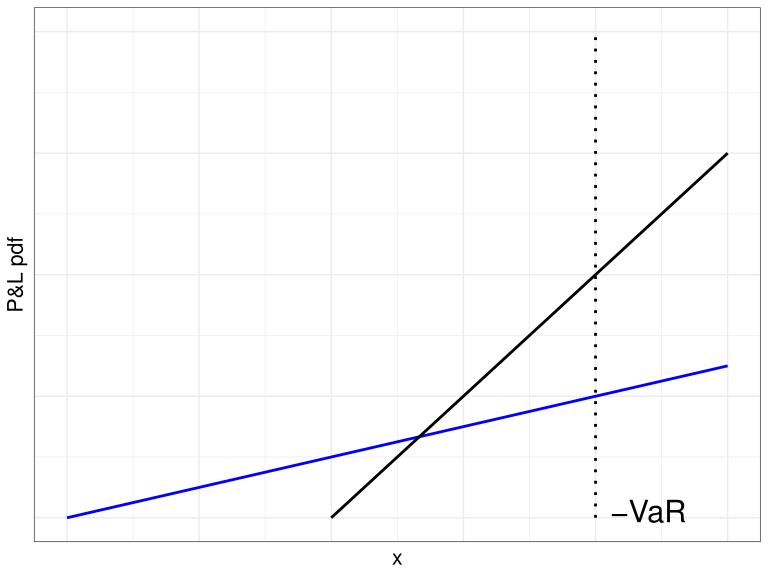
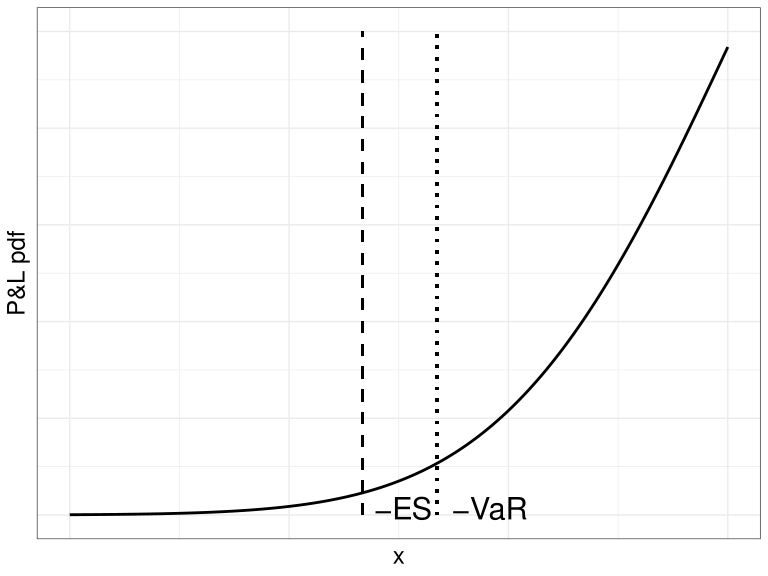

# VaR와 ES

## 개요

손실분포를 이용한 대표적 위험 측도인 VaR와 ES를 다룬다.

## 학습 목표

-   VaR의 정의와 해석을 이해한다.
-   ES의 정의와 VaR와의 차이를 설명한다.
-   위험 측도의 장단점을 비교한다.

## VaR

### VaR의 등장

1970-80년대에 금융기관은 기관 전체의 위험을 측정하기 위한 내부 모형을 개발하기 시작하였다. 여러 위험을 하나의 수치로 통합하는 일은 쉽지 않았지만, 시간이 지나면서 공통적으로 사용하는 위험 측도의 틀이 형성되었다.

대표적인 사례는 J.P. Morgan의 RiskMetrics 시스템이다. 1990년 Dennis Weatherstone은 매일 향후 24시간 동안 회사 전체가 부담하는 위험을 한 페이지 보고서로 보고받기를 원했다. 이에 따라 J.P. Morgan은 VaR를 이용해 위험을 요약하는 방식을 발전시켰다.[^index-1]

[^index-1]: RiskMetrics의 역사적 배경은 @Dowd2007 참고.

::: callout-note
VaR는 포트폴리오가 부담하는 잠재적 손실을 나타내므로 위험 메트릭(risk metric)으로 볼 수 있다. 동시에 잠재적 손실을 측정하는 구체적인 방법이므로 위험 측도(risk measure)이기도 하다.
:::

### 손익과 손실

시점 $t$의 자산 또는 포트폴리오 가치를 $V_t$라고 하자. 기간 $0$부터 $t$까지의 손익(profit and loss, P&L)은 다음과 같다.

$$
V_t - V_0
$$

이 손익의 분포를 $0$부터 $t$까지의 손익 분포라고 한다. 손실(loss)은 손익에 음수를 붙여 다음과 같이 정의한다.

$$
L_t = -(V_t - V_0).
$$ {#eq-loss-from-pnl}

따라서 $L_t>0$이면 손실이 발생한 것이고, $L_t<0$이면 이익이 발생한 것이다.

::: callout-warning
VaR는 손익을 기준으로 정의할 수도 있고 손실을 기준으로 정의할 수도 있다. 두 정의에서는 부호와 분위수의 위치가 달라지므로, 어떤 확률변수를 기준으로 삼는지 함께 확인해야 한다.
:::

### VaR를 정하는 세 요소

VaR를 측정하려면 다음 세 가지를 먼저 정해야 한다.

-   **보유 기간(VaR horizon)**: 하루, 이틀, 일주일, 한 달 등 VaR를 계산할 기간이다.
-   **손실의 분위수**: 유의수준 $\alpha$ 또는 신뢰수준 $100(1-\alpha)\%$이다.
-   **통화 단위**: 손실을 나타낼 원, 달러 등의 단위이다.

예를 들어 $\alpha=0.01$에서의 $\mathrm{VaR}_{0.01}$은 99% 신뢰수준 VaR와 같은 뜻이다. 보유 기간까지 함께 표시할 때는 다음과 같이 쓸 수 있다.

$$
\mathrm{VaR}_{\text{1-day},\alpha},
\quad
\mathrm{VaR}_{\text{1-month},\alpha},
\quad
\mathrm{VaR}_{\text{1-year},\alpha}.
$$

하루 99% VaR가 10억 원이라는 것은 정상적인 시장 조건을 가정할 때 하루 손실이 10억 원을 초과할 날이 약 100일 중 1일이라는 뜻이다 [@jorion2007value].

::: callout-note
VaR에서 말하는 최대 손실은 절대로 넘지 않는 상한이 아니다. VaR는 손실분포의 특정 분위수이므로, VaR를 초과하는 손실은 낮은 확률이지만 발생할 수 있다.
:::

### 분위수 함수

VaR는 확률과 통계에서 사용하는 분위수 함수와 밀접하게 연결되어 있다. 누적분포함수

$$
F(x) = \mathbb{P}(X \leq x)
$$

가 주어졌을 때, 분위수 함수 $Q(p)$는 다음과 같이 정의한다.

$$
Q(p) = \inf\{x : p \leq F(x)\},
\qquad 0<p<1.
$$ {#eq-quantile-function}

여기서 $\inf$는 조건을 만족하는 값들의 하한(infimum)을 뜻한다. 누적분포함수는 우연속이므로 이 정의에서 최소값을 사용해도 된다.

$X$가 연속확률변수이고 누적분포함수 $F$가 순단조증가하면 분위수 함수는 역함수로 간단히 쓸 수 있다.

$$
Q(p) = F^{-1}(p).
$$

누적분포함수에 편평한 부분이 있으면 같은 분위수에 대응하는 값이 여러 개일 수 있다. 분위수 함수는 그 값들 가운데 가장 작은 값을 선택한다.

### VaR의 정의

특정 기간 뒤의 손익을 나타내는 확률변수 $X$의 분포함수를 $F_X$라고 하자. 유의수준 $\alpha\in(0,1)$에서 VaR는 다음과 같이 정의한다.

$$
\mathrm{VaR}_\alpha(X)
=
-\inf\{x : \alpha < F_X(x)\}.
$$ {#eq-var-pnl}

$X$가 연속확률변수이고 $F_X$가 순단조증가하면, 손익 기준 VaR 정의(@eq-var-pnl)는 다음과 같이 쓸 수 있다.

$$
\mathrm{VaR}_\alpha(X)
=
-F_X^{-1}(\alpha).
$$

한편 손실 $L$을 기준으로 VaR를 정의하면 다음과 같다.

$$
\mathrm{VaR}_\alpha(L)
=
\inf\{x : 1-\alpha \leq F_L(x)\}.
$$ {#eq-var-loss}

문헌에 따라 손익 기준 VaR를 다음처럼 정의하기도 한다.

$$
\mathrm{VaR}_\alpha(X)
=
-\inf\{x\in\mathbb{R} : \alpha \leq F_X(x)\}.
$$ {#eq-var-pnl-quantile}

손익 기준 정의(@eq-var-pnl)와 분위수 기준 정의(@eq-var-pnl-quantile)는 누적분포함수에 수평인 부분이 없으면 같은 값을 준다. 수평인 부분이 있으면 두 정의가 달라질 수 있으며, 분위수 기준 정의(@eq-var-pnl-quantile)가 더 보수적인 VaR를 선택한다.[^index-2]

[^index-2]: 이산형 또는 비연속 분포에서 VaR 정의의 차이는 @Elliott2005 참고.

{#fig-two-var width="60%"}

다음 그림(@fig-two-var)에서 $q^\alpha$는 손익 기준 VaR 정의(@eq-var-pnl)에 따른 VaR의 위치이고, $q_\alpha$는 분위수 기준 정의(@eq-var-pnl-quantile)에 따른 VaR의 위치이다.

## VaR의 성질

### 정규분포 수익률의 VaR

특정 기간의 수익률이 정규분포 $N(\mu,\sigma^2)$를 따른다고 하자. 초기 투자금이 $V_0$이면, 해당 기간의 손익은 표준정규확률변수 $Z$를 이용해 다음과 같이 나타낼 수 있다.

$$
V_T - V_0 = V_0(\mu + \sigma Z).
$$

유의수준 $\alpha$에 대해 $z_\alpha$를

$$
\mathbb{P}(Z > z_\alpha) = \alpha
$$

를 만족하는 표준정규분포의 상위 $\alpha$ 분위수라고 하자. 그러면 손익 기준 VaR는 다음과 같다.

$$
\mathrm{VaR}_\alpha
=
(-\mu+\sigma z_\alpha)V_0.
$$ {#eq-normal-var}

즉, 기대수익률이 높을수록 VaR는 작아지고 변동성이 클수록 VaR는 커진다. 또한 같은 수익률 분포라도 투자금 $V_0$가 커지면 VaR도 같은 비율로 커진다.

정규분포에서 자주 사용하는 $z_\alpha$의 값은 다음과 같다.

|   $\alpha$ |  0.005 |   0.01 |  0.025 |   0.05 |    0.1 |
|-----------:|-------:|-------:|-------:|-------:|-------:|
| $z_\alpha$ | 2.5758 | 2.3263 | 1.9600 | 1.6449 | 1.2816 |

: 유의수준별 표준정규분포 분위수

::: callout-note
예를 들어 $\alpha=0.01$은 99% 신뢰수준에 해당한다. 따라서 $z_{0.01}$은 표준정규분포에서 상위 1%에 해당하는 값이다.
:::

### 예제: 연간 VaR

연간 기대수익률이 5%, 변동성이 12%인 정규분포를 따르는 자산에 2백만 달러를 투자했다고 하자. 1년 90% VaR는 $\alpha=0.1$을 사용해 계산한다.

$$
\begin{aligned}
\mathrm{VaR}_{0.1}
&=
(-0.05 + z_{0.1} \times 0.12)
\times 2{,}000{,}000 \\
&\approx 207{,}572.
\end{aligned}
$$

여기서 $z_{0.1}$는 $\mathbb{P}(Z < -z_{0.1})=0.1$을 만족하는 분위수이며, $z_{0.1}\approx 1.2816$이다. 표의 값은 표시를 위한 반올림값이다.

따라서 정상적인 시장 조건을 가정하면, 향후 1년 동안 손실이 약 207,572달러를 초과하지 않을 확률은 90%이다. 반대로 말하면 약 10%의 확률로 이 금액을 초과하는 손실이 발생할 수 있다.

### 기간 확대

여러 기간의 VaR를 계산하려면 기간별 수익률이 어떻게 누적되는지 살펴야 한다. 일간 수익률이 서로 독립이고 동일한 분포를 따른다고 가정하면, $h$일 수익률의 기대수익률과 분산은 다음과 같이 확대된다.

$$
\mu_h = h\mu_{\text{day}},
\qquad
\sigma_h^2 = h\sigma_{\text{day}}^2.
$$

따라서 표준편차는 기간의 제곱근에 비례한다.

$$
\sigma_h = \sqrt{h}\sigma_{\text{day}}.
$$

::: callout-warning
기간 확대는 일간 수익률이 독립이고 동일한 분포를 따른다는 가정에 의존한다. 금융 수익률에는 변동성 군집이 나타날 수 있으므로, 이 가정이 적절하지 않은 경우에는 단순한 제곱근 시간 법칙을 그대로 적용하기 어렵다.
:::

### 예제: 5일 VaR

어떤 투자자가 10,000달러어치 자산을 보유하고 있다고 하자. 연간 수익률의 기댓값은 0.05이고 분산은 0.04이다. 1년을 250거래일로 두고, 일간 수익률이 독립이고 동일한 분포를 따른다고 가정한다.

일간 기대수익률과 분산은 각각 다음과 같다.

$$
\mu_{\text{day}}
=
\frac{0.05}{250}
=
0.0002,
\qquad
\sigma_{\text{day}}^2
=
\frac{0.04}{250}
=
0.00016.
$$

따라서 5일 수익률의 기대수익률과 분산은 다음과 같다.

$$
\mu_5
=
5 \times 0.0002
=
0.001,
\qquad
\sigma_5^2
=
5 \times 0.00016
=
0.0008.
$$

5일 99% VaR는 식(@eq-normal-var)에 따라 계산할 수 있다.

$$
\begin{aligned}
\mathrm{VaR}_{0.01}
&=
(-0.001 + 2.3263\sqrt{0.0008})
\times 10{,}000 \\
&\approx 647.99.
\end{aligned}
$$

즉, 이 가정 아래에서 향후 5일 동안 손실이 약 647.99달러를 초과할 확률은 1%이다.

### 분산투자와 VaR의 한계

분산은 일반적으로 분산투자를 하면 같거나 감소한다. VaR도 많은 경우 이러한 성질을 보이지만, 항상 그런 것은 아니다. 특히 이산형 손실분포에서는 분산투자 후 VaR가 오히려 커질 수 있다.

어떤 은행이 한 기업에 100,000달러를 대출했다고 하자. 부도확률은 0.008이고, 부도하면 회수금은 없다고 가정한다. 이 대출의 손익 $X$는 다음과 같다.

$$
X =
\begin{cases}
0, & \text{확률 } 0.992, \\
-100{,}000, & \text{확률 } 0.008.
\end{cases}
$$

유의수준 $\alpha=0.01$에서 부도확률 0.008은 0.01보다 작으므로 이 대출의 VaR는 0달러이다.

이제 서로 독립인 두 기업에 각각 50,000달러씩 대출했다고 하자. 각 기업의 부도확률은 앞과 같이 0.008이다. 전체 대출의 손익은 다음과 같이 분포한다.

$$
X =
\begin{cases}
0, & \text{확률 } 0.992^2 = 0.984064, \\
-50{,}000, & \text{확률 } 2 \times 0.008 \times 0.992 = 0.015872, \\
-100{,}000, & \text{확률 } 0.008^2 = 0.000064.
\end{cases}
$$

이 경우 $\alpha=0.01$에서 VaR는 50,000달러이다. 개별 대출의 VaR는 각각 0달러이지만, 두 대출을 합친 포트폴리오의 VaR는 50,000달러가 된다.

::: callout-warning
이 결과는 분산투자가 실제 위험을 높였다는 뜻이 아니다. 특정 분위수만 보는 VaR가 이산형 손실분포에서 분산투자의 효과를 충분히 반영하지 못할 수 있음을 보여주는 예이다.
:::

이러한 현상은 VaR가 항상 다음의 부가산성(subadditivity)을 만족하지는 않는다는 뜻이다.

$$
\mathrm{VaR}_\alpha(X+Y)
\leq
\mathrm{VaR}_\alpha(X)
+
\mathrm{VaR}_\alpha(Y).
$$

다만 손익이 정규분포나 $t$분포처럼 타원형 분포(elliptical distribution)를 따르면 VaR는 부가산성을 만족한다.

### VaR의 기본 성질

손익을 나타내는 확률변수 $X$와 $Y$에 대해 VaR는 다음 성질을 가진다.

-   $X\geq0$이면 $\mathrm{VaR}_\alpha(X)\leq0$이다. 손익이 항상 0 이상이면 손실 위험은 없거나 음수이다.
-   $X\geq Y$이면 $\mathrm{VaR}_\alpha(X)\leq\mathrm{VaR}_\alpha(Y)$이다. 항상 더 좋은 성과를 내는 자산의 VaR는 더 작다.
-   $\lambda\geq0$이면 $\mathrm{VaR}_\alpha(\lambda X)=\lambda\mathrm{VaR}_\alpha(X)$이다. 포지션 규모를 $\lambda$배로 키우면 VaR도 $\lambda$배가 된다.
-   실수 $k$에 대해 $\mathrm{VaR}_\alpha(X+k)=\mathrm{VaR}_\alpha(X)-k$이다. 확정된 수익 $k$가 추가되면 VaR는 그만큼 감소한다.

### VaR의 장점과 한계

VaR는 채권, 주식, 파생상품 등 다양한 금융자산에 공통적으로 적용할 수 있고, 복잡한 포트폴리오의 위험을 하나의 통화 단위로 요약할 수 있다는 장점이 있다. 또한 공분산 행렬을 이용한 모형뿐 아니라 시뮬레이션과 역사적 자료를 이용한 방법에도 적용할 수 있다.[^index-3]

[^index-3]: VaR와 포트폴리오 이론의 관계 및 VaR 방법의 특징은 @Dowd2007 참고.

반면 VaR는 모형의 가정과 추정 방법에 따라 크게 달라질 수 있다. 또한 VaR는 특정 분위수에서의 손실만 알려 줄 뿐, VaR를 초과한 더 큰 손실의 규모와 꼬리위험의 형태는 설명하지 못한다.

이러한 한계는 다음 절에서 다룰 Expected Shortfall(ES)이 필요한 이유가 된다.

## Expected Shortfall

### VaR가 설명하지 못하는 꼬리위험

VaR는 손실분포의 특정 분위수를 통화 단위로 요약한다. 그러나 VaR를 초과하는 손실이 발생했을 때 그 손실이 얼마나 클 수 있는지는 알려 주지 않는다.

아래 그림의 두 손익(P&L) 분포는 같은 VaR를 가진다고 하자. VaR 왼쪽 영역의 확률은 같지만, 파란색 분포는 더 긴 왼쪽 꼬리를 가진다. 따라서 VaR를 초과하는 손실이 발생하면 파란색 분포에서 더 큰 손실이 나타날 가능성이 높다.

{#fig-tail-compare width="60%"}

그림(@fig-tail-compare)은 VaR가 꼬리 부분의 손실 규모를 충분히 설명하지 못할 수 있음을 보여 준다.

### Expected Shortfall의 정의

Expected Shortfall(ES)은 VaR 수준과 같거나 더 큰 손실이 발생했을 때의 평균 손실을 나타내는 위험 측도이다. 손익을 나타내는 확률변수 $X$가 연속분포를 따르면, 유의수준 $\alpha$에서 ES는 다음과 같이 정의한다.

$$
\mathrm{ES}_{\alpha}(X)
=
-\mathbb{E}
\left[
X
\mid
X\leq-\mathrm{VaR}_{\alpha}(X)
\right]
=
-\frac{1}{\alpha}
\int_{-\infty}^{-\mathrm{VaR}_{\alpha}}
x f(x)\,\mathrm{d}x.
$$ {#eq-es-continuous}

여기서 $f$는 $X$의 확률밀도함수이다. 즉, ES는 손실분포의 하위 $\alpha$ 영역에서 발생하는 손실의 평균을 측정한다.

이 정의는 연속분포에서는 직관적이지만, 이산형 분포에서는 경계점에 확률질량이 모여 하위 $\alpha$ 영역의 확률이 정확히 $\alpha$가 되지 않을 수 있다. 이 경우에도 사용할 수 있는 일반적 정의는 분위수 함수를 적분하는 방식이다.

$$
\mathrm{ES}_{\alpha}(X)
=
\frac{1}{\alpha}
\int_{0}^{\alpha}
\mathrm{VaR}_{\gamma}(X)\,\mathrm{d}\gamma.
$$ {#eq-es-general}

일반적 정의(@eq-es-general)는 연속분포뿐 아니라 이산형 분포에도 적용할 수 있다.[^index-4]

[^index-4]: 이산형 또는 비연속 분포에서 Expected Shortfall의 일반적 정의는 @Elliott2005 참고.

일반적으로 ES는 VaR보다 크다. ES가 VaR를 초과하는 손실들의 평균을 나타내기 때문이다.

{#fig-es-var width="60%"}

그림(@fig-es-var)에서 ES는 VaR보다 더 왼쪽, 즉 더 큰 손실이 발생하는 영역을 반영한다.

### 정규분포에서의 ES

손익 $X$가 정규분포 $N(\mu,\sigma^2)$를 따르고, $z_\alpha$가 표준정규분포의 상위 $\alpha$ 분위수라고 하자. 이때 ES는 다음과 같다.

$$
\mathrm{ES}_{\alpha}
=
-\mu
+
\sigma
\frac{\exp(-z_\alpha^2/2)}
{\alpha\sqrt{2\pi}}
=
-\mu
+
\sigma
\frac{\phi(z_\alpha)}{\alpha}.
$$ {#eq-normal-es}

여기서 $\phi(\cdot)$는 표준정규분포의 확률밀도함수이다.

### 예제: 표준정규분포의 VaR와 ES

손익이 표준정규분포를 따른다고 하자. 유의수준 $\alpha=0.01$에서는

$$
\mathrm{VaR}_{0.01}
=
z_{0.01}
\approx
2.3263
$$

이다. 같은 유의수준에서 ES는 식(@eq-normal-es)에 따라 다음과 같이 계산한다.

$$
\mathrm{ES}_{0.01}
=
\frac{\exp(-z_{0.01}^2/2)}
{0.01\sqrt{2\pi}}
\approx
2.6652.
$$

따라서 $\mathrm{ES}_{0.01}>\mathrm{VaR}_{0.01}$이다. VaR가 1% 분위수의 손실을 나타낸다면, ES는 그보다 더 나쁜 1% 상황에서의 평균 손실을 나타낸다.

### Coherent Risk Measure

손익 분포 확률변수 $X$, $Y$에 대해 위험 측도 $\rho$가 다음 성질을 만족하면 일관된 위험 측도(coherent risk measure)라고 한다.

-   $X=0$이면 $\rho(X)=0$이다.
-   $X\geq Y$이면 $\rho(X)\leq\rho(Y)$이다.
-   $\lambda\geq0$이면 $\rho(\lambda X)=\lambda\rho(X)$이다.
-   실수 $k$에 대해 $\rho(X+k)=\rho(X)-k$이다.
-   $\rho(X+Y)\leq\rho(X)+\rho(Y)$이다.

마지막 성질은 부가산성(subadditivity)이다. 포트폴리오를 결합했을 때의 위험이 각 포지션 위험의 합보다 커지지 않아야 한다는 뜻이다.

ES는 이 다섯 성질을 만족하는 일관된 위험 측도이다 [@artzner1999coherent]. 반면 VaR는 앞의 네 성질은 만족하지만, 이산형 분포에서는 부가산성을 만족하지 않을 수 있다.

### 예제: 분산 대출의 ES

앞의 VaR 예제와 같이 부도확률이 0.008인 대출을 생각하자. 유의수준은 $\alpha=0.01$이다.

#### 단일 대출

100,000달러를 한 기업에 대출하고, 부도하면 전액을 잃는다고 하자. 이산형 분포의 일반적 정의(@eq-es-general)를 이용하면 다음과 같다.

$$
\begin{aligned}
\mathrm{ES}_{0.01}
&=
\frac{1}{0.01}
\left(
\int_0^{0.008}
100{,}000\,\mathrm{d}\gamma
+
\int_{0.008}^{0.01}
0\,\mathrm{d}\gamma
\right) \\
&=
\frac{800}{0.01}
=
80{,}000.
\end{aligned}
$$

따라서 단일 대출의 ES는 80,000달러이다.

#### 두 기업에 나누어 대출

이제 서로 독립인 두 기업에 각각 50,000달러씩 대출한다고 하자. 손실 100,000달러가 발생할 확률은 $0.008^2=0.000064$이고, 손실 50,000달러가 발생할 확률은 $2\times0.008\times0.992=0.015872$이다.

$$
\begin{aligned}
\mathrm{ES}_{0.01}
&=
\frac{1}{0.01}
\left(
\int_0^{0.000064}
100{,}000\,\mathrm{d}\gamma
+
\int_{0.000064}^{0.01}
50{,}000\,\mathrm{d}\gamma
\right) \\
&=
\frac{6.4+496.8}{0.01}
=
50{,}320.
\end{aligned}
$$

분산 대출의 ES는 50,320달러로 단일 대출의 ES보다 작다. ES는 이처럼 분산투자로 인한 꼬리위험 감소를 반영하며, 부가산성을 만족한다.

::: callout-note
VaR는 두 대출을 결합했을 때 0달러에서 50,000달러로 증가하는 모습을 보일 수 있었다. 그러나 ES는 극단적 손실까지 평균에 반영하므로, 분산 대출의 위험 감소를 더 일관되게 보여 준다.
:::

### 규제에서의 ES

VaR는 1996년 바젤위원회의 시장위험 규제에서 내부모형 기반 자본요건 산정에 사용되었다. 그러나 2007-2008년 금융위기에서는 VaR가 극단적 손실, 즉 꼬리위험을 충분히 반영하지 못한다는 한계가 드러났다.

이에 따라 바젤위원회는 거래계정의 근본적 검토(Fundamental Review of the Trading Book, FRTB)를 통해 VaR 대신 97.5% 신뢰수준의 ES를 도입하였다. FRTB에서는 자산의 유동성에 따라 보유 기간을 달리 적용하고, 내부모형의 사용 기준도 강화하였다.[^index-5]

[^index-5]: FRTB의 ES 도입 배경은 [바젤위원회 설명자료](https://www.bis.org/bcbs/publ/d457_note.pdf) 참고.
