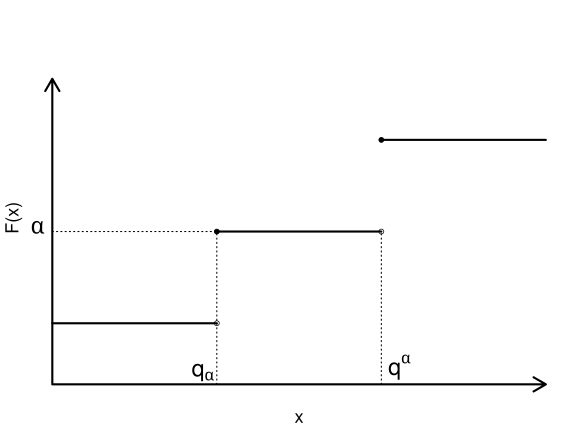

# VaR와 ES

## 개요

손실분포를 이용한 대표적 위험 측도인 VaR와 ES를 다룬다.

## 학습 목표

-   VaR의 정의와 해석을 이해한다.
-   ES의 정의와 VaR와의 차이를 설명한다.
-   위험 측도의 장단점을 비교한다.

## VaR

### VaR의 등장

1970-80년대에 금융기관은 기관 전체의 위험을 측정하기 위한 내부 모형을 개발하기 시작하였다. 여러 위험을 하나의 수치로 통합하는 일은 쉽지 않았지만, 시간이 지나면서 공통적으로 사용하는 위험 측도의 틀이 형성되었다.

대표적인 사례는 J.P. Morgan의 RiskMetrics 시스템이다. 1990년 Dennis Weatherstone은 매일 향후 24시간 동안 회사 전체가 부담하는 위험을 한 페이지 보고서로 보고받기를 원했다. 이에 따라 J.P. Morgan은 VaR를 이용해 위험을 요약하는 방식을 발전시켰다.[^index-1]

[^index-1]: RiskMetrics의 역사적 배경은 @Dowd2007 참고.

::: callout-note
VaR는 포트폴리오가 부담하는 잠재적 손실을 나타내므로 위험 메트릭(risk metric)으로 볼 수 있다. 동시에 잠재적 손실을 측정하는 구체적인 방법이므로 위험 측도(risk measure)이기도 하다.
:::

### 손익과 손실

시점 $t$의 자산 또는 포트폴리오 가치를 $V_t$라고 하자. 기간 $0$부터 $t$까지의 손익(profit and loss, P&L)은 다음과 같다.

$$
V_t - V_0
$$

이 손익의 분포를 $0$부터 $t$까지의 손익 분포라고 한다. 손실(loss)은 손익에 음수를 붙여 다음과 같이 정의한다.

$$
L_t = -(V_t - V_0).
$$ {#eq-loss-from-pnl}

따라서 $L_t>0$이면 손실이 발생한 것이고, $L_t<0$이면 이익이 발생한 것이다.

::: callout-warning
VaR는 손익을 기준으로 정의할 수도 있고 손실을 기준으로 정의할 수도 있다. 두 정의에서는 부호와 분위수의 위치가 달라지므로, 어떤 확률변수를 기준으로 삼는지 함께 확인해야 한다.
:::

### VaR를 정하는 세 요소

VaR를 측정하려면 다음 세 가지를 먼저 정해야 한다.

-   **보유 기간(VaR horizon)**: 하루, 이틀, 일주일, 한 달 등 VaR를 계산할 기간이다.
-   **손실의 분위수**: 유의수준 $\alpha$ 또는 신뢰수준 $100(1-\alpha)\%$이다.
-   **통화 단위**: 손실을 나타낼 원, 달러 등의 단위이다.

예를 들어 $\alpha=0.01$에서의 $\mathrm{VaR}_{0.01}$은 99% 신뢰수준 VaR와 같은 뜻이다. 보유 기간까지 함께 표시할 때는 다음과 같이 쓸 수 있다.

$$
\mathrm{VaR}_{\text{1-day},\alpha},
\quad
\mathrm{VaR}_{\text{1-month},\alpha},
\quad
\mathrm{VaR}_{\text{1-year},\alpha}.
$$

하루 99% VaR가 10억 원이라는 것은 정상적인 시장 조건을 가정할 때 하루 손실이 10억 원을 초과할 날이 약 100일 중 1일이라는 뜻이다 [@jorion2007value].

::: callout-note
VaR에서 말하는 최대 손실은 절대로 넘지 않는 상한이 아니다. VaR는 손실분포의 특정 분위수이므로, VaR를 초과하는 손실은 낮은 확률이지만 발생할 수 있다.
:::

### 분위수 함수

VaR는 확률과 통계에서 사용하는 분위수 함수와 밀접하게 연결되어 있다. 누적분포함수

$$
F(x) = \mathbb{P}(X \leq x)
$$

가 주어졌을 때, 분위수 함수 $Q(p)$는 다음과 같이 정의한다.

$$
Q(p) = \inf\{x : p \leq F(x)\},
\qquad 0<p<1.
$$ {#eq-quantile-function}

여기서 $\inf$는 조건을 만족하는 값들의 하한(infimum)을 뜻한다. 누적분포함수는 우연속이므로 이 정의에서 최소값을 사용해도 된다.

$X$가 연속확률변수이고 누적분포함수 $F$가 순단조증가하면 분위수 함수는 역함수로 간단히 쓸 수 있다.

$$
Q(p) = F^{-1}(p).
$$

누적분포함수에 편평한 부분이 있으면 같은 분위수에 대응하는 값이 여러 개일 수 있다. 분위수 함수는 그 값들 가운데 가장 작은 값을 선택한다.

### VaR의 정의

특정 기간 뒤의 손익을 나타내는 확률변수 $X$의 분포함수를 $F_X$라고 하자. 유의수준 $\alpha\in(0,1)$에서 VaR는 다음과 같이 정의한다.

$$
\mathrm{VaR}_\alpha(X)
=
-\inf\{x : \alpha < F_X(x)\}.
$$ {#eq-var-pnl}

$X$가 연속확률변수이고 $F_X$가 순단조증가하면, 손익 기준 VaR 정의(@eq-var-pnl)는 다음과 같이 쓸 수 있다.

$$
\mathrm{VaR}_\alpha(X)
=
-F_X^{-1}(\alpha).
$$

한편 손실 $L$을 기준으로 VaR를 정의하면 다음과 같다.

$$
\mathrm{VaR}_\alpha(L)
=
\inf\{x : 1-\alpha \leq F_L(x)\}.
$$ {#eq-var-loss}

문헌에 따라 손익 기준 VaR를 다음처럼 정의하기도 한다.

$$
\mathrm{VaR}_\alpha(X)
=
-\inf\{x\in\mathbb{R} : \alpha \leq F_X(x)\}.
$$ {#eq-var-pnl-quantile}

손익 기준 정의(@eq-var-pnl)와 분위수 기준 정의(@eq-var-pnl-quantile)는 누적분포함수에 수평인 부분이 없으면 같은 값을 준다. 수평인 부분이 있으면 두 정의가 달라질 수 있으며, 분위수 기준 정의(@eq-var-pnl-quantile)가 더 보수적인 VaR를 선택한다.[^index-2]

[^index-2]: 이산형 또는 비연속 분포에서 VaR 정의의 차이는 @Elliott2005 참고.

{#fig-two-var width="60%"}

다음 그림(@fig-two-var)에서 $q^\alpha$는 손익 기준 VaR 정의(@eq-var-pnl)에 따른 VaR의 위치이고, $q_\alpha$는 분위수 기준 정의(@eq-var-pnl-quantile)에 따른 VaR의 위치이다.
