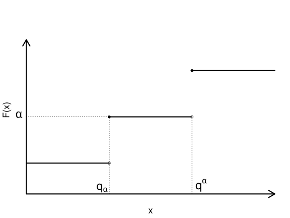
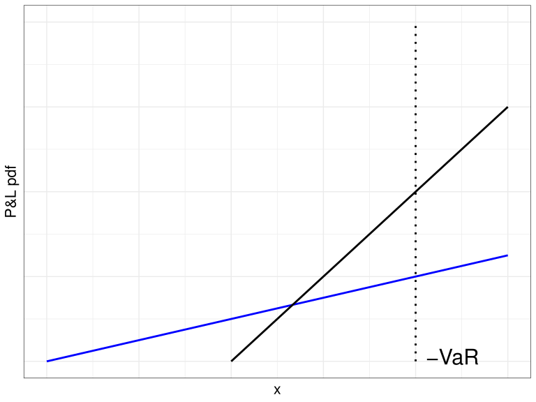
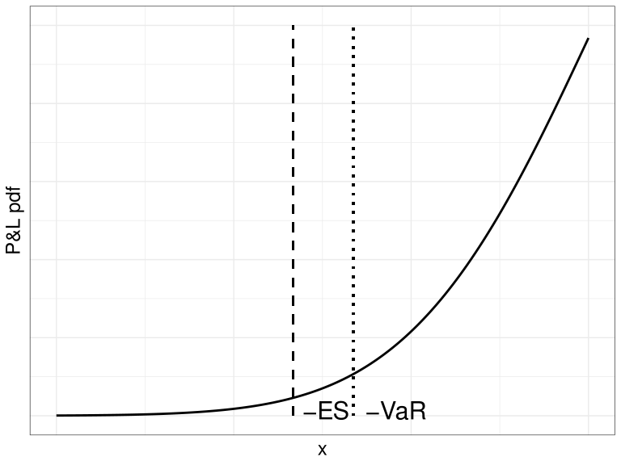
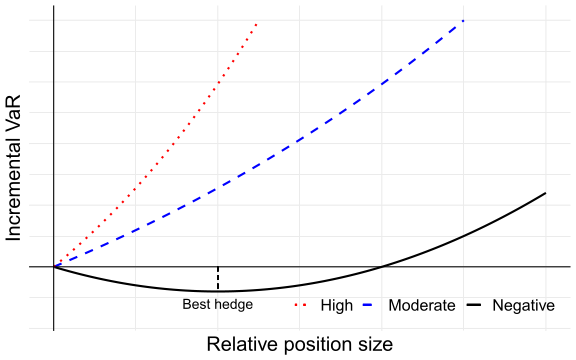

# VaR와 ES

## 개요

손실분포를 이용한 대표적 위험 측도인 VaR와 ES를 다룬다.

## 학습 목표

-   VaR의 정의와 해석을 이해한다.
-   ES의 정의와 VaR와의 차이를 설명한다.
-   위험 측도의 장단점을 비교한다.

## VaR

### VaR의 등장

1970-80년대에 금융기관은 기관 전체의 위험을 측정하기 위한 내부 모형을 개발하기 시작하였다. 여러 위험을 하나의 수치로 통합하는 일은 쉽지 않았지만, 시간이 지나면서 공통적으로 사용하는 위험 측도의 틀이 형성되었다.

대표적인 사례는 J.P. Morgan의 RiskMetrics 시스템이다. 1990년 Dennis Weatherstone은 매일 향후 24시간 동안 회사 전체가 부담하는 위험을 한 페이지 보고서로 보고받기를 원했다. 이에 따라 J.P. Morgan은 VaR를 이용해 위험을 요약하는 방식을 발전시켰다.[^index-1]

[^index-1]: RiskMetrics의 역사적 배경은 @Dowd2007 참고.

::: {.callout-note}
VaR는 포트폴리오가 부담하는 잠재적 손실을 나타내므로 위험 메트릭(risk metric)으로 볼 수 있다. 동시에 잠재적 손실을 측정하는 구체적인 방법이므로 위험 측도(risk measure)이기도 하다.
:::

### 손익과 손실

시점 $t$의 자산 또는 포트폴리오 가치를 $V_t$라고 하자. 기간 $0$부터 $t$까지의 손익(profit and loss, P&L)은 다음과 같다.

$$
V_t - V_0
$$

이 손익의 분포를 $0$부터 $t$까지의 손익 분포라고 한다. 손실(loss)은 손익에 음수를 붙여 다음과 같이 정의한다.

$$
L_t = -(V_t - V_0).
$$ {#eq-loss-from-pnl}

따라서 $L_t>0$이면 손실이 발생한 것이고, $L_t<0$이면 이익이 발생한 것이다.

::: {.callout-warning}
VaR는 손익을 기준으로 정의할 수도 있고 손실을 기준으로 정의할 수도 있다. 두 정의에서는 부호와 분위수의 위치가 달라지므로, 어떤 확률변수를 기준으로 삼는지 함께 확인해야 한다.
:::

### VaR를 정하는 세 요소

VaR를 측정하려면 다음 세 가지를 먼저 정해야 한다.

-   **보유 기간(VaR horizon)**: 하루, 이틀, 일주일, 한 달 등 VaR를 계산할 기간이다.
-   **손실의 분위수**: 유의수준 $\alpha$ 또는 신뢰수준 $100(1-\alpha)\%$이다.
-   **통화 단위**: 손실을 나타낼 원, 달러 등의 단위이다.

예를 들어 $\alpha=0.01$에서의 $\mathrm{VaR}_{0.01}$은 99% 신뢰수준 VaR와 같은 뜻이다. 보유 기간까지 함께 표시할 때는 다음과 같이 쓸 수 있다.

$$
\mathrm{VaR}_{\text{1-day},\alpha},
\quad
\mathrm{VaR}_{\text{1-month},\alpha},
\quad
\mathrm{VaR}_{\text{1-year},\alpha}.
$$

하루 99% VaR가 10억 원이라는 것은 정상적인 시장 조건을 가정할 때 하루 손실이 10억 원을 초과할 날이 약 100일 중 1일이라는 뜻이다 [@jorion2007value].

::: {.callout-note}
VaR에서 말하는 최대 손실은 절대로 넘지 않는 상한이 아니다. VaR는 손실분포의 특정 분위수이므로, VaR를 초과하는 손실은 낮은 확률이지만 발생할 수 있다.
:::

### 분위수 함수

VaR는 확률과 통계에서 사용하는 분위수 함수와 밀접하게 연결되어 있다. 누적분포함수

$$
F(x) = \mathbb{P}(X \leq x)
$$

가 주어졌을 때, 분위수 함수 $Q(p)$는 다음과 같이 정의한다.

$$
Q(p) = \inf\{x : p \leq F(x)\},
\qquad 0<p<1.
$$ {#eq-quantile-function}

여기서 $\inf$는 조건을 만족하는 값들의 하한(infimum)을 뜻한다. 누적분포함수는 우연속이므로 이 정의에서 최소값을 사용해도 된다.

$X$가 연속확률변수이고 누적분포함수 $F$가 순단조증가하면 분위수 함수는 역함수로 간단히 쓸 수 있다.

$$
Q(p) = F^{-1}(p).
$$

누적분포함수에 편평한 부분이 있으면 같은 분위수에 대응하는 값이 여러 개일 수 있다. 분위수 함수는 그 값들 가운데 가장 작은 값을 선택한다.

### VaR의 정의

특정 기간 뒤의 손익을 나타내는 확률변수 $X$의 분포함수를 $F_X$라고 하자. 유의수준 $\alpha\in(0,1)$에서 VaR는 다음과 같이 정의한다.

$$
\mathrm{VaR}_\alpha(X)
=
-\inf\{x : \alpha < F_X(x)\}.
$$ {#eq-var-pnl}

$X$가 연속확률변수이고 $F_X$가 순단조증가하면, 손익 기준 VaR 정의(@eq-var-pnl)는 다음과 같이 쓸 수 있다.

$$
\mathrm{VaR}_\alpha(X)
=
-F_X^{-1}(\alpha).
$$

한편 손실 $L$을 기준으로 VaR를 정의하면 다음과 같다.

$$
\mathrm{VaR}_\alpha(L)
=
\inf\{x : 1-\alpha \leq F_L(x)\}.
$$ {#eq-var-loss}

문헌에 따라 손익 기준 VaR를 다음처럼 정의하기도 한다.

$$
\mathrm{VaR}_\alpha(X)
=
-\inf\{x\in\mathbb{R} : \alpha \leq F_X(x)\}.
$$ {#eq-var-pnl-quantile}

손익 기준 정의(@eq-var-pnl)와 분위수 기준 정의(@eq-var-pnl-quantile)는 누적분포함수에 수평인 부분이 없으면 같은 값을 준다. 수평인 부분이 있으면 두 정의가 달라질 수 있으며, 분위수 기준 정의(@eq-var-pnl-quantile)가 더 보수적인 VaR를 선택한다.[^index-2]

[^index-2]: 이산형 또는 비연속 분포에서 VaR 정의의 차이는 @Elliott2005 참고.

{#fig-two-var width="60%"}

다음 그림(@fig-two-var)에서 $q^\alpha$는 손익 기준 VaR 정의(@eq-var-pnl)에 따른 VaR의 위치이고, $q_\alpha$는 분위수 기준 정의(@eq-var-pnl-quantile)에 따른 VaR의 위치이다.

## VaR의 성질

### 정규분포 수익률의 VaR

특정 기간의 수익률이 정규분포 $N(\mu,\sigma^2)$를 따른다고 하자. 초기 투자금이 $V_0$이면, 해당 기간의 손익은 표준정규확률변수 $Z$를 이용해 다음과 같이 나타낼 수 있다.

$$
V_T - V_0 = V_0(\mu + \sigma Z).
$$

유의수준 $\alpha$에 대해 $z_\alpha$를

$$
\mathbb{P}(Z > z_\alpha) = \alpha
$$

를 만족하는 표준정규분포의 상위 $\alpha$ 분위수라고 하자. 그러면 손익 기준 VaR는 다음과 같다.

$$
\mathrm{VaR}_\alpha
=
(-\mu+\sigma z_\alpha)V_0.
$$ {#eq-normal-var}

즉, 기대수익률이 높을수록 VaR는 작아지고 변동성이 클수록 VaR는 커진다. 또한 같은 수익률 분포라도 투자금 $V_0$가 커지면 VaR도 같은 비율로 커진다.

정규분포에서 자주 사용하는 $z_\alpha$의 값은 다음과 같다.

|   $\alpha$ |  0.005 |   0.01 |  0.025 |   0.05 |    0.1 |
|-----------:|-------:|-------:|-------:|-------:|-------:|
| $z_\alpha$ | 2.5758 | 2.3263 | 1.9600 | 1.6449 | 1.2816 |

: 유의수준별 표준정규분포 분위수

::: {.callout-note}
예를 들어 $\alpha=0.01$은 99% 신뢰수준에 해당한다. 따라서 $z_{0.01}$은 표준정규분포에서 상위 1%에 해당하는 값이다.
:::

### 예제: 연간 VaR

연간 기대수익률이 5%, 변동성이 12%인 정규분포를 따르는 자산에 2백만 달러를 투자했다고 하자. 1년 90% VaR는 $\alpha=0.1$을 사용해 계산한다.

$$
\begin{aligned}
\mathrm{VaR}_{0.1}
&=
(-0.05 + z_{0.1} \times 0.12)
\times 2{,}000{,}000 \\
&\approx 207{,}572.
\end{aligned}
$$

여기서 $z_{0.1}$는 $\mathbb{P}(Z < -z_{0.1})=0.1$을 만족하는 분위수이며, $z_{0.1}\approx 1.2816$이다. 표의 값은 표시를 위한 반올림값이다.

따라서 정상적인 시장 조건을 가정하면, 향후 1년 동안 손실이 약 207,572달러를 초과하지 않을 확률은 90%이다. 반대로 말하면 약 10%의 확률로 이 금액을 초과하는 손실이 발생할 수 있다.

### 기간 확대

여러 기간의 VaR를 계산하려면 기간별 수익률이 어떻게 누적되는지 살펴야 한다. 일간 수익률이 서로 독립이고 동일한 분포를 따른다고 가정하면, $h$일 수익률의 기대수익률과 분산은 다음과 같이 확대된다.

$$
\mu_h = h\mu_{\text{day}},
\qquad
\sigma_h^2 = h\sigma_{\text{day}}^2.
$$

따라서 표준편차는 기간의 제곱근에 비례한다.

$$
\sigma_h = \sqrt{h}\sigma_{\text{day}}.
$$

::: {.callout-warning}
기간 확대는 일간 수익률이 독립이고 동일한 분포를 따른다는 가정에 의존한다. 금융 수익률에는 변동성 군집이 나타날 수 있으므로, 이 가정이 적절하지 않은 경우에는 단순한 제곱근 시간 법칙을 그대로 적용하기 어렵다.
:::

### 예제: 5일 VaR

어떤 투자자가 10,000달러어치 자산을 보유하고 있다고 하자. 연간 수익률의 기댓값은 0.05이고 분산은 0.04이다. 1년을 250거래일로 두고, 일간 수익률이 독립이고 동일한 분포를 따른다고 가정한다.

일간 기대수익률과 분산은 각각 다음과 같다.

$$
\mu_{\text{day}}
=
\frac{0.05}{250}
=
0.0002,
\qquad
\sigma_{\text{day}}^2
=
\frac{0.04}{250}
=
0.00016.
$$

따라서 5일 수익률의 기대수익률과 분산은 다음과 같다.

$$
\mu_5
=
5 \times 0.0002
=
0.001,
\qquad
\sigma_5^2
=
5 \times 0.00016
=
0.0008.
$$

5일 99% VaR는 식 @eq-normal-var 에 따라 계산할 수 있다.

$$
\begin{aligned}
\mathrm{VaR}_{0.01}
&=
(-0.001 + 2.3263\sqrt{0.0008})
\times 10{,}000 \\
&\approx 647.99.
\end{aligned}
$$

즉, 이 가정 아래에서 향후 5일 동안 손실이 약 647.99달러를 초과할 확률은 1%이다.

### 분산투자와 VaR의 한계

분산은 일반적으로 분산투자를 하면 같거나 감소한다. VaR도 많은 경우 이러한 성질을 보이지만, 항상 그런 것은 아니다. 특히 이산형 손실분포에서는 분산투자 후 VaR가 오히려 커질 수 있다.

어떤 은행이 한 기업에 100,000달러를 대출했다고 하자. 부도확률은 0.008이고, 부도하면 회수금은 없다고 가정한다. 이 대출의 손익 $X$는 다음과 같다.

$$
X =
\begin{cases}
0, & \text{확률 } 0.992, \\
-100{,}000, & \text{확률 } 0.008.
\end{cases}
$$

유의수준 $\alpha=0.01$에서 부도확률 0.008은 0.01보다 작으므로 이 대출의 VaR는 0달러이다.

이제 서로 독립인 두 기업에 각각 50,000달러씩 대출했다고 하자. 각 기업의 부도확률은 앞과 같이 0.008이다. 전체 대출의 손익은 다음과 같이 분포한다.

$$
X =
\begin{cases}
0, & \text{확률 } 0.992^2 = 0.984064, \\
-50{,}000, & \text{확률 } 2 \times 0.008 \times 0.992 = 0.015872, \\
-100{,}000, & \text{확률 } 0.008^2 = 0.000064.
\end{cases}
$$

이 경우 $\alpha=0.01$에서 VaR는 50,000달러이다. 개별 대출의 VaR는 각각 0달러이지만, 두 대출을 합친 포트폴리오의 VaR는 50,000달러가 된다.

::: {.callout-warning}
이 결과는 분산투자가 실제 위험을 높였다는 뜻이 아니다. 특정 분위수만 보는 VaR가 이산형 손실분포에서 분산투자의 효과를 충분히 반영하지 못할 수 있음을 보여주는 예이다.
:::

이러한 현상은 VaR가 항상 다음의 부가산성(subadditivity)을 만족하지는 않는다는 뜻이다.

$$
\mathrm{VaR}_\alpha(X+Y)
\leq
\mathrm{VaR}_\alpha(X)
+
\mathrm{VaR}_\alpha(Y).
$$

다만 손익이 정규분포나 $t$분포처럼 타원형 분포(elliptical distribution)를 따르면 VaR는 부가산성을 만족한다.

### VaR의 기본 성질

손익을 나타내는 확률변수 $X$와 $Y$에 대해 VaR는 다음 성질을 가진다.

-   $X\geq0$이면 $\mathrm{VaR}_\alpha(X)\leq0$이다. 손익이 항상 0 이상이면 손실 위험은 없거나 음수이다.
-   $X\geq Y$이면 $\mathrm{VaR}_\alpha(X)\leq\mathrm{VaR}_\alpha(Y)$이다. 항상 더 좋은 성과를 내는 자산의 VaR는 더 작다.
-   $\lambda\geq0$이면 $\mathrm{VaR}_\alpha(\lambda X)=\lambda\mathrm{VaR}_\alpha(X)$이다. 포지션 규모를 $\lambda$배로 키우면 VaR도 $\lambda$배가 된다.
-   실수 $k$에 대해 $\mathrm{VaR}_\alpha(X+k)=\mathrm{VaR}_\alpha(X)-k$이다. 확정된 수익 $k$가 추가되면 VaR는 그만큼 감소한다.

### VaR의 장점과 한계

VaR는 채권, 주식, 파생상품 등 다양한 금융자산에 공통적으로 적용할 수 있고, 복잡한 포트폴리오의 위험을 하나의 통화 단위로 요약할 수 있다는 장점이 있다. 또한 공분산 행렬을 이용한 모형뿐 아니라 시뮬레이션과 역사적 자료를 이용한 방법에도 적용할 수 있다.[^index-3]

[^index-3]: VaR와 포트폴리오 이론의 관계 및 VaR 방법의 특징은 @Dowd2007 참고.

반면 VaR는 모형의 가정과 추정 방법에 따라 크게 달라질 수 있다. 또한 VaR는 특정 분위수에서의 손실만 알려 줄 뿐, VaR를 초과한 더 큰 손실의 규모와 꼬리위험의 형태는 설명하지 못한다.

이러한 한계는 다음 절에서 다룰 Expected Shortfall(ES)이 필요한 이유가 된다.

## Expected Shortfall

### VaR가 설명하지 못하는 꼬리위험

VaR는 손실분포의 특정 분위수를 통화 단위로 요약한다. 그러나 VaR를 초과하는 손실이 발생했을 때 그 손실이 얼마나 클 수 있는지는 알려 주지 않는다.

아래 그림의 두 손익(P&L) 분포는 같은 VaR를 가진다고 하자. VaR 왼쪽 영역의 확률은 같지만, 파란색 분포는 더 긴 왼쪽 꼬리를 가진다. 따라서 VaR를 초과하는 손실이 발생하면 파란색 분포에서 더 큰 손실이 나타날 가능성이 높다.

{#fig-tail-compare width="60%"}

그림(@fig-tail-compare)은 VaR가 꼬리 부분의 손실 규모를 충분히 설명하지 못할 수 있음을 보여 준다.

### Expected Shortfall의 정의

Expected Shortfall(ES)은 VaR 수준과 같거나 더 큰 손실이 발생했을 때의 평균 손실을 나타내는 위험 측도이다. 손익을 나타내는 확률변수 $X$가 연속분포를 따르면, 유의수준 $\alpha$에서 ES는 다음과 같이 정의한다.

$$
\mathrm{ES}_{\alpha}(X)
=
-\mathbb{E}
\left[
X
\mid
X\leq-\mathrm{VaR}_{\alpha}(X)
\right]
=
-\frac{1}{\alpha}
\int_{-\infty}^{-\mathrm{VaR}_{\alpha}}
x f(x)\,\mathrm{d}x.
$$ {#eq-es-continuous}

여기서 $f$는 $X$의 확률밀도함수이다. 즉, ES는 손실분포의 하위 $\alpha$ 영역에서 발생하는 손실의 평균을 측정한다.

이 정의는 연속분포에서는 직관적이지만, 이산형 분포에서는 경계점에 확률질량이 모여 하위 $\alpha$ 영역의 확률이 정확히 $\alpha$가 되지 않을 수 있다. 이 경우에도 사용할 수 있는 일반적 정의는 분위수 함수를 적분하는 방식이다.

$$
\mathrm{ES}_{\alpha}(X)
=
\frac{1}{\alpha}
\int_{0}^{\alpha}
\mathrm{VaR}_{\gamma}(X)\,\mathrm{d}\gamma.
$$ {#eq-es-general}

일반적 정의(@eq-es-general)는 연속분포뿐 아니라 이산형 분포에도 적용할 수 있다.[^index-4]

[^index-4]: 이산형 또는 비연속 분포에서 Expected Shortfall의 일반적 정의는 @Elliott2005 참고.

일반적으로 ES는 VaR보다 크다. ES가 VaR를 초과하는 손실들의 평균을 나타내기 때문이다.

{#fig-es-var width="60%"}

그림(@fig-es-var)에서 ES는 VaR보다 더 왼쪽, 즉 더 큰 손실이 발생하는 영역을 반영한다.

### 정규분포에서의 ES

손익 $X$가 정규분포 $N(\mu,\sigma^2)$를 따르고, $z_\alpha$가 표준정규분포의 상위 $\alpha$ 분위수라고 하자. 이때 ES는 다음과 같다.

$$
\mathrm{ES}_{\alpha}
=
-\mu
+
\sigma
\frac{\exp(-z_\alpha^2/2)}
{\alpha\sqrt{2\pi}}
=
-\mu
+
\sigma
\frac{\phi(z_\alpha)}{\alpha}.
$$ {#eq-normal-es}

여기서 $\phi(\cdot)$는 표준정규분포의 확률밀도함수이다.

### 예제: 표준정규분포의 VaR와 ES

손익이 표준정규분포를 따른다고 하자. 유의수준 $\alpha=0.01$에서는

$$
\mathrm{VaR}_{0.01}
=
z_{0.01}
\approx
2.3263
$$

이다. 같은 유의수준에서 ES는 식(@eq-normal-es)에 따라 다음과 같이 계산한다.

$$
\mathrm{ES}_{0.01}
=
\frac{\exp(-z_{0.01}^2/2)}
{0.01\sqrt{2\pi}}
\approx
2.6652.
$$

따라서 $\mathrm{ES}_{0.01}>\mathrm{VaR}_{0.01}$이다. VaR가 1% 분위수의 손실을 나타낸다면, ES는 그보다 더 나쁜 1% 상황에서의 평균 손실을 나타낸다.

### Coherent Risk Measure

손익 분포 확률변수 $X$, $Y$에 대해 위험 측도 $\rho$가 다음 성질을 만족하면 일관된 위험 측도(coherent risk measure)라고 한다.

-   $X=0$이면 $\rho(X)=0$이다.
-   $X\geq Y$이면 $\rho(X)\leq\rho(Y)$이다.
-   $\lambda\geq0$이면 $\rho(\lambda X)=\lambda\rho(X)$이다.
-   실수 $k$에 대해 $\rho(X+k)=\rho(X)-k$이다.
-   $\rho(X+Y)\leq\rho(X)+\rho(Y)$이다.

마지막 성질은 부가산성(subadditivity)이다. 포트폴리오를 결합했을 때의 위험이 각 포지션 위험의 합보다 커지지 않아야 한다는 뜻이다.

ES는 이 다섯 성질을 만족하는 일관된 위험 측도이다 [@artzner1999coherent]. 반면 VaR는 앞의 네 성질은 만족하지만, 이산형 분포에서는 부가산성을 만족하지 않을 수 있다.

### 예제: 분산 대출의 ES

앞의 VaR 예제와 같이 부도확률이 0.008인 대출을 생각하자. 유의수준은 $\alpha=0.01$이다.

#### 단일 대출

100,000달러를 한 기업에 대출하고, 부도하면 전액을 잃는다고 하자. 이산형 분포의 일반적 정의(@eq-es-general)를 이용하면 다음과 같다.

$$
\begin{aligned}
\mathrm{ES}_{0.01}
&=
\frac{1}{0.01}
\left(
\int_0^{0.008}
100{,}000\,\mathrm{d}\gamma
+
\int_{0.008}^{0.01}
0\,\mathrm{d}\gamma
\right) \\
&=
\frac{800}{0.01}
=
80{,}000.
\end{aligned}
$$

따라서 단일 대출의 ES는 80,000달러이다.

#### 두 기업에 나누어 대출

이제 서로 독립인 두 기업에 각각 50,000달러씩 대출한다고 하자. 손실 100,000달러가 발생할 확률은 $0.008^2=0.000064$이고, 손실 50,000달러가 발생할 확률은 $2\times0.008\times0.992=0.015872$이다.

$$
\begin{aligned}
\mathrm{ES}_{0.01}
&=
\frac{1}{0.01}
\left(
\int_0^{0.000064}
100{,}000\,\mathrm{d}\gamma
+
\int_{0.000064}^{0.01}
50{,}000\,\mathrm{d}\gamma
\right) \\
&=
\frac{6.4+496.8}{0.01}
=
50{,}320.
\end{aligned}
$$

분산 대출의 ES는 50,320달러로 단일 대출의 ES보다 작다. ES는 이처럼 분산투자로 인한 꼬리위험 감소를 반영하며, 부가산성을 만족한다.

::: {.callout-note}
VaR는 두 대출을 결합했을 때 0달러에서 50,000달러로 증가하는 모습을 보일 수 있었다. 그러나 ES는 극단적 손실까지 평균에 반영하므로, 분산 대출의 위험 감소를 더 일관되게 보여 준다.
:::

### 규제에서의 ES

VaR는 1996년 바젤위원회의 시장위험 규제에서 내부모형 기반 자본요건 산정에 사용되었다. 그러나 2007-2008년 금융위기에서는 VaR가 극단적 손실, 즉 꼬리위험을 충분히 반영하지 못한다는 한계가 드러났다.

이에 따라 바젤위원회는 거래계정의 근본적 검토(Fundamental Review of the Trading Book, FRTB)를 통해 VaR 대신 97.5% 신뢰수준의 ES를 도입하였다. FRTB에서는 자산의 유동성에 따라 보유 기간을 달리 적용하고, 내부모형의 사용 기준도 강화하였다.[^index-5]

[^index-5]: FRTB의 ES 도입 배경은 [@Basel2019] 참고.

## Portfolio VaR

앞에서는 하나의 자산이나 대출의 손익 분포를 이용해 VaR와 ES를 계산하였다. 이제 여러 자산으로 이루어진 포트폴리오의 위험을 계산하고, 각 자산이 전체 위험에 얼마나 기여하는지 살펴본다.

이 절에서는 [현대 포트폴리오 이론](../02-modern-portfolio-theory/index.qmd)에서 사용한 수익률 벡터와 공분산 행렬을 다시 이용한다. 동일한 투자 기간에 대한 자산 수익률 벡터를

$$
\mathbf{R}
=
\begin{bmatrix}
R_1 \\
\vdots \\
R_N
\end{bmatrix}
$$

라고 하고, $\mathbf{R}$가 기대수익률 벡터 $\boldsymbol{\mu}$와 공분산 행렬 $\mathbf{C}$를 갖는 다변량 정규분포를 따른다고 가정한다.

초기 자본을 $W_0>0$, 투자 비중 벡터를 $\mathbf{w}$라고 하면, 각 자산의 투자 금액 벡터는 다음과 같다.

$$
\mathbf{x}
=
W_0\mathbf{w},
\qquad
x_i=W_0w_i.
$$

여기서 $\sum_{i=1}^N w_i=1$이며, 공매도를 허용하면 일부 $w_i$는 음수일 수 있다. 포트폴리오 수익률과 손익은 각각 다음과 같다.

$$
R_p=\mathbf{w}^{\top}\mathbf{R},
\qquad
X_p=W_0R_p=\mathbf{x}^{\top}\mathbf{R}.
$$

정규성 가정은 실제 금융 수익률의 두꺼운 꼬리를 충분히 설명하지 못할 수 있다. 그러나 포트폴리오 위험과 자산별 위험 기여도를 간결한 식으로 나타낼 수 있어, 분산투자의 효과를 이해하는 출발점이 된다.

### 포트폴리오 VaR와 분산효과

포트폴리오 수익률의 기대수익률과 분산은 다음과 같다.

$$
\mu_p=\mathbf{w}^{\top}\boldsymbol{\mu},
$$

$$
\begin{aligned}
\sigma_p^2
&=
\mathbf{w}^{\top}\mathbf{C}\mathbf{w} \\
&=
\sum_{i=1}^{N}w_i^2\sigma_i^2
+
2\sum_{i=1}^{N}\sum_{j<i}
w_iw_j\operatorname{Cov}(R_i,R_j).
\end{aligned}
$$ {#eq-portfolio-variance}

다변량 정규분포의 선형결합도 정규분포를 따르므로, 식 @eq-normal-var 에 따라 포트폴리오 VaR는 다음과 같다.

$$
\mathrm{VaR}_{p,\alpha}
=
\left(
-\mathbf{w}^{\top}\boldsymbol{\mu}
+
z_\alpha\sigma_p
\right)W_0.
$$

이하에서는 분산효과와 위험 기여도에 집중하기 위해 각 자산의 기대수익률을 0으로 가정한다. 또한 $0<\alpha<0.5$로 두고, 유의수준이 고정되어 있으면 아래첨자 $\alpha$를 생략한다.

::: {.callout-note}
기대수익률을 0으로 두면 변동성에 따른 위험만 남는다. 이는 미래 금액을 현재가치로 환산하는 할인과는 다른 단순화이다. 기대수익률을 포함하려면 위 식의 $-\mathbf{w}^{\top}\boldsymbol{\mu}W_0$ 항을 함께 사용해야 한다.
:::

이 가정 아래에서 포트폴리오 VaR는 다음과 같다.

$$
\begin{aligned}
\mathrm{VaR}_p
&=
z_\alpha\sigma_pW_0 \\
&=
z_\alpha
\sqrt{\mathbf{w}^{\top}\mathbf{C}\mathbf{w}}\,W_0 \\
&=
z_\alpha
\sqrt{\mathbf{x}^{\top}\mathbf{C}\mathbf{x}}.
\end{aligned}
$$ {#eq-portfolio-var}

이 값은 자산 사이의 공분산을 반영하므로 분산효과를 고려한 VaR, 즉 diversified VaR라고도 한다.

### Individual VaR와 undiversified VaR

Individual VaR는 포트폴리오의 구성 자산 하나를 따로 보유한다고 생각하고 계산한 VaR이다. 기대수익률을 0으로 둔 정규분포 모형에서 자산 $i$의 individual VaR는 다음과 같다.

$$
\mathrm{VaR}_i
=
z_\alpha\sigma_i|x_i|
=
z_\alpha\sigma_i|w_i|W_0.
$$ {#eq-individual-var}

절댓값은 공매도 포지션도 고려하기 위해 사용한다. 기대수익률이 0인 정규분포에서는 같은 크기의 매수 포지션과 공매도 포지션이 같은 individual VaR를 가진다.

Undiversified VaR는 individual VaR를 모두 더한 값이다.

$$
\mathrm{VaR}_{\mathrm{undiv}}
=
\sum_{i=1}^{N}\mathrm{VaR}_i.
$$

현재의 정규분포 가정 아래에서는 다음 관계가 성립한다.

$$
\mathrm{VaR}_p
\leq
\sum_{i=1}^{N}\mathrm{VaR}_i.
$$

따라서 분산투자로 얻는 위험 감소 효과를 다음 차이로 나타낼 수 있다.

$$
\text{분산효과}
=
\mathrm{VaR}_{\mathrm{undiv}}
-
\mathrm{VaR}_p.
$$

모든 포지션이 매수이고 자산 수익률 사이의 상관계수가 모두 1이면 두 VaR가 같아진다. 공매도를 포함할 때는 수익률의 상관관계뿐 아니라 포지션의 부호도 함께 고려해야 한다.

### 예제: 두 자산의 포트폴리오 VaR {#sec-example-portfolio-var}

두 자산의 수익률 표준편차와 상관계수가 다음과 같다고 하자.

$$
\sigma_1=0.05,
\qquad
\sigma_2=0.12,
\qquad
\rho_{12}=0.2.
$$

공분산 행렬은 다음과 같다.

$$
\mathbf{C}
=
\begin{bmatrix}
0.05^2 & 0.2\times0.05\times0.12 \\
0.2\times0.05\times0.12 & 0.12^2
\end{bmatrix}
=
\begin{bmatrix}
0.0025 & 0.0012 \\
0.0012 & 0.0144
\end{bmatrix}.
$$

자산 1과 자산 2에 각각 2,500달러와 7,500달러를 투자하면,

$$
W_0=10{,}000,
\qquad
\mathbf{w}
=
\begin{bmatrix}
0.25 \\
0.75
\end{bmatrix}
$$

이다. 포트폴리오 수익률의 분산과 표준편차는 다음과 같다.

$$
\begin{aligned}
\sigma_p^2
&=
0.25^2\times0.05^2
+
0.75^2\times0.12^2
+
2\times0.25\times0.75\times0.0012 \\
&=
0.00870625,
\end{aligned}
$$

$$
\sigma_p
=
\sqrt{0.00870625}
\approx
0.0933073.
$$

95% 신뢰수준에서는 $\alpha=0.05$이고 $z_{0.05}\approx1.6449$이므로,

$$
\mathrm{VaR}_p
=
z_{0.05}\sqrt{0.00870625}\times10{,}000
\approx
1{,}534.77
$$

이다. 각 자산의 individual VaR는 다음과 같다.

$$
\begin{aligned}
\mathrm{VaR}_1
&=
z_{0.05}\times0.05\times2{,}500
\approx205.61, \\
\mathrm{VaR}_2
&=
z_{0.05}\times0.12\times7{,}500
\approx1{,}480.37.
\end{aligned}
$$

따라서 undiversified VaR와 분산효과는 각각 다음과 같다.

$$
\mathrm{VaR}_{\mathrm{undiv}}
\approx
1{,}685.97,
$$

$$
\mathrm{VaR}_{\mathrm{undiv}}
-
\mathrm{VaR}_p
\approx
151.21.
$$

두 자산을 함께 보유하면 개별 위험의 합보다 포트폴리오 위험이 작아진다. 이는 두 자산이 항상 같은 방향과 비율로 움직이지 않기 때문이다.

::: {.callout-note}
이하 예제에서는 계산 중간에 충분한 자릿수를 유지하고 최종 결과를 반올림한다. 따라서 표시된 반올림값만 더하거나 곱하면 마지막 자릿수에 차이가 생길 수 있다. 금액의 단위는 달러이다.
:::

### Marginal VaR

포트폴리오 전체의 VaR를 아는 것만으로는 어떤 자산의 투자 금액을 조정해야 할지 판단하기 어렵다. 이를 위해 각 자산의 투자 금액 변화에 대한 VaR의 민감도를 살펴본다.

자산 $i$의 marginal VaR는 다른 자산의 투자 금액을 고정한 상태에서 $x_i$를 미소하게 변화시킬 때의 포트폴리오 VaR 변화율이다.

$$
\Delta\mathrm{VaR}_i
=
\frac{\partial\mathrm{VaR}_p}{\partial x_i}.
$$

식 @eq-portfolio-var 를 투자 금액 $x_i$에 대해 미분하면, $\sigma_p>0$일 때 다음을 얻는다.

$$
\Delta\mathrm{VaR}_i
=
z_\alpha
\frac{(\mathbf{C}\mathbf{x})_i}
{\sqrt{\mathbf{x}^{\top}\mathbf{C}\mathbf{x}}}.
$$

여기서 $(\mathbf{C}\mathbf{x})_i$는 벡터 $\mathbf{C}\mathbf{x}$의 $i$번째 원소이다.

$\mathbf{x}=W_0\mathbf{w}$이고

$$
(\mathbf{C}\mathbf{w})_i
=
\sum_{j=1}^{N}
w_j\operatorname{Cov}(R_i,R_j)
=
\operatorname{Cov}(R_i,R_p)
$$

이므로, marginal VaR는 다음과 같이 나타낼 수 있다.

$$
\Delta\mathrm{VaR}_i
=
z_\alpha
\frac{\operatorname{Cov}(R_i,R_p)}{\sigma_p}.
$$ {#eq-marginal-var}

투자 금액의 작은 변화 $\delta x_i$에 대해서는

$$
\text{포트폴리오 VaR의 변화}
\approx
\Delta\mathrm{VaR}_i\,\delta x_i
$$

이다. 따라서 marginal VaR가 양수이면 해당 자산의 투자 금액 증가가 VaR를 높이는 방향으로 작용하고, 음수이면 VaR를 낮추는 방향으로 작용한다.

::: {.callout-note}
Marginal VaR는 위험 금액 자체가 아니라 투자 금액 한 단위당 위험의 변화율이다. 예를 들어 marginal VaR가 0.03이면, 해당 자산에 1달러를 추가할 때 포트폴리오 VaR가 약 0.03달러 증가한다는 뜻이다.

총투자금을 유지하면서 자산 비중을 바꾸면 여러 투자 금액이 동시에 변하므로, 조정되는 모든 자산의 marginal VaR를 함께 사용해야 한다.
:::

포트폴리오 $p$에 대한 자산 $i$의 베타를 다음과 같이 정의하자.

$$
\beta_i
=
\frac{\operatorname{Cov}(R_i,R_p)}{\sigma_p^2}.
$$

그러면 식 @eq-marginal-var 는 다음과 같이 쓸 수 있다.

$$
\Delta\mathrm{VaR}_i
=
\frac{\mathrm{VaR}_p}{W_0}\beta_i.
$$ {#eq-marginal-var-beta}

여기서 $\beta_i$는 현재 분석하는 포트폴리오에 대한 민감도이다. CAPM에서 사용하는 시장 포트폴리오에 대한 베타와는 기준 포트폴리오가 다를 수 있다.

### 예제: 두 자산의 marginal VaR

앞의 두 자산 예제에서 각 자산 수익률과 포트폴리오 수익률의 공분산은 다음과 같다.

$$
\begin{aligned}
\operatorname{Cov}(R_1,R_p)
&=
0.25\times0.0025
+
0.75\times0.0012 \\
&=
0.001525, \\
\operatorname{Cov}(R_2,R_p)
&=
0.25\times0.0012
+
0.75\times0.0144 \\
&=
0.0111.
\end{aligned}
$$

Marginal VaR를 원소로 갖는 벡터를 $\Delta\boldsymbol{\mathrm{VaR}}$라고 하면,

$$
\Delta\boldsymbol{\mathrm{VaR}}
=
\frac{z_{0.05}}{\sqrt{0.00870625}}
\begin{bmatrix}
0.001525 \\
0.0111
\end{bmatrix}
\approx
\begin{bmatrix}
0.026883 \\
0.195675
\end{bmatrix}
$$

이다.

현재 포트폴리오에서는 자산 2의 투자 금액을 늘릴 때 VaR가 더 크게 증가한다. 이러한 차이는 각 자산의 변동성과 현재 포트폴리오와의 공분산을 함께 반영한 결과이다.

### Incremental VaR

Marginal VaR가 미소한 투자 금액 변화에 대한 민감도라면, incremental VaR는 실제 포지션 변경 전후의 VaR 차이이다.

추가 투자 금액 벡터를 $\mathbf{a}$라고 하자. $a_i>0$이면 자산 $i$의 투자 금액을 늘리고, $a_i<0$이면 줄인다는 뜻이다. 변경 후 투자 금액 벡터는 $\mathbf{x}+\mathbf{a}$이다.

Incremental VaR는 다음과 같이 정의한다.

$$
\mathrm{IVaR}(\mathbf{a})
=
\mathrm{VaR}(\mathbf{x}+\mathbf{a})
-
\mathrm{VaR}(\mathbf{x}).
$$ {#eq-incremental-var}

정규분포 모형에서 그 값은 다음과 같다.

$$
\mathrm{IVaR}(\mathbf{a})
=
z_\alpha
\left[
\sqrt{
(\mathbf{x}+\mathbf{a})^{\top}
\mathbf{C}
(\mathbf{x}+\mathbf{a})
}
-
\sqrt{
\mathbf{x}^{\top}\mathbf{C}\mathbf{x}
}
\right].
$$

포지션 변경 후의 위험을 매번 다시 계산하는 대신, 변경 규모가 작으면 테일러 전개의 일차항으로 근사할 수 있다.[^index-6]

[^index-6]: Marginal VaR를 이용한 incremental VaR의 일차 근사는 [@garman1996improving] 참고.

$$
\mathrm{IVaR}(\mathbf{a})
\approx
\mathbf{a}^{\top}
\Delta\boldsymbol{\mathrm{VaR}}
=
\sum_{i=1}^{N}
a_i\Delta\mathrm{VaR}_i.
$$ {#eq-incremental-var-approx}

이때 marginal VaR는 변경 전 포트폴리오에서 계산한 값이다.

### 예제: 두 자산의 투자 금액 조정

앞의 두 자산 예제에서 자산 1의 투자 금액을 500달러 늘리고, 자산 2의 투자 금액을 500달러 줄인다고 하자.

$$
\mathbf{a}
=
\begin{bmatrix}
500 \\
-500
\end{bmatrix}.
$$

총투자금은 10,000달러로 유지되며, 변경 후 투자 비중은 다음과 같다.

$$
\mathbf{w}_{\mathrm{new}}
=
\begin{bmatrix}
0.3 \\
0.7
\end{bmatrix}.
$$

변경 후 포트폴리오 분산은

$$
\begin{aligned}
\sigma_{\mathrm{new}}^2
&=
0.3^2\times0.0025
+
0.7^2\times0.0144
+
2\times0.3\times0.7\times0.0012 \\
&=
0.007785
\end{aligned}
$$

이므로, VaR를 다시 계산하면 다음과 같다.

$$
\mathrm{VaR}_{\mathrm{new}}
=
z_{0.05}\sqrt{0.007785}\times10{,}000
\approx
1{,}451.30.
$$

따라서 incremental VaR는

$$
\mathrm{IVaR}(\mathbf{a})
\approx
1{,}451.30-1{,}534.77
=
-83.47
$$

이다. 투자 비중 조정으로 포트폴리오 VaR가 약 83.47달러 감소하였다.

한편 marginal VaR를 이용한 일차 근사는 다음과 같다.

$$
\begin{aligned}
\mathrm{IVaR}(\mathbf{a})
&\approx
500\Delta\mathrm{VaR}_1
-
500\Delta\mathrm{VaR}_2 \\
&\approx
-84.40.
\end{aligned}
$$

이에 따른 변경 후 VaR의 근사값은 약 1,450.37달러로, 직접 다시 계산한 1,451.30달러와 가깝다.

### 헤지와 근사의 범위

Incremental VaR가 음수이면 해당 포지션 변경으로 전체 VaR가 감소했다는 뜻이다. 이 경우 추가된 포지션은 기존 포트폴리오에 대해 헤지 역할을 한다.

그러나 처음에 위험을 줄여 주는 방향이라도 포지션을 계속 확대하면 위험이 다시 증가할 수 있다. 특정 방향의 포지션 조정에서 VaR가 가장 작아지는 지점을 최적 헤지(best hedge)라고 한다.

{#fig-incremental-var width="80%"}

그림 @fig-incremental-var 는 포지션 추가에 따른 위험 변화가 추가 규모에 따라 달라질 수 있음을 보여 준다.

::: {.callout-warning}
Marginal VaR를 이용한 근사는 현재 포트폴리오 부근의 작은 변화에 대한 근사이다. 투자 금액을 크게 조정하거나 자산을 전부 제거하는 경우에는 변경 후 VaR를 다시 계산하여 확인해야 한다.
:::

### Component VaR

Individual VaR는 자산을 단독으로 보유할 때의 위험이다. 따라서 individual VaR의 합은 분산효과를 반영한 포트폴리오 VaR와 일반적으로 다르다.

전체 VaR를 각 자산의 기여분으로 나누기 위해 component VaR를 사용한다. 자산 $i$의 component VaR는 투자 금액과 marginal VaR의 곱으로 정의한다.

$$
\mathrm{CVaR}_i
=
x_i\Delta\mathrm{VaR}_i
=
w_iW_0\Delta\mathrm{VaR}_i.
$$ {#eq-component-var}

여기서 $\mathrm{CVaR}_i$는 component VaR를 뜻한다. 다른 문헌에서 ES의 이름으로 사용하는 conditional VaR와는 구분해야 한다.

식 @eq-marginal-var-beta 를 이용하면 다음과 같이 나타낼 수 있다.

$$
\mathrm{CVaR}_i
=
w_i\beta_i\mathrm{VaR}_p.
$$ {#eq-component-var-beta}

Component VaR는 현재 포지션의 크기와 위험 민감도를 함께 반영한다. 해당 포지션을 현재 방향으로 조금 확대하면, component VaR가 양수일 때는 VaR가 증가하고 음수일 때는 감소한다.

#### 합산 성질

Component VaR를 모두 더하면 포트폴리오 VaR가 된다.

$$
\begin{aligned}
\sum_{i=1}^{N}\mathrm{CVaR}_i
&=
\frac{z_\alpha W_0}{\sigma_p}
\sum_{i=1}^{N}
w_i\operatorname{Cov}(R_i,R_p) \\
&=
\frac{z_\alpha W_0}{\sigma_p}
\operatorname{Cov}
\left(
\sum_{i=1}^{N}w_iR_i,
R_p
\right) \\
&=
\frac{z_\alpha W_0}{\sigma_p}\sigma_p^2 \\
&=
\mathrm{VaR}_p.
\end{aligned}
$$ {#eq-component-var-sum}

이 성질 덕분에 component VaR를 이용해 전체 위험을 자산별로 배분할 수 있다. 각 자산의 위험 기여 비율은 다음과 같다.

$$
\frac{\mathrm{CVaR}_i}{\mathrm{VaR}_p}
=
w_i\beta_i.
$$

기여 비율의 합은 1이다. 다만 헤지 포지션이 있으면 일부 기여 비율이 음수가 되고, 다른 자산의 기여 비율은 100%를 넘을 수도 있다.

#### Individual VaR와의 관계

자산 $i$와 포트폴리오의 상관계수를

$$
\rho_i
=
\frac{\operatorname{Cov}(R_i,R_p)}
{\sigma_i\sigma_p}
$$

라고 하면,

$$
\begin{aligned}
\mathrm{CVaR}_i
&=
z_\alpha\sigma_iw_iW_0\rho_i \\
&=
\operatorname{sign}(w_i)\rho_i\mathrm{VaR}_i.
\end{aligned}
$$ {#eq-component-individual-var}

즉, component VaR는 individual VaR에 포트폴리오와의 상관관계 및 포지션의 방향을 반영한 값이다.

::: {.callout-note}
자산 $i$를 전부 제거하는 변화는 $a_i=-x_i$이다. 일차 근사를 적용하면

$$
\mathrm{VaR}_{\mathrm{제거\ 후}}
-
\mathrm{VaR}_p
\approx
-\mathrm{CVaR}_i
$$

이다. 따라서 component VaR는 자산 제거에 따른 VaR 감소액의 근사값으로 볼 수 있다. 다만 전체 포지션 제거는 큰 변화일 수 있으므로, 이 근사가 항상 정확한 것은 아니다.
:::

### 예제: 두 자산의 component VaR

앞의 두 자산 예제에서 component VaR는 다음과 같다.

$$
\begin{aligned}
\mathrm{CVaR}_1
&=
2{,}500\Delta\mathrm{VaR}_1
\approx67.21, \\
\mathrm{CVaR}_2
&=
7{,}500\Delta\mathrm{VaR}_2
\approx1{,}467.56.
\end{aligned}
$$

두 기여분의 합은 포트폴리오 VaR와 같다.

$$
\mathrm{CVaR}_1+\mathrm{CVaR}_2
=
\mathrm{VaR}_p
\approx
1{,}534.77.
$$

| 자산   | 투자 금액 | Individual VaR | Component VaR | 위험 기여 비율 |
|:-------|----------:|---------------:|--------------:|---------------:|
| 자산 1 |     2,500 |         205.61 |         67.21 |          4.38% |
| 자산 2 |     7,500 |       1,480.37 |      1,467.56 |         95.62% |

: 두 자산의 개별 위험과 포트폴리오 위험 기여도

자산 1은 전체 투자금의 25%를 차지하지만 VaR 기여 비율은 약 4.38%이다. 투자 비중과 위험 기여 비율은 서로 다르며, 위험 기여 비율은 변동성과 자산 사이의 관계도 반영한다.

### 예제: 공매도를 포함한 포트폴리오

같은 공분산 행렬을 사용하되, 초기 자본 10,000달러를 다음 비중으로 투자한다고 하자.

$$
\mathbf{w}
=
\begin{bmatrix}
1.5 \\
-0.5
\end{bmatrix},
\qquad
\mathbf{x}
=
\begin{bmatrix}
15{,}000 \\
-5{,}000
\end{bmatrix}.
$$

자산 2를 5,000달러만큼 공매도하고, 그 대금을 초기 자본과 함께 자산 1에 투자한 경우이다.

포트폴리오의 분산과 VaR는 다음과 같다.

$$
\sigma_p^2
=
\mathbf{w}^{\top}\mathbf{C}\mathbf{w}
=
0.007425,
$$

$$
\mathrm{VaR}_p
=
z_{0.05}\sqrt{0.007425}\times10{,}000
\approx
1{,}417.34.
$$

각 자산과 포트폴리오의 공분산은

$$
\mathbf{C}\mathbf{w}
=
\begin{bmatrix}
0.00315 \\
-0.0054
\end{bmatrix}
$$

이므로, marginal VaR는 다음과 같다.

$$
\Delta\boldsymbol{\mathrm{VaR}}
=
\frac{z_{0.05}}{\sqrt{0.007425}}
\begin{bmatrix}
0.00315 \\
-0.0054
\end{bmatrix}
\approx
\begin{bmatrix}
0.060130 \\
-0.103080
\end{bmatrix}.
$$

Component VaR는 각 투자 금액을 곱하여 계산한다.

$$
\begin{aligned}
\mathrm{CVaR}_1
&=
15{,}000\Delta\mathrm{VaR}_1
\approx901.95, \\
\mathrm{CVaR}_2
&=
(-5{,}000)\Delta\mathrm{VaR}_2
\approx515.40.
\end{aligned}
$$

반올림 전 값으로 계산하면 두 component VaR의 합은 포트폴리오 VaR와 정확히 같다.

상관계수와 individual VaR를 이용해도 같은 결과를 얻는다.

$$
\begin{aligned}
\rho_1
&=
\frac{0.00315}{0.05\sqrt{0.007425}}
\approx0.7311, \\
\rho_2
&=
\frac{-0.0054}{0.12\sqrt{0.007425}}
\approx-0.5222.
\end{aligned}
$$

$$
\mathrm{VaR}_1\approx1{,}233.64,
\qquad
\mathrm{VaR}_2\approx986.91.
$$

따라서 식 @eq-component-individual-var 에 의해

$$
\mathrm{CVaR}_1
=
\rho_1\mathrm{VaR}_1,
\qquad
\mathrm{CVaR}_2
=
-\rho_2\mathrm{VaR}_2
$$

이다.

::: {.callout-warning}
자산 2의 marginal VaR는 음수이지만 component VaR는 양수이다.

Marginal VaR가 음수라는 것은 $x_2$를 증가시키면, 즉 현재의 공매도 규모를 줄이면 VaR가 감소한다는 뜻이다. 반대로 공매도 규모를 더 늘리면 $x_2$는 더 작아지므로 VaR가 증가한다. 위험 기여도를 해석할 때는 marginal VaR의 부호와 포지션의 부호를 함께 보아야 한다.
:::

### 예제: 세 자산의 VaR와 위험 기여도

세 자산의 연간 수익률이 다변량 정규분포를 따르고, 기대수익률은 모두 0이라고 하자. 표준편차와 상관계수는 다음과 같다.

$$
\sigma_1=0.1,
\qquad
\sigma_2=0.3,
\qquad
\sigma_3=0.4,
$$

$$
\rho_{12}=0.7,
\qquad
\rho_{13}=-0.2,
\qquad
\rho_{23}=-0.3.
$$

이에 따른 공분산 행렬은 다음과 같다.

$$
\mathbf{C}
=
\begin{bmatrix}
0.01 & 0.021 & -0.008 \\
0.021 & 0.09 & -0.036 \\
-0.008 & -0.036 & 0.16
\end{bmatrix}.
$$

초기 자본 1,000달러를 $4:4:2$의 비율로 투자하면,

$$
\mathbf{w}
=
\begin{bmatrix}
0.4 \\
0.4 \\
0.2
\end{bmatrix}
$$

이다.

#### 포트폴리오 VaR

포트폴리오 분산은

$$
\sigma_p^2
=
\mathbf{w}^{\top}\mathbf{C}\mathbf{w}
=
0.02208
$$

이므로, 1년 95% VaR는 다음과 같다.

$$
\mathrm{VaR}_p
=
z_{0.05}\sqrt{0.02208}\times1{,}000
\approx
244.41.
$$

#### Marginal VaR

각 자산과 포트폴리오 사이의 공분산은 다음과 같다.

$$
\mathbf{C}\mathbf{w}
=
\begin{bmatrix}
0.01\times0.4+0.021\times0.4-0.008\times0.2 \\
0.021\times0.4+0.09\times0.4-0.036\times0.2 \\
-0.008\times0.4-0.036\times0.4+0.16\times0.2
\end{bmatrix}
=
\begin{bmatrix}
0.0108 \\
0.0372 \\
0.0144
\end{bmatrix}.
$$

따라서 marginal VaR는 다음과 같다.

$$
\Delta\boldsymbol{\mathrm{VaR}}
=
\frac{z_{0.05}}{\sqrt{0.02208}}
\begin{bmatrix}
0.0108 \\
0.0372 \\
0.0144
\end{bmatrix}
\approx
\begin{bmatrix}
0.119551 \\
0.411785 \\
0.159401
\end{bmatrix}.
$$

#### 투자 비중 변경과 incremental VaR

자산 1의 투자 금액을 50달러 늘리고, 자산 2와 자산 3의 투자 금액을 각각 25달러 줄인다고 하자.

$$
\mathbf{a}
=
\begin{bmatrix}
50 \\
-25 \\
-25
\end{bmatrix},
\qquad
\mathbf{w}_{\mathrm{new}}
=
\begin{bmatrix}
0.45 \\
0.375 \\
0.175
\end{bmatrix}.
$$

변경 후 분산과 VaR는 다음과 같다.

$$
\sigma_{\mathrm{new}}^2
=
\mathbf{w}_{\mathrm{new}}^{\top}
\mathbf{C}
\mathbf{w}_{\mathrm{new}}
=
0.02068375,
$$

$$
\mathrm{VaR}_{\mathrm{new}}
=
z_{0.05}\sqrt{0.02068375}\times1{,}000
\approx
236.56.
$$

따라서 실제 incremental VaR는 약 $-7.85$달러이다.

한편 marginal VaR를 이용하면,

$$
\begin{aligned}
\mathrm{IVaR}(\mathbf{a})
&\approx
50\Delta\mathrm{VaR}_1
-
25\Delta\mathrm{VaR}_2
-
25\Delta\mathrm{VaR}_3 \\
&\approx
-8.30
\end{aligned}
$$

이다. 변경 후 VaR의 일차 근사값은 약 236.11달러로, 직접 계산한 236.56달러와 약 0.45달러 차이가 난다.

#### Component VaR

변경 전 $4:4:2$ 포트폴리오의 component VaR는 다음과 같다.

$$
\begin{aligned}
\mathrm{CVaR}_1
&=
400\Delta\mathrm{VaR}_1
\approx47.82, \\
\mathrm{CVaR}_2
&=
400\Delta\mathrm{VaR}_2
\approx164.71, \\
\mathrm{CVaR}_3
&=
200\Delta\mathrm{VaR}_3
\approx31.88.
\end{aligned}
$$

이들의 합은 포트폴리오 VaR인 약 244.41달러이다. 자산 1과 자산 2의 투자 금액은 같지만, 전체 VaR에 대한 기여도는 자산 2가 훨씬 크다.

## Portfolio ES

포트폴리오 VaR를 자산별 민감도와 위험 기여도로 나누었듯이, ES도 marginal ES와 component ES로 나눌 수 있다.

이 절에서도 자산 수익률은 다변량 정규분포를 따르고 기대수익률은 모두 0이라고 가정한다. 또한 앞 절과 같이 $W_0>0$, $\sigma_p>0$, $0<\alpha<0.5$로 둔다.

### 포트폴리오 ES의 계산

포트폴리오 손익은

$$
X_p
=
W_0R_p
\sim
N(0,W_0^2\sigma_p^2)
$$

을 따른다. 따라서 정규분포의 ES 공식인 식 @eq-normal-es 에 의해 포트폴리오 ES는 다음과 같다.

$$
\begin{aligned}
\mathrm{ES}_p
&=
\frac{\phi(z_\alpha)}{\alpha}
\sigma_pW_0 \\
&=
\frac{\phi(z_\alpha)}{\alpha}
\sqrt{\mathbf{x}^{\top}\mathbf{C}\mathbf{x}}.
\end{aligned}
$$ {#eq-portfolio-es}

여기서 $\phi$는 표준정규분포의 확률밀도함수이다.

포트폴리오 VaR와 비교하면, $z_\alpha$ 대신 $\phi(z_\alpha)/\alpha$를 곱한다는 차이가 있다.

$$
\frac{\mathrm{ES}_p}{\mathrm{VaR}_p}
=
\frac{\phi(z_\alpha)}{\alpha z_\alpha}.
$$ {#eq-portfolio-es-var-ratio}

현재의 가정 아래에서 이 비율은 포트폴리오의 투자 비중이나 공분산 행렬과 무관하며, 유의수준 $\alpha$에만 의존한다.

예를 들어 $\alpha=0.01$이면

$$
\frac{\mathrm{ES}_p}{\mathrm{VaR}_p}
\approx
\frac{2.6652}{2.3263}
\approx
1.1457
$$

이다. 같은 포트폴리오의 99% ES는 99% VaR보다 약 14.6% 크다.

::: {.callout-note}
VaR와 ES 사이의 일정한 비율은 기대수익률을 0으로 둔 정규분포 모형의 결과이다. 기대수익률을 포함하거나 분포의 형태가 달라지면 이 비율이 유의수준만으로 결정되지는 않는다.
:::

### Marginal ES

자산 $i$의 marginal ES는 다른 자산의 투자 금액을 고정한 상태에서 $x_i$를 미소하게 변화시킬 때의 포트폴리오 ES 변화율이다.

$$
\Delta\mathrm{ES}_i
=
\frac{\partial\mathrm{ES}_p}{\partial x_i}.
$$

식 @eq-portfolio-es 를 미분하면 다음과 같다.

$$
\begin{aligned}
\Delta\mathrm{ES}_i
&=
\frac{\phi(z_\alpha)}{\alpha}
\frac{(\mathbf{C}\mathbf{x})_i}
{\sqrt{\mathbf{x}^{\top}\mathbf{C}\mathbf{x}}} \\
&=
\frac{\phi(z_\alpha)}{\alpha}
\frac{\operatorname{Cov}(R_i,R_p)}{\sigma_p}.
\end{aligned}
$$ {#eq-marginal-es}

Marginal VaR와 비교하면 다음 비례 관계가 성립한다.

$$
\Delta\mathrm{ES}_i
=
\frac{\phi(z_\alpha)}{\alpha z_\alpha}
\Delta\mathrm{VaR}_i
=
\frac{\mathrm{ES}_p}{\mathrm{VaR}_p}
\Delta\mathrm{VaR}_i.
$$ {#eq-marginal-es-var}

비례상수가 양수이므로, 현재의 정규분포 모형에서는 자산별 marginal ES의 순위와 marginal VaR의 순위가 같다.

작은 포지션 변경 $\mathbf{a}$에 대해서는 ES의 변화도 다음과 같이 근사할 수 있다.

$$
\mathrm{ES}(\mathbf{x}+\mathbf{a})
-
\mathrm{ES}(\mathbf{x})
\approx
\sum_{i=1}^{N}
a_i\Delta\mathrm{ES}_i.
$$

### Marginal ES의 꼬리위험 해석

Marginal ES는 포트폴리오가 큰 손실을 보는 상황에서 해당 자산이 어떤 성과를 내는지와 연결된다.

정규분포에 한정하지 않고, 포트폴리오 손익을

$$
X_p=\sum_{j=1}^{N}x_jR_j
$$

라고 하자. 꼬리 사건의 확률이 정확히 $\alpha$이고, 기댓값의 존재 및 미분에 필요한 정칙조건이 성립하면 다음과 같이 나타낼 수 있다.

$$
\Delta\mathrm{ES}_i
=
-\mathbb{E}
\left[
R_i
\mid
X_p\leq-\mathrm{VaR}_\alpha(X_p)
\right].
$$ {#eq-marginal-es-tail}

즉, marginal ES는 포트폴리오의 손익이 하위 $\alpha$ 영역에 있을 때 자산 $i$의 평균 수익률에 음수를 붙인 값이다.

같은 식을 지시함수로 표현하면 다음과 같다.

$$
\Delta\mathrm{ES}_i
=
-\frac{1}{\alpha}
\mathbb{E}
\left[
R_i
\mathbf{1}_{\{
X_p\leq-\mathrm{VaR}_\alpha(X_p)
\}}
\right].
$$

여기서 $\mathbf{1}_{A}$는 사건 $A$가 발생하면 1, 그렇지 않으면 0인 지시함수이다. 조건부기댓값은 이미 꼬리 사건의 확률로 나눈 평균이므로, 식 @eq-marginal-es-tail 에는 $1/\alpha$를 다시 곱하지 않는다.

포트폴리오가 큰 손실을 볼 때 함께 손실을 보는 자산은 양의 marginal ES를 갖는다. 반대로 그 상황에서 평균적으로 이익을 내는 자산은 음의 marginal ES를 가질 수 있다.

::: {.callout-warning}
이산형 분포에서는 VaR 경계점에 확률질량이 있어 꼬리 사건의 확률이 정확히 $\alpha$가 되지 않을 수 있다. 이때는 위 조건부기댓값을 그대로 적용하지 않고, ES의 일반적 정의에 맞춰 경계점의 확률질량을 배분해야 한다. 미분이 존재하지 않는 경우에는 marginal ES의 취급에도 추가적인 주의가 필요하다.
:::

### Component ES

자산 $i$의 component ES는 투자 금액과 marginal ES의 곱으로 정의한다.

$$
\mathrm{CES}_i
=
x_i\Delta\mathrm{ES}_i
=
w_iW_0\Delta\mathrm{ES}_i.
$$ {#eq-component-es}

정규분포 모형에서는

$$
\begin{aligned}
\mathrm{CES}_i
&=
w_iW_0
\frac{\phi(z_\alpha)}{\alpha}
\frac{\operatorname{Cov}(R_i,R_p)}{\sigma_p} \\
&=
w_i\beta_i\mathrm{ES}_p.
\end{aligned}
$$ {#eq-component-es-beta}

Component VaR와 마찬가지로 투자 비중과 포트폴리오에 대한 베타를 함께 반영한다.

#### 합산 성질

각 자산의 component ES를 더하면 포트폴리오 ES가 된다.

$$
\begin{aligned}
\sum_{i=1}^{N}\mathrm{CES}_i
&=
\frac{\phi(z_\alpha)W_0}{\alpha\sigma_p}
\sum_{i=1}^{N}
w_i\operatorname{Cov}(R_i,R_p) \\
&=
\frac{\phi(z_\alpha)W_0}{\alpha\sigma_p}
\sigma_p^2 \\
&=
\mathrm{ES}_p.
\end{aligned}
$$ {#eq-component-es-sum}

따라서 component ES는 포트폴리오 전체의 평균 꼬리손실을 각 자산의 기여분으로 나누어 보여 준다.

식 @eq-marginal-es-tail 을 적용할 수 있는 경우에는 다음 해석도 가능하다.

$$
\mathrm{CES}_i
=
-\mathbb{E}
\left[
x_iR_i
\mid
X_p\leq-\mathrm{VaR}_\alpha(X_p)
\right].
$$

즉, 포트폴리오가 큰 손실을 보는 상황에서 해당 포지션이 평균적으로 부담하는 손실이다. 그 상황에서 평균적으로 이익을 내는 포지션은 음의 component ES를 갖는다.

#### VaR 기여도와의 비교

식 @eq-marginal-es-var 에 투자 금액 $x_i$를 곱하면 다음을 얻는다.

$$
\mathrm{CES}_i
=
\frac{\mathrm{ES}_p}{\mathrm{VaR}_p}
\mathrm{CVaR}_i.
$$

따라서 현재의 정규분포 모형에서는 각 자산의 VaR 기여 비율과 ES 기여 비율이 같다.

$$
\frac{\mathrm{CES}_i}{\mathrm{ES}_p}
=
\frac{\mathrm{CVaR}_i}{\mathrm{VaR}_p}
=
w_i\beta_i.
$$ {#eq-var-es-contribution-share}

ES의 전체 위험 금액은 VaR보다 크지만, 자산별로 나누는 비율은 동일한 것이다. 일반적인 비정규분포에서는 이 관계가 성립하지 않을 수 있다.

::: {.callout-note}
위험 기여분의 합이 전체 위험과 같아지는 성질은 위험 측도의 양의 동차성과 미분 가능성에 연결된다. 이를 Euler 분해라고 한다.

ES의 부가산성은 분산투자 효과를 일관되게 반영하는 별도의 성질이다. ES가 일관된 위험 측도라는 사실만으로, 현재의 marginal ES가 큰 포지션 변경까지 정확히 설명하는 것은 아니다.
:::

### 예제: 두 자산의 ES와 위험 기여도

앞의 두 자산 VaR 예제와 같은 포트폴리오를 이용한다.

$$
\mathbf{C}
=
\begin{bmatrix}
0.0025 & 0.0012 \\
0.0012 & 0.0144
\end{bmatrix},
\qquad
\mathbf{w}
=
\begin{bmatrix}
0.25 \\
0.75
\end{bmatrix},
\qquad
W_0=10{,}000.
$$

이 포트폴리오에서 앞서 구한 값은 다음과 같다.

$$
\sigma_p^2=0.00870625,
\qquad
\mathrm{VaR}_p\approx1{,}534.77,
$$

$$
\operatorname{Cov}(R_1,R_p)=0.001525,
\qquad
\operatorname{Cov}(R_2,R_p)=0.0111.
$$

#### 포트폴리오 ES

95% 신뢰수준에서는 $\alpha=0.05$이고,

$$
z_{0.05}\approx1.6448536,
\qquad
\frac{\phi(z_{0.05})}{0.05}
\approx2.0627128
$$

이다. 따라서 포트폴리오 ES는 다음과 같다.

$$
\begin{aligned}
\mathrm{ES}_p
&=
\frac{\phi(z_{0.05})}{0.05}
\sqrt{0.00870625}\times10{,}000 \\
&\approx
1{,}924.66.
\end{aligned}
$$

VaR와의 비율은

$$
\frac{\mathrm{ES}_p}{\mathrm{VaR}_p}
=
\frac{\phi(z_{0.05})}{0.05z_{0.05}}
\approx
1.2540
$$

이다. 이 포트폴리오의 95% ES는 95% VaR보다 약 25.4% 크다.

#### Marginal ES

식 @eq-marginal-es 를 이용하면 다음과 같다.

$$
\Delta\boldsymbol{\mathrm{ES}}
=
\frac{\phi(z_{0.05})}
{0.05\sqrt{0.00870625}}
\begin{bmatrix}
0.001525 \\
0.0111
\end{bmatrix}
\approx
\begin{bmatrix}
0.033713 \\
0.245384
\end{bmatrix}.
$$

현재 포트폴리오에서 자산 2에 1달러를 추가하면 ES는 약 0.2454달러 증가한다. 자산 1에 1달러를 추가할 때의 증가분은 약 0.0337달러이다.

이 값들은 각각의 marginal VaR에 약 1.2540을 곱한 값과 같다.

#### Component ES

각 투자 금액을 marginal ES에 곱하면 다음과 같다.

$$
\begin{aligned}
\mathrm{CES}_1
&=
2{,}500\Delta\mathrm{ES}_1
\approx84.28, \\
\mathrm{CES}_2
&=
7{,}500\Delta\mathrm{ES}_2
\approx1{,}840.38.
\end{aligned}
$$

두 기여분의 합은 포트폴리오 ES와 같다.

$$
\mathrm{CES}_1+\mathrm{CES}_2
=
\mathrm{ES}_p
\approx
1{,}924.66.
$$

#### 위험 기여 비율 비교

| 자산 | Component VaR | VaR 기여 비율 | Component ES | ES 기여 비율 |
|:---|---:|---:|---:|---:|
| 자산 1 | 67.21 | 4.38% | 84.28 | 4.38% |
| 자산 2 | 1,467.56 | 95.62% | 1,840.38 | 95.62% |
| 합계 | 1,534.77 | 100.00% | 1,924.66 | 100.00% |

: 두 자산 포트폴리오의 VaR와 ES 기여도 비교 {#tbl-portfolio-es-contributions}

@tbl-portfolio-es-contributions 에서 ES는 VaR를 넘어서는 손실의 크기를 반영하므로 전체 위험 금액과 각 자산의 기여액이 더 크다. 그러나 기대수익률을 0으로 둔 정규분포 모형에서는 위험 기여 비율이 동일하다.

실제 수익률 분포가 정규분포와 다르면 자산별 꼬리손실의 형태도 달라질 수 있다. 이때 ES 기여도를 분석하면 포트폴리오가 극단적인 손실을 보는 상황에서 어떤 포지션이 손실을 키우고, 어떤 포지션이 이를 완화하는지 살펴볼 수 있다.
