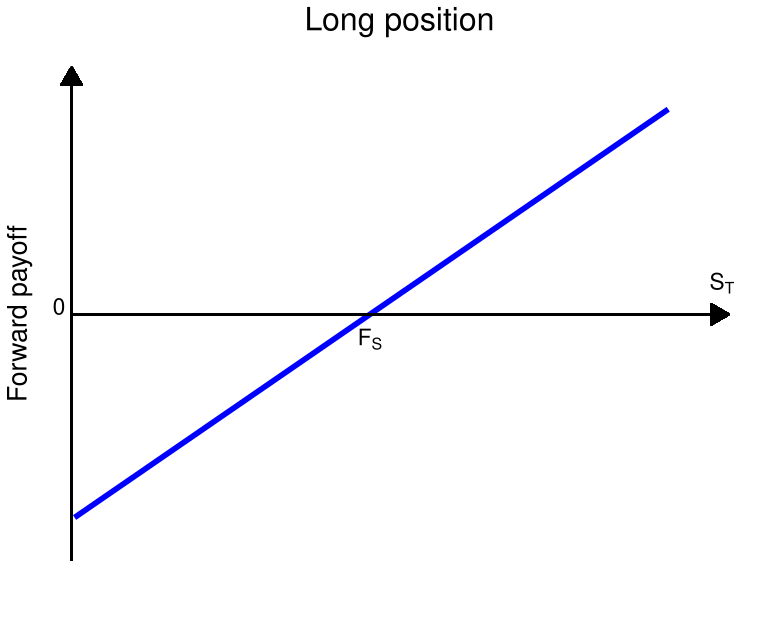
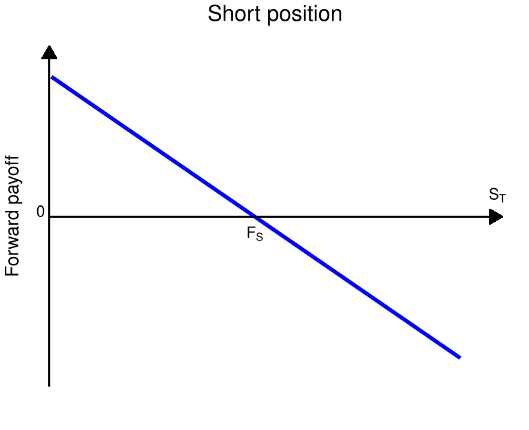

# 파생상품

## 개요

선도, 선물, 옵션 등 기본 파생상품의 payoff와 가격 결정 아이디어를 소개한다.

## 학습 목표

- 선도와 선물의 기본 구조를 이해한다.
- 콜옵션과 풋옵션의 payoff를 설명한다.
- 무차익 가격 결정의 기본 직관을 이해한다.

## 무차익 원리

무차익 원리는 파생상품 가격 결정 이론의 핵심 원리로 종종 공짜 점심은 없다 (no free lunch)라고도 표현한다.
어떤 관점에서는 경쟁적인 금융 시장에서 리스크를 짊어지지 않은 초과 수익은 올릴 수 없음을 의미한다.
확률공간 $\{\Omega, \mathbb{P} \}$에서 정의된 시장 모형이 있고, 시장 모형 내의 자산의 가격이 확률변수로 주어질 때,
무차익 원리를 수학적으로 정의하면 아래와 같다.

:::: {.callout-note title="정의: 무차익 원리"}
::: {#def-arbitrage}
어떤 자산 혹은 포트폴리오의 시간 $t$에서의 가격을 $V(t)$라고 하자.
만약 다음을 만족하면,

$$
V(0) = 0, \enspace V(T) \geq 0 \quad \textrm{and} \quad \mathbb{P}\{ V(T) > 0 \} > 0
$$ {#eq-nap}

차익 거래의 기회 (arbitrage opportunity)가 있다고 말한다.
차익 거래의 기회가 없는 (arbitrage-free) 시장 모형은
무차익 원리 (no-arbitrage principle)를 따른다고 한다.
:::
::::

위 정의의 식 @eq-nap 을 자세히 살펴보자.

- $V(0) = 0$ : 초기 포트폴리오의 구성 비용이 0, 즉, 초기 투자금이 없다.
- $V(T) \geq 0$ : 항상 손해는 나지 않으며, 최소한 본전임을 뜻한다.
- $\mathbb{P}(V(T) > 0) > 0$ : 이익이 날 확률이 양수이다. (운이 좋으면 수익이 발생할 수 있음.)

초기 포트폴리오의 구성 비용이 0이었음에도, $V(T)$는 항상 0보다 같거나 크므로, 어떤 경우에도 손해를 보지 않는다.
그러면서 $V(T)$가 0보다 클 확률 (이득을 볼 확률)이 양의 값이다.
만약 이러한 금융 상품이 시장에 존재한다면, 누구나 이 상품을 가지고 싶어할 것이다.
손해는 절대 보지 않으면서 이득을 볼 기회도 존재하기 때문이다.
경쟁적 시장의 경우 이런 기회가 있다면 순식간에 수요가 몰려 가격이 즉시 조정되고, 차익 거래의 기회가 사라진다.
그리고 $V(0)$는 0이 아닌 어떤 양의 값에서 가격 균형을 이룰 것이다.

더 나아가 식 @eq-nap 대신

$$
V(0) < 0, \enspace V(T) \geq 0
$$

이면 강한 차익 거래의 기회가 있다고 말하기도 한다.
파생상품의 가격을 결정하는 이론에 있어 가장 핵심적인 개념은 결국 무차익 원리를 따르는 수학 모형을 설립하는 것이다.
무차익 원리는 금융 시장에서 자산 가격이 합리적이라는 것을 보장해 주는 기초적인 원리이다.
파생상품 가격 결정 이론과 복잡한 금융 공학 모델들도 모두 이 원리를 기반으로 설계된다.

## 무위험자산

### 무이표채

본격적으로 파생상품에 대해 공부하기에 앞서, 이전에 살펴본 무위험 자산에 대해 한 번 살펴보자.
무이표채(zero-coupon bond)는 채권의 발행 주체가 정해진 미래 시점인 만기일 $T$에 채권 투자자에게 액면가(face value, principal, par) $F$를 한 번에 지급하는 채권을 의미한다.
만기 이전에는 별도의 이자(이표) 지급이 없으며, 실제 시장에서는 만기가 1년 이내인 경우가 많다.
본 자료에서는 이론적 논의를 위해 임의의 $T>0$를 가정한다.
반면, 주기적으로 이표를 지급하는 채권을 이표채라고 부르며, 자세한 사항은 [이자율과 채권](../10-interest-rates-bonds/index.qmd) 단원에서 공부한다.

무이표채(제로 쿠폰채)의 가격은 시장의 수요와 공급에 의해 결정되며, 이자율이 양수이면 액면가 $F$보다 낮게 형성된다.
또한 발행 주체의 신용도에 따라 가격이 달라지며, 부도 위험이 거의 없는 정부채의 가격이 부도 위험이 존재하는 회사채의 가격보다 높다.

시점 $0$에서 만기가 $T$인 제로 쿠폰채의 가격을 $B(0,T)$로 표기하자. 임의의 시점 $0 \le t < T$에서도 제로 쿠폰채는 거래될 수 있으며, 이때의 가격을 $B(t,T)$로 나타낸다. 만기일 $T$는 고정되어 있으나, 만기까지 남은 시간 $T-t$는 시간이 지남에 따라 감소한다.

제로 쿠폰채의 액면가는 임의의 실수값 $F$를 가질 수 있으며, 이는 액면가가 1인 제로 쿠폰채 $F$개를 보유하는 것과 수학적으로 동일하다. 따라서 특별한 언급이 없는 한 액면가를 1로 가정하며, 이 경우

$$
B(T,T) = 1
$$

이 성립한다. 또한 이후 논의에서는 채권의 부도 위험이 없다고 가정한다.

제로 쿠폰채의 가격은 미래 현금 흐름을 현재 가치로 환산하는 기준으로 사용된다.
예를 들어 시점 $t$에 부도 위험이 없는 상대에게 $V_t$만큼의 금액을 빌려주고, 만기 $T$에 원리금을 한 번에 받기로 하였다면, 만기 시점의 지급액 $V_T$는

$$
V_T = \frac{V_t}{B(t,T)}
$$

로 주어지며, 반대로 현재 가치는

$$
V_t = B(t,T) V_T
$$

로 표현된다. 이때 $B(t,T)$는 미래 수입 $V_T$를 현재 가치로 환산하는 할인인자(discount factor)의 역할을 한다.

제로 쿠폰채에 투자하는 것은 해당 기간 동안 자금을 무위험자산에 예치하고 만기 시점에 원금과 이자를 함께 받는 것과 동일하다.
즉, 할인인자는 이자율로 표현된다.
할인인자를 이자율의 언어로 표현하는 방식은 여러 가지가 있으나, 수학적으로 다루기 편리한 연속복리 이자율로 표현할 수 있다.
구체적으로, $B(t,T) > 0$이므로 실수 $r$이 존재하여

$$
B(t,T) = \mathrm{e}^{-r(T-t)}
$$

로 나타낼 수 있으며, 이를 $r$에 대해 풀면

$$
r = -\frac{1}{T-t} \log B(t,T)
$$

가 된다[^ch5-rf].
$B(t,T)<1$이면 $r>0$이고, $B(t,T)>1$이면 $r<0$이다.
이 $r$을 시점 $t$에서 만기 $T$까지의 **무위험 이자율(risk-free rate)**이라 부른다.
더 자세한 이자율의 종류와 만기 구조에 대해서는 추후에 논의하고, 특별한 언급이 없는 한
고정된 이자율 $r$을 고려하겠다.
이 단원에서는 할인율로서 $B(t, T)$ 혹은 $\mathrm{e}^{-r(T-t)}$를 이용한다.

[^ch5-rf]: 단리 이자율 $r_F$와의 관계는 식 @eq-rf 를 참고하라.

## 선도와 선물

파생상품의 가장 간단한 형태는 선도 거래와 선물 거래라고 할 수 있다. 두 거래 모두 미래에 발생할 거래의 가격을 앞 선 시점에서 미리 정하는 것으로, 양자 간에 미래의 불확실성을 제거하기 위하여 활용되었다.

먼 과거에는 주로 농산물 시장의 가격 위험을 제거하기 위해 도입되었다. 예를 들어, 상인이 농부로부터 5개월 후에 추수할 곡물을 미리 정해진 가격을 주고 구매하기로 계약하였다면 이는 선도 거래이다.

근래에 이르러 거래 대상은 농산물이나 원자재를 비롯하여 주식 등 금융 상품으로 확대되었다. 또한 선도 거래를 원하는 사람들이 늘어나면서, 전문적인 거래소에서 특정한 규격과 제도 하에 거래가 절차화 되었는데 이를 선물 거래라 한다.

### 선도 계약

선도 계약 (forward contract)는 거래소가 아닌 장외 (over-the-counter)로 거래되는 상품 중의 하나로 당사자 간 미리 합의된 가격으로 미래 시점 $T$에 특정 자산을 매매하기로 약속하는 계약을 말한다.

장외 거래는 거래소가 아닌 곳에서 참여자 간의 직접적인 거래를 말하며, 이는 개별 기업, 금융 기관, 또는 브로커와 클라이언트 사이에서 발생할 수 있다. 장외 거래는 거래소를 거치지 않고 당사자 간에 직접 거래되므로, 계약 조건이 자유롭고 유연하지만, 표준화되어 있지 않으며 거래 상대방의 신용 위험이 존재할 수 있다.

미래 시점에 구매하기로 한 당사자는 매입 혹은 매수 포지션 (long position)을, 판매하기로 한 당사자는 매도 포지션 (short position)을 취했다고 한다.

거래하기로 한 상품을 **기초 자산** (underlying asset)이라고 부르며, 미리 정한 거래 가격을 **선도 가격** (forward price, delivery price)라고 한다. 거래가 이루어지는 미래 시점 $T$는 **만기** (maturity, delivery date)라고 부른다. 시간이 0으로부터 흘러 $t$ 시점이 되어 남아있는 시간, $T-t$을 만기까지의 시간 (TTM, Time to maturity)라고 부른다.

선도 가격은 무차익 원리에 따라 계약 체결 시점에서 양측의 기대 수익이 0이 되도록 설정되며, 그 결과 계약의 초기 가치는 0이 된다. 즉, 계약 시점에서는 서로 간에 교환되는 비용은 없다.

만기 시점에 이르러 만약 기초 자산의 가격이 선도 가격보다 높으면, 매입 포지션이 이득을 보고, 기초 자산의 가격이 선도 가격보다 낮으면 매도 포지션이 이득을 본다.

만기 시점에서 각 투자자가 받거나 지불하게 되는 금액인 페이오프[^ch5-payoff] (payoff)를 그래프로 표현하면 그림 @fig-forward-payoff 과 같다. 페이오프 그래프는 파생상품을 분석할 때 필수적으로 등장하는 그래프이며, 보통 만기 시점 $T$에 기초 자산 $S_T$의 가격에 따라 지불하거나 지불 받는 금액을 표현한다.

두 그래프 모두 선도 가격 $F_s$의 $x$ 절편과 $+1$ 혹은 $-1$의 기울기를 가지는 직선의 그래프로서, 매입이나 매도 포지션이냐에 따라 기울기의 부호가 바뀐다. 두 포지션의 payoff를 합치면 항상 0이 되는데, 이는 선도 계약이 단순한 부의 이전 (제로섬 게임)임을 나타낸다.

[^ch5-payoff]: Payoff에 해당하는 마땅한 우리말이 없기 때문에, 그대로 페이오프 혹은 payoff라고 부르기로 하자.

::: {#fig-forward-payoff layout-ncol=2}
{#fig-forward-long}

{#fig-forward-short}

선도 거래 포지션 별 payoff
:::

선도 계약이나 선물 계약의 가격 결정론은 기초 자산이 투자 자산이냐 소비 자산이냐에 따라 구별된다. 투자 자산은 주식, 채권, 귀금속 등 투자자에 의해 투자 목적으로 보유되는 자산이며, 소비 자산은 농산물, 원자재 등 공업이나 농업 등에서 소비 목적으로 보유되는 자산이다.

소비 자산에 대한 파생상품의 가격은 보관 비용과 소비 가치[^ch5-consumption-value] 등 다양한 요인을 고려하여 결정된다.

[^ch5-consumption-value]: 자산을 직접 보유함으로써 얻는 비금전적 이익

투자 자산에 대한 파생상품의 가격 결정 이론은 이러한 요소가 없으며, 보다 수학적 논리에 따라 유도된다. 이 논리는 @def-arbitrage 에서 소개한 무차익 원리에 근거한다. 이 자료에서는 투자 자산에 대한 파생상품의 가격 결정 이론에 대해 주로 공부한다.

주식의 경우 주식 보유자에게 기업의 이윤을 소유 지분에 따라 분배하기도 하는데, 투자 자산 중 이렇게 배당 (dividend)을 제공하는 상품들을 기초 자산으로 삼을 때면 배당의 효과를 가격 결정 공식에 도입해야 한다.

보통은 모형의 간결화를 위하여 지속적인 배당 수익률(dividend yield)을 고려하여 선도 가격이 할인된다. 배당이 있는 경우나 없는 경우나 수학적 전개 구조는 비슷하지만, 배당이 있는 경우 선도 가격이 낮게 책정된다. 이론 전개의 단순화를 위하여 이 자료에서는 특별한 언급이 없는 한 배당이 없는 기초 자산만을 고려한다.

::: {.callout-note title="정리: 선도 가격"}
자산 $S$를 기초 자산으로 하는 만기일 $T$의 선도 거래의 $0 \leq t < T$ 시점에서의 거래 양 측의 가치를 0으로 하는 선도 가격은 다음과 같다.

$$
F_S(t, T) = \frac{S(t)}{B(t,T)}
$$

여기서 $B(t,T)$는 만기일 $T$의 무이표 채권의 $t$ 시점에서의 가격이다.
:::

::: {.callout-note title="증명"}
(i) 만약 $F_S(t, T) > \dfrac{S(t)}{B(t,T)}$라고 하자. 이 경우 선도 가격이 비싸게 형성된 것이므로, 선도 거래를 매도하면 차익 거래를 얻을 수 있다. 이를 위해 $t$ 시점에서 다음의 전략을 고려하자.

- 액면가 $\dfrac{S(t)}{B(t,T)}$의 무이표채를 매도하고, 얻은 금액으로 $S(t)$를 하나 매입
- 선도 거래에 대해 $F_S(t, T)$의 선도 가격으로 숏 포지션을 취한다. 즉, $F_S(t,T)$의 가격으로 $T$시점에 $S$를 한 주 팔기로 약속.

시점 $T$에 이르면,

- 선도 거래 청산을 위해 $F_S(t, T)$의 미리 약속된 가격으로 주식 $S$를 매도
- $\dfrac{S(t)}{B(t,T)}$의 무이표채 액면가 지급

하여 정산하게 되는데, $F_S(t, T) > \frac{S(t)}{B(t,T)}$이므로 항상 양의 수익을 얻어, 차익 거래의 기회를 얻는다. 투자된 자산 가격의 변화를 표로 나타내면 다음과 같다.

| | $t$ | $T$ |
|:--|:--:|:--:|
| 무이표채 | $-S_t$ | $-\frac{S(t)}{B(t,T)}$ |
| 주식 | $S_t$ | $S_T$ |
| 선도거래 | $0$ | $-S_T + F_S(t, T)$ |
| 합계 | $0$ | $F_S(t,T) - \frac{S(t)}{B(t,T)} > 0$ |

(ii) 만약 $F_S(t, T) < \dfrac{S(t)}{B(t,T)}$이면 위의 반대 거래를 하면 차익 거래의 기회를 얻는다. 즉, 선도 거래의 매수 포지션을 취해야 하는데, 미래에 주식을 구매해야 하므로, 현금을 확보해야 한다.

이를 위해, 주식을 $t$ 시점에서 공매도하여, 현금 $S(t)$을 확보한 후, 이 금액을 모두 무이표채에 투자하고, 동시에 선도 거래에서 매수 포지션을 취한다. 무이표채에 투자한다는 것은 예금을 하는 것과 마찬가지이다. 액면가 $\dfrac{S(t)}{B(t,T)}$의 무이표채의 현재 가격이 $S(t)$ 이므로, 이를 구입한다. 혹은 액면가 1의 무이표채를 $\dfrac{S(t)}{B(t,T)}$의 개수 만큼 구입한 것과 같다.

시점 $T$에 이르러서는 무이표채에 투자한 결과로 $\dfrac{S(t)}{B(t,T)}$를 얻는다. 이 중, $F_S(t,T)$의 금액으로 선도 거래를 수행하고, 선도 거래를 통해 얻은 기초 자산으로 공매도 포지션을 청산한다. 표로 나타내면 아래와 같다.

| | $t$ | $T$ |
|:--|:--:|:--:|
| 무이표채 | $S(t)$ | $\frac{S(t)}{B(t,T)}$ |
| 주식 | $-S(t)$ | $-S(T)$ |
| 선도거래 | $0$ | $S(T) - F_S(t, T)$ |
| 합계 | $0$ | $-F_S(t,T) + \frac{S(t)}{B(t,T)} > 0$ |

위의 두 경우 모두 선도 가격이 $\frac{S(t)}{B(t, T)}$보다 크거나 작으면 무차익 기회가 발생하므로, 무차익 원리를 만족하기 위해서는 반드시

$$
F_S(t, T) = \frac{S(t)}{B(t,T)}
$$

를 만족해야 한다.
:::

앞서 설명한 바와 같이 선도 가격은 시점 0에 정해지며, 거래 당사자 양측의 가치가 모두 0이 되도록 설정된다. 비록 시점 0에서 체결된 선도 거래의 가치가 0일지라도, 시간이 지남에 따라 기초 자산의 가격이 변동하면서 선도 거래의 가치도 변한다.

기초 자산의 가격이 상승하면, 매입 포지션의 가치가 양수가 되고 매도 포지션의 가치가 음이 된다. 반대로 기초 자산의 가격이 하락하면, 매입 포지션의 가치가 음이 되고 매수 포지션의 가치가 양이 된다. 어떤 경우든지 매입 포지션의 가치와 매도 포지션의 가치를 합하면 0이 되어 선도 거래가 제로섬 게임(zero-sum game)임을 의미한다.

::: {.callout-note title="정리: 선도 거래의 가치"}
자산 $S$를 기초 자산으로 하고 $F_S(0, T)$의 선도 가격을 가지는 선도의 $t$ 시점에서 매입 포지션의 가치는 다음과 같다.

$$
V_t = (F_S(t, T) - F_S(0, T)) B(t, T)
$$ {#eq-forward-value}

여기서 $F_S(t,T)$는 시점 $t$ 기준의 선도 가격이며, $B(t,T)$는 시점 $t$에서 만기 $T$의 무이표채 가격이다.
:::

::: {.callout-note title="증명"}
선도 가격 $F_S(0, T)$의 선도 거래의 매수 포지션에 있는 사람은 $t$ 시점에서 $F_S(t,T)$의 선도 거래의 매도 포지션에 0의 비용으로 계약할 수 있다. 이 두 거래의 $T$ 시점에서 현금 흐름은 고정된 $F_S(t, T) - F_S(0, T)$이므로, 이 금액의 $t$ 시점에서의 가격은 무이표채 가격으로 할인되어

$$
B(t, T) (F_S(t, T) - F_S(0, T))
$$

이다.

이것은 $t$ 시점에서 (i) 선도 가격 $F_S(0, T)$의 선도 거래 매수 포지션과 (ii) 선도 가격 $F_S(t, T)$의 선도 거래 매도 포지션으로 구성된 포트폴리오의 가치인데, (ii)의 선도 거래 매도 포지션의 가치가 0이므로, 곧 위 값은 (i)의 선도 거래의 매입 포지션의 $t$ 시점의 가치이다.
:::

이 정리의 의미는 선도 계약의 현재 가치는, $t$ 시점 체결되는 선도 계약의 payoff와 0 시점에 체결된 선도 계약 payoff의 차이를 무위험 이자율로 할인한 값이라는 의미이다. 정리하자면,

- 시점 $t$에 체결된 선도 계약의 $T$ 시점 payoff : $S_T - F_S(t, T)$
- 시점 $0$에 체결된 선도 계약의 $T$ 시점 payoff : $S_T - F_S(0, T)$

이고, 이 둘의 차를 $B(t, T)$로 할인한 값이 식 @eq-forward-value 이다.

위 정리에 따르면 선도 거래의 포지션 가치는 다음과 같은 특징을 가진다.

- 기초 자산 가격이 상승하면 매입 포지션의 가치가 증가하고, 매도 포지션의 가치는 감소한다.
- 기초 자산 가격이 하락하면 반대로 매입 포지션의 가치가 감소하고, 매도 포지션의 가치는 증가한다.
- 두 포지션의 가치는 항상 반대이며, 합하면 0이 된다.

| 기초 자산 가격 변화 | 매입 포지션 가치 | 매도 포지션 가치 |
|:--|:--:|:--:|
| 상승 | 양수 $(V_t > 0)$ | 음수 $(V_t < 0)$ |
| 하락 | 음수 $(V_t < 0)$ | 양수 $(V_t > 0)$ |
| 불변 | 0 | 0 |

: 기초 자산 가격 변화에 따른 포지션 가치 변화 {#tbl-forward-position-value}

선도 거래와 다음 절에 소개할 선물 거래는 투기 목적과 리스크 헷지 목적에 모두 이용될 수 있다.

투기적 목적의 관점에서 살펴보면, 자산 가치가 미래에 상승할 것이라고 예측하면 선도나 선물의 매입 포지션을 취할 것이고, 하락할 것이라고 예측되면 매도 포지션을 취할 것이다.

리스크 관리의 목적에서 살펴보면, 자산 가치가 하락할 것을 걱정하여 하락 위험을 헷지하고 싶으면 선도나 선물의 매도 포지션을 취할 것이고, 상승할 것이 걱정되면 매입 포지션을 취할 수 있다.

예를 들어, 어떤 투자자가 금 가격이 앞으로 오를 것이라 예상한다면, 선도 계약을 통해 금을 미래에 현재 가격으로 사는 매입 포지션을 취할 수 있다. 실제로 가격이 오르면 시점 $T$에 싼 값으로 금을 매입하게 되므로 차익을 얻는다.

한 농부가 앞으로 수확할 밀 가격이 하락할까 걱정된다면, 지금 선도 계약을 통해 미래에 일정 가격으로 밀을 팔기로 약속함으로써 가격 하락 위험을 피할 수 있다.
