# 파생상품

## 개요

선도, 선물, 옵션 등 기본 파생상품의 payoff와 가격 결정 아이디어를 소개한다.

## 학습 목표

- 선도와 선물의 기본 구조를 이해한다.
- 콜옵션과 풋옵션의 payoff를 설명한다.
- 무차익 가격 결정의 기본 직관을 이해한다.

## 무차익 원리

무차익 원리는 파생상품 가격 결정 이론의 핵심 원리로 종종 공짜 점심은 없다 (no free lunch)라고도 표현한다.
어떤 관점에서는 경쟁적인 금융 시장에서 리스크를 짊어지지 않은 초과 수익은 올릴 수 없음을 의미한다.
확률공간 $\{\Omega, \mathbb{P} \}$에서 정의된 시장 모형이 있고, 시장 모형 내의 자산의 가격이 확률변수로 주어질 때,
무차익 원리를 수학적으로 정의하면 아래와 같다.

:::: {.callout-note title="정의: 무차익 원리"}
::: {#def-arbitrage}
어떤 자산 혹은 포트폴리오의 시간 $t$에서의 가격을 $V(t)$라고 하자.
만약 다음을 만족하면,

$$
V(0) = 0, \enspace V(T) \geq 0 \quad \textrm{and} \quad \mathbb{P}\{ V(T) > 0 \} > 0
$$ {#eq-nap}

차익 거래의 기회 (arbitrage opportunity)가 있다고 말한다.
차익 거래의 기회가 없는 (arbitrage-free) 시장 모형은
무차익 원리 (no-arbitrage principle)를 따른다고 한다.
:::
::::

위 정의의 식 @eq-nap 을 자세히 살펴보자.

- $V(0) = 0$ : 초기 포트폴리오의 구성 비용이 0, 즉, 초기 투자금이 없다.
- $V(T) \geq 0$ : 항상 손해는 나지 않으며, 최소한 본전임을 뜻한다.
- $\mathbb{P}(V(T) > 0) > 0$ : 이익이 날 확률이 양수이다. (운이 좋으면 수익이 발생할 수 있음.)

초기 포트폴리오의 구성 비용이 0이었음에도, $V(T)$는 항상 0보다 같거나 크므로, 어떤 경우에도 손해를 보지 않는다.
그러면서 $V(T)$가 0보다 클 확률 (이득을 볼 확률)이 양의 값이다.
만약 이러한 금융 상품이 시장에 존재한다면, 누구나 이 상품을 가지고 싶어할 것이다.
손해는 절대 보지 않으면서 이득을 볼 기회도 존재하기 때문이다.
경쟁적 시장의 경우 이런 기회가 있다면 순식간에 수요가 몰려 가격이 즉시 조정되고, 차익 거래의 기회가 사라진다.
그리고 $V(0)$는 0이 아닌 어떤 양의 값에서 가격 균형을 이룰 것이다.

더 나아가 식 @eq-nap 대신

$$
V(0) < 0, \enspace V(T) \geq 0
$$

이면 강한 차익 거래의 기회가 있다고 말하기도 한다.
파생상품의 가격을 결정하는 이론에 있어 가장 핵심적인 개념은 결국 무차익 원리를 따르는 수학 모형을 설립하는 것이다.
무차익 원리는 금융 시장에서 자산 가격이 합리적이라는 것을 보장해 주는 기초적인 원리이다.
파생상품 가격 결정 이론과 복잡한 금융 공학 모델들도 모두 이 원리를 기반으로 설계된다.

## 무위험자산

### 무이표채

본격적으로 파생상품에 대해 공부하기에 앞서, 이전에 살펴본 무위험 자산에 대해 한 번 살펴보자.
무이표채(zero-coupon bond)는 채권의 발행 주체가 정해진 미래 시점인 만기일 $T$에 채권 투자자에게 액면가(face value, principal, par) $F$를 한 번에 지급하는 채권을 의미한다.
만기 이전에는 별도의 이자(이표) 지급이 없으며, 실제 시장에서는 만기가 1년 이내인 경우가 많다.
본 자료에서는 이론적 논의를 위해 임의의 $T>0$를 가정한다.
반면, 주기적으로 이표를 지급하는 채권을 이표채라고 부르며, 자세한 사항은 [이자율과 채권](../10-interest-rates-bonds/index.qmd) 단원에서 공부한다.

무이표채(제로 쿠폰채)의 가격은 시장의 수요와 공급에 의해 결정되며, 이자율이 양수이면 액면가 $F$보다 낮게 형성된다.
또한 발행 주체의 신용도에 따라 가격이 달라지며, 부도 위험이 거의 없는 정부채의 가격이 부도 위험이 존재하는 회사채의 가격보다 높다.

시점 $0$에서 만기가 $T$인 제로 쿠폰채의 가격을 $B(0,T)$로 표기하자. 임의의 시점 $0 \le t < T$에서도 제로 쿠폰채는 거래될 수 있으며, 이때의 가격을 $B(t,T)$로 나타낸다. 만기일 $T$는 고정되어 있으나, 만기까지 남은 시간 $T-t$는 시간이 지남에 따라 감소한다.

제로 쿠폰채의 액면가는 임의의 실수값 $F$를 가질 수 있으며, 이는 액면가가 1인 제로 쿠폰채 $F$개를 보유하는 것과 수학적으로 동일하다. 따라서 특별한 언급이 없는 한 액면가를 1로 가정하며, 이 경우

$$
B(T,T) = 1
$$

이 성립한다. 또한 이후 논의에서는 채권의 부도 위험이 없다고 가정한다.

제로 쿠폰채의 가격은 미래 현금 흐름을 현재 가치로 환산하는 기준으로 사용된다.
예를 들어 시점 $t$에 부도 위험이 없는 상대에게 $V_t$만큼의 금액을 빌려주고, 만기 $T$에 원리금을 한 번에 받기로 하였다면, 만기 시점의 지급액 $V_T$는

$$
V_T = \frac{V_t}{B(t,T)}
$$

로 주어지며, 반대로 현재 가치는

$$
V_t = B(t,T) V_T
$$

로 표현된다. 이때 $B(t,T)$는 미래 수입 $V_T$를 현재 가치로 환산하는 할인인자(discount factor)의 역할을 한다.

제로 쿠폰채에 투자하는 것은 해당 기간 동안 자금을 무위험자산에 예치하고 만기 시점에 원금과 이자를 함께 받는 것과 동일하다.
즉, 할인인자는 이자율로 표현된다.
할인인자를 이자율의 언어로 표현하는 방식은 여러 가지가 있으나, 수학적으로 다루기 편리한 연속복리 이자율로 표현할 수 있다.
구체적으로, $B(t,T) > 0$이므로 실수 $r$이 존재하여

$$
B(t,T) = \mathrm{e}^{-r(T-t)}
$$

로 나타낼 수 있으며, 이를 $r$에 대해 풀면

$$
r = -\frac{1}{T-t} \log B(t,T)
$$

가 된다[^ch5-rf].
$B(t,T)<1$이면 $r>0$이고, $B(t,T)>1$이면 $r<0$이다.
이 $r$을 시점 $t$에서 만기 $T$까지의 **무위험 이자율(risk-free rate)**이라 부른다.
더 자세한 이자율의 종류와 만기 구조에 대해서는 추후에 논의하고, 특별한 언급이 없는 한
고정된 이자율 $r$을 고려하겠다.
이 단원에서는 할인율로서 $B(t, T)$ 혹은 $\mathrm{e}^{-r(T-t)}$를 이용한다.

[^ch5-rf]: 단리 이자율 $r_F$와의 관계는 식 @eq-rf 를 참고하라.

## 선도와 선물

파생상품의 가장 간단한 형태는 선도 거래와 선물 거래라고 할 수 있다. 두 거래 모두 미래에 발생할 거래의 가격을 앞 선 시점에서 미리 정하는 것으로, 양자 간에 미래의 불확실성을 제거하기 위하여 활용되었다.

먼 과거에는 주로 농산물 시장의 가격 위험을 제거하기 위해 도입되었다. 예를 들어, 상인이 농부로부터 5개월 후에 추수할 곡물을 미리 정해진 가격을 주고 구매하기로 계약하였다면 이는 선도 거래이다.

근래에 이르러 거래 대상은 농산물이나 원자재를 비롯하여 주식 등 금융 상품으로 확대되었다. 또한 선도 거래를 원하는 사람들이 늘어나면서, 전문적인 거래소에서 특정한 규격과 제도 하에 거래가 절차화 되었는데 이를 선물 거래라 한다.

### 선도 계약

선도 계약 (forward contract)는 거래소가 아닌 장외 (over-the-counter)로 거래되는 상품 중의 하나로 당사자 간 미리 합의된 가격으로 미래 시점 $T$에 특정 자산을 매매하기로 약속하는 계약을 말한다.

장외 거래는 거래소가 아닌 곳에서 참여자 간의 직접적인 거래를 말하며, 이는 개별 기업, 금융 기관, 또는 브로커와 클라이언트 사이에서 발생할 수 있다. 장외 거래는 거래소를 거치지 않고 당사자 간에 직접 거래되므로, 계약 조건이 자유롭고 유연하지만, 표준화되어 있지 않으며 거래 상대방의 신용 위험이 존재할 수 있다.

미래 시점에 구매하기로 한 당사자는 매입 혹은 매수 포지션 (long position)을, 판매하기로 한 당사자는 매도 포지션 (short position)을 취했다고 한다.

거래하기로 한 상품을 **기초 자산** (underlying asset)이라고 부르며, 미리 정한 거래 가격을 **선도 가격** (forward price, delivery price)라고 한다. 거래가 이루어지는 미래 시점 $T$는 **만기** (maturity, delivery date)라고 부른다. 시간이 0으로부터 흘러 $t$ 시점이 되어 남아있는 시간, $T-t$을 만기까지의 시간 (TTM, Time to maturity)라고 부른다.

선도 가격은 무차익 원리에 따라 계약 체결 시 양측의 계약 가치가 0이 되도록 정해진다.
즉, 계약 시점에서는 서로 간에 교환되는 비용은 없다.

만기 시점에 이르러 만약 기초 자산의 가격이 선도 가격보다 높으면, 매입 포지션이 이득을 보고, 기초 자산의 가격이 선도 가격보다 낮으면 매도 포지션이 이득을 본다.

만기 시점에서 각 투자자가 받거나 지불하게 되는 금액인 페이오프[^ch5-payoff] (payoff)를 그래프로 표현하면 그림 @fig-forward-payoff 과 같다. 페이오프 그래프는 파생상품을 분석할 때 필수적으로 등장하는 그래프이며, 보통 만기 시점 $T$에 기초 자산 $S_T$의 가격에 따라 지불하거나 지불 받는 금액을 표현한다.

두 그래프 모두 선도 가격 $F_s$의 $x$ 절편과 $+1$ 혹은 $-1$의 기울기를 가지는 직선의 그래프로서, 매입이나 매도 포지션이냐에 따라 기울기의 부호가 바뀐다. 두 포지션의 payoff를 합치면 항상 0이 되는데, 이는 선도 계약이 단순한 부의 이전 (제로섬 게임)임을 나타낸다.

[^ch5-payoff]: Payoff에 해당하는 마땅한 우리말이 없기 때문에, 그대로 페이오프 혹은 payoff라고 부르기로 하자.

::: {#fig-forward-payoff layout-ncol=2}
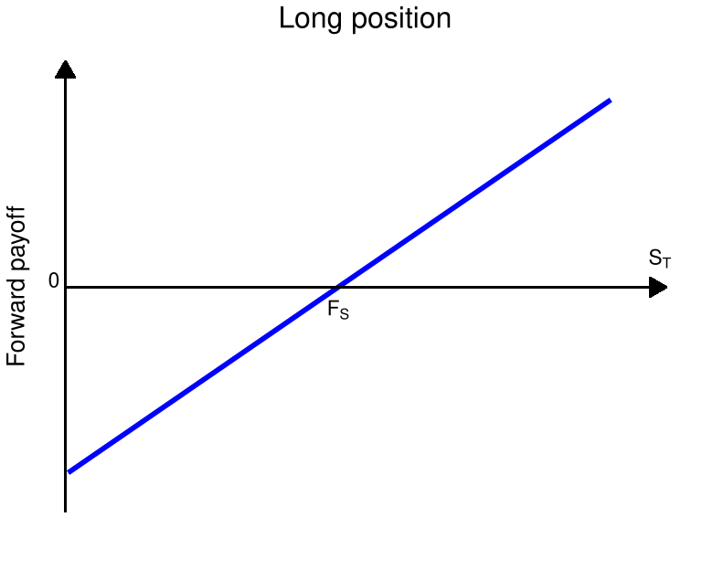{#fig-forward-long}

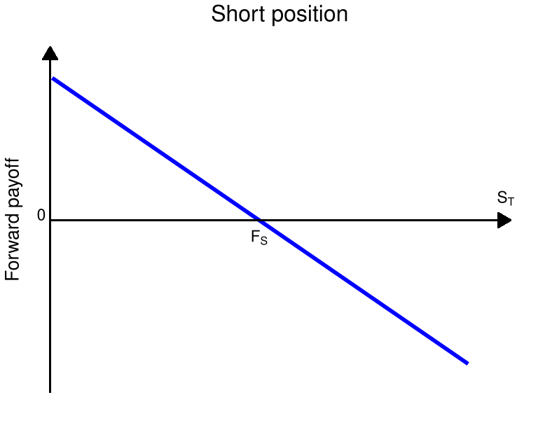{#fig-forward-short}

선도 거래 포지션 별 payoff
:::

선도 계약이나 선물 계약의 가격 결정론은 기초 자산이 투자 자산이냐 소비 자산이냐에 따라 구별된다. 투자 자산은 주식, 채권, 귀금속 등 투자자에 의해 투자 목적으로 보유되는 자산이며, 소비 자산은 농산물, 원자재 등 공업이나 농업 등에서 소비 목적으로 보유되는 자산이다.

소비 자산에 대한 파생상품의 가격은 보관 비용과 소비 가치[^ch5-consumption-value] 등 다양한 요인을 고려하여 결정된다.

[^ch5-consumption-value]: 자산을 직접 보유함으로써 얻는 비금전적 이익

투자 자산에 대한 파생상품의 가격 결정 이론은 이러한 요소가 없으며, 보다 수학적 논리에 따라 유도된다. 이 논리는 @def-arbitrage 에서 소개한 무차익 원리에 근거한다. 이 자료에서는 투자 자산에 대한 파생상품의 가격 결정 이론에 대해 주로 공부한다.

주식의 경우 주식 보유자에게 기업의 이윤을 소유 지분에 따라 분배하기도 하는데, 투자 자산 중 이렇게 배당 (dividend)을 제공하는 상품들을 기초 자산으로 삼을 때면 배당의 효과를 가격 결정 공식에 도입해야 한다.

보통은 모형의 간결화를 위하여 지속적인 배당 수익률(dividend yield)을 고려하여 선도 가격이 할인된다. 배당이 있는 경우나 없는 경우나 수학적 전개 구조는 비슷하지만, 배당이 있는 경우 선도 가격이 낮게 책정된다. 이론 전개의 단순화를 위하여 이 자료에서는 특별한 언급이 없는 한 배당이 없는 기초 자산만을 고려한다.

::: {.callout-note title="정리: 선도 가격"}
자산 $S$를 기초 자산으로 하는 만기일 $T$의 선도 거래의 $0 \leq t < T$ 시점에서의 거래 양 측의 가치를 0으로 하는 선도 가격은 다음과 같다.

$$
F_S(t, T) = \frac{S(t)}{B(t,T)}
$$

여기서 $B(t,T)$는 만기일 $T$의 무이표 채권의 $t$ 시점에서의 가격이다.
:::

::: {.callout-note title="증명"}
(i) 만약 $F_S(t, T) > \dfrac{S(t)}{B(t,T)}$라고 하자. 이 경우 선도 가격이 비싸게 형성된 것이므로, 선도 거래를 매도하면 차익 거래를 얻을 수 있다. 이를 위해 $t$ 시점에서 다음의 전략을 고려하자.

- 액면가 $\dfrac{S(t)}{B(t,T)}$의 무이표채를 매도하고, 얻은 금액으로 $S(t)$를 하나 매입
- 선도 거래에 대해 $F_S(t, T)$의 선도 가격으로 숏 포지션을 취한다. 즉, $F_S(t,T)$의 가격으로 $T$시점에 $S$를 한 주 팔기로 약속.

시점 $T$에 이르면,

- 선도 거래 청산을 위해 $F_S(t, T)$의 미리 약속된 가격으로 주식 $S$를 매도
- $\dfrac{S(t)}{B(t,T)}$의 무이표채 액면가 지급

하여 정산하게 되는데, $F_S(t, T) > \frac{S(t)}{B(t,T)}$이므로 항상 양의 수익을 얻어, 차익 거래의 기회를 얻는다. 투자된 자산 가격의 변화를 표로 나타내면 다음과 같다.

| | $t$ | $T$ |
|:--|:--:|:--:|
| 무이표채 | $-S_t$ | $-\frac{S(t)}{B(t,T)}$ |
| 주식 | $S_t$ | $S_T$ |
| 선도거래 | $0$ | $-S_T + F_S(t, T)$ |
| 합계 | $0$ | $F_S(t,T) - \frac{S(t)}{B(t,T)} > 0$ |

(ii) 만약 $F_S(t, T) < \dfrac{S(t)}{B(t,T)}$이면 위의 반대 거래를 하면 차익 거래의 기회를 얻는다. 즉, 선도 거래의 매수 포지션을 취해야 하는데, 미래에 주식을 구매해야 하므로, 현금을 확보해야 한다.

이를 위해, 주식을 $t$ 시점에서 공매도하여, 현금 $S(t)$을 확보한 후, 이 금액을 모두 무이표채에 투자하고, 동시에 선도 거래에서 매수 포지션을 취한다. 무이표채에 투자한다는 것은 예금을 하는 것과 마찬가지이다. 액면가 $\dfrac{S(t)}{B(t,T)}$의 무이표채의 현재 가격이 $S(t)$ 이므로, 이를 구입한다. 혹은 액면가 1의 무이표채를 $\dfrac{S(t)}{B(t,T)}$의 개수 만큼 구입한 것과 같다.

시점 $T$에 이르러서는 무이표채에 투자한 결과로 $\dfrac{S(t)}{B(t,T)}$를 얻는다. 이 중, $F_S(t,T)$의 금액으로 선도 거래를 수행하고, 선도 거래를 통해 얻은 기초 자산으로 공매도 포지션을 청산한다. 표로 나타내면 아래와 같다.

| | $t$ | $T$ |
|:--|:--:|:--:|
| 무이표채 | $S(t)$ | $\frac{S(t)}{B(t,T)}$ |
| 주식 | $-S(t)$ | $-S(T)$ |
| 선도거래 | $0$ | $S(T) - F_S(t, T)$ |
| 합계 | $0$ | $-F_S(t,T) + \frac{S(t)}{B(t,T)} > 0$ |

위의 두 경우 모두 선도 가격이 $\frac{S(t)}{B(t, T)}$보다 크거나 작으면 무차익 기회가 발생하므로, 무차익 원리를 만족하기 위해서는 반드시

$$
F_S(t, T) = \frac{S(t)}{B(t,T)}
$$

를 만족해야 한다.
:::

앞서 설명한 바와 같이 선도 가격은 시점 0에 정해지며, 거래 당사자 양측의 가치가 모두 0이 되도록 설정된다.
시점 0에서 체결된 선도 거래의 가치는 0이지만, 시간이 지나 시장의 선도 가격이 달라지면 기존 계약의 가치도 변한다.
시점 $t$의 선도 가격 $F_S(t,T)$이 계약 가격 $F_S(0,T)$보다 높으면 매입 포지션의 가치는 양수이고 매도 포지션의 가치는 음수이다.
반대로 $F_S(t,T)$이 $F_S(0,T)$보다 낮으면 매입 포지션의 가치는 음수이고 매도 포지션의 가치는 양수이다.
어떤 경우든지 매입 포지션의 가치와 매도 포지션의 가치를 합하면 0이 되어 선도 거래가 제로섬 게임(zero-sum game)임을 의미한다.

::: {.callout-note title="정리: 선도 거래의 가치"}
자산 $S$를 기초 자산으로 하고 $F_S(0, T)$의 선도 가격을 가지는 선도의 $t$ 시점에서 매입 포지션의 가치는 다음과 같다.

$$
V_t = (F_S(t, T) - F_S(0, T)) B(t, T)
$$ {#eq-forward-value}

여기서 $F_S(t,T)$는 시점 $t$ 기준의 선도 가격이며, $B(t,T)$는 시점 $t$에서 만기 $T$의 무이표채 가격이다.
:::

::: {.callout-note title="증명"}
선도 가격 $F_S(0, T)$의 선도 거래의 매수 포지션에 있는 사람은 $t$ 시점에서 $F_S(t,T)$의 선도 거래의 매도 포지션에 0의 비용으로 계약할 수 있다. 이 두 거래의 $T$ 시점에서 현금 흐름은 고정된 $F_S(t, T) - F_S(0, T)$이므로, 이 금액의 $t$ 시점에서의 가격은 무이표채 가격으로 할인되어

$$
B(t, T) (F_S(t, T) - F_S(0, T))
$$

이다.

이것은 $t$ 시점에서 (i) 선도 가격 $F_S(0, T)$의 선도 거래 매수 포지션과 (ii) 선도 가격 $F_S(t, T)$의 선도 거래 매도 포지션으로 구성된 포트폴리오의 가치인데, (ii)의 선도 거래 매도 포지션의 가치가 0이므로, 곧 위 값은 (i)의 선도 거래의 매입 포지션의 $t$ 시점의 가치이다.
:::

이 정리의 의미는 선도 계약의 현재 가치는, $t$ 시점 체결되는 선도 계약의 payoff와 0 시점에 체결된 선도 계약 payoff의 차이를 무위험 이자율로 할인한 값이라는 의미이다. 정리하자면,

- 시점 $t$에 체결된 선도 계약의 $T$ 시점 payoff : $S_T - F_S(t, T)$
- 시점 $0$에 체결된 선도 계약의 $T$ 시점 payoff : $S_T - F_S(0, T)$

이고, 이 둘의 차를 $B(t, T)$로 할인한 값이 식 @eq-forward-value 이다.

위 정리에 따르면 포지션 가치의 부호는 $F_S(t,T)$와 $F_S(0,T)$의 비교로 결정된다. 두 포지션의 가치는 항상 반대이며 합하면 0이다.

| 선도 가격 비교 | 매입 포지션 가치 | 매도 포지션 가치 |
|:--|:--:|:--:|
| $F_S(t,T)>F_S(0,T)$ | 양수 | 음수 |
| $F_S(t,T)<F_S(0,T)$ | 음수 | 양수 |
| $F_S(t,T)=F_S(0,T)$ | 0 | 0 |

: 현재 선도 가격과 계약 가격의 비교에 따른 포지션 가치 {#tbl-forward-position-value}

선도 거래와 다음 절에 소개할 선물 거래는 투기 목적과 리스크 헷지 목적에 모두 이용될 수 있다.

투기적 목적의 관점에서 살펴보면, 자산 가치가 미래에 상승할 것이라고 예측하면 선도나 선물의 매입 포지션을 취할 것이고, 하락할 것이라고 예측되면 매도 포지션을 취할 것이다.

리스크 관리의 목적에서 살펴보면, 자산 가치가 하락할 것을 걱정하여 하락 위험을 헷지하고 싶으면 선도나 선물의 매도 포지션을 취할 것이고, 상승할 것이 걱정되면 매입 포지션을 취할 수 있다.

예를 들어, 어떤 투자자가 만기일의 금 가격이 계약 당시 정한 선도 가격보다 높을 것으로 예상한다면 매입 포지션을 취할 수 있다. 실제로 만기일의 금 가격 $S_T$가 계약 가격 $F_S(0,T)$보다 높으면 $S_T-F_S(0,T)>0$의 페이오프를 얻는다.

한 농부가 앞으로 수확할 밀 가격이 하락할까 걱정된다면, 지금 선도 계약을 통해 미래에 일정 가격으로 밀을 팔기로 약속함으로써 가격 하락 위험을 피할 수 있다.

### 선물

선물 거래 (futures)는 선도 거래와 흡사하나, 거래소에서 이루어지고 중간 정산이 이루어진다.
앞에서 살펴본 바와 같이, 선도 거래는 페이오프 구조의 특성상 거래 계약자 중 한 명이 이득을 보고 다른 한 명이 손실을 보게 되어 있다.
장외 거래로 계약이 이루어지는 경우 손실을 본 계약자가 만기 시점에 거래를 이행하지 못할 위험이 있다.
이러한 신용 위험을 방지하기 위해 공인된 거래소에서 거래를 진행하고 매일 변화하는 선도 거래의 가치에 따라 **중간 정산**이 이루어지는 거래를 선물 거래라고 한다.
따라서 선물 거래는 선도 거래와 근본적으로 매우 흡사하다.
다만 거래소에서 이루어지기 때문에 거래소의 제도 하에 절차화, 규격화되어 있다.

선도 거래와 같이 선물 거래에서도 거래 대상이 되는 기초 자산 $S$와 만기 시점 $T$를 정한다.
기초 자산 가격 $S(t)$와 별도로 시장에서는 선물 가격 $f_S(t, T)$가 형성된다.
선물 가격 $f_S(t, T)$는 $t$ 이전의 시점에는 알 수 없으며 $t$ 시점에 이르러 랜덤하게 결정되는 확률변수이다.
시장에서는 선물을 매입하고 싶은 거래자들과 매도하고 싶은 거래자들 간의 수요-공급 법칙에 의해 선물 가격이 형성된다.
즉, 해당 선물을 매입하고자 하는 거래자들이 많으면 선물 가격이 상승하고, 매도하고자 하는 거래자들이 많으면 가격이 하락할 것이다.
그리고 정의 상 만기 시점에서의 선물 가격은 $f_S(T, T) = S(T)$이다.

선도 거래와 마찬가지로 선물 거래도 초기 시점에는 양측 모두 거래 상대방에게 지급하는 비용은 없다.
선도 거래에서는 마지막 시점 $T$에 $S(T) - F_S(0,T)$의 현금 흐름이 발생하는 데에 반해,
선물 거래에서는 미리 정해진 $0 < t_1 < t_2 < \cdots < t_N = T$의 시점에서, 일반적으로 매일매일, 중간 정산 (marking-to-market)이 이루어진다.

선물 거래의 매입 포지션을 취하고 있는 당사자는 매 시점 $t_n$에 다음의 현금 흐름을 받게 된다.

$$
f_S(t_n, T) - f_S(t_{n-1}, T)
$$

즉, 전날의 선물 가격과 오늘의 선물 가격 간의 차액이다.
위 값이 양수이면 매도 포지션을 취한 거래자로부터 해당 액수만큼 지불 받고, 음수이면 상대에게 지불한다.
시점 $t_n$에서의 선물 가격 $f_S(t_n, T)$은 앞에서 언급하였듯 시장에서는 수요-공급 법칙에 의해 형성되며,
해당 선물 계약을 새로 체결할 때 양측의 비용이 0이 되는 가격으로 형성된다.

예를 들어, 선물 가격이 $t_{n-1}$ 시점에 $f(t_{n-1}, T) = 100$이었다가 $t_n$에 $f(t_n, T) = 102$로 바뀌면,
선물 매수 포지션에 있는 투자자는 2의 금액을 얻고, 매도 포지션에 있는 투자자는 2의 금액을 잃는다.
단, 거래는 당사자 간에 직접 이루어지는 것이 아니라 거래소의 증거금 (margin)을 통해 이루어진다.
증거금은 일종의 보증금으로, 거래자의 손익 결과에 따라 감해지거나 더해진다.
선물 거래자들은 선물 거래를 개시하기 위해 최초 증거금 (initial margin)을 예치하여야 하며,
예치된 증거금이 특정 레벨 이하로 떨어지지 않도록 유지 증거금 (maintenance margin)을 항상 갖춰야 한다.

::: {.callout-note title="정리"}

만약 이자율이 시간에 지나도 변하지 않는 고정된 상수라면 선도 가격과 선물 가격은 같다. 즉,

$$
F_S(0, T) = f_S(0, T).
$$

:::

만약 이자율이 랜덤하게 변동한다면 선물 가격과 선도 가격은 다를 수 있다.
이론적으로 보았을 때, 기초 자산과 이자율이 양의 상관관계를 지니면 선물 가격이 선도 가격보다 높다.
기초 자산과 이자율의 양의 상관관계는 선물 매입자에게 유리하게 작동할 가능성이 높으며 이에 따라 선물 가격이 높아진다.
자세히 살펴보자면 다음과 같다.

기초 자산 가격이 상승하면, 선물 거래에서 매입자가 이득을 본다.
이때, 기초 자산과 이자율의 양의 상관관계에 의해 이자율도 높아졌을 가능성이 높은데,
선물 거래에서 이득을 본 금액을 중간 정산으로 받아, 예금하여 높은 이자를 받을 수 있으며 매입자의 이득을 증대시킨다.
반대로 자산 가격이 하락하면, 선물 매입자는 선물 거래에서 손해를 보지만,
손해를 충당하기 위해 대출로 자금을 조달 받을 때 적용된 이자율이 낮아졌을 가능성이 높아
이런 점이 매입자에게 유리하게 적용된다.
한편, 선도 거래는 중간 정산이 없기 때문에 이러한 중간 과정이 이루어지지 않아 위 논의와는 관계가 없다.

반대로 기초 자산과 이자율이 음의 상관관계를 지니면 선물 가격이 선도 가격보다 낮다.
자산 가격이 상승하면, 선물 매입자는 선물 거래에서 이득을 보지만, 이를 이자 시장에 재투자할 때, 낮은 금리를 받을 가능성이 높다.
자산 가격이 하락하면, 선물 거래에서 손해를 보며, 손해를 조달하기 위해 대출 시장을 이용한다면 높은 금리가 적용될 가능성이 크다.
이러한 점들은 선물 매입자에게 불리하게 적용되고 이에 따라 선물 가격이 낮아진다.

하지만 실제 세상에서는 더 많은 요인들이 선물 가격과 선도 가격의 차이에 영향을 미치며,
이자율과 기초 자산 가격 사이의 상관관계는 그다지 중요한 문제가 아닐 가능성이 높다.
선물 거래는 거래소에서 증거금 계좌를 바탕으로 이루어지기 때문에, 증거금의 조달 비용과 그외 거래 비용, 선도 거래에서의 신용 위험 등이 보다 더 가격에 영향을 미치는 요인에 해당된다.
선도 거래와 선물 거래는 비슷한 점이 많지만 여러 요인에 의해 다르게 구분될 요소들 또한 존재한다.
그럼에도 이론의 간결성을 위해 선물 가격과 선도 가격은 종종 같다고 놓고 논의가 전개되며, 많은 경우에 큰 문제가 되지 않는다.

## 옵션 {#sec-options}

옵션은 미리 정해진 가격에 주식, 지수, 환율 등의 자산을 향후 일정 기간 동안 혹은 만기일에 사거나 팔 수 있는 권리를 거래하는 파생상품이다.
선도나 선물이 거래 양측에 모두 만기에 거래 의무를 부여하는데 반해,
옵션은 매수자에게는 거래 권리가 주어지고 매도자는 거래 의무가 부여된다.
즉, 옵션 매수자는 손익 구조를 보고 판단하여, 기초 자산의 매수 혹은 매도를 진행할 수도 있고 포기할 수도 있다.
매도자는 옵션 매수자가 권리를 행사하면 응해야 한다.
이러한 특성 때문에 옵션은 비선형적인 페이오프 구조의 특징을 지니며,
시장에서 형성된 옵션 가격으로 시장 참여자들의 위험에 대한 태도를 유추할 수 있다.
옵션은 거래소와 장외 시장에서 모두 거래될 수 있으나, 주요 옵션들은 거래소에서 거래된다.

유러피안 콜 옵션 (European call option)은 만기 시점 $T$에 옵션의 구매자가 기초자산을 미리 지정한 가격 $K$에 매수할 수 있는 권리를 구입하는 거래를 말한다.
선도 거래와는 달리 매수할 권리만을 구입하기 때문에, 만기 시점에 $K$의 가격에 기초자산을 구입하는 것이 손해라고 생각되면, 즉, 만기 시점의 기초자산의 가격이 $K$보다 작다면,
자연스럽게 $K$의 가격으로 기초자산 구매하는 것을 포기하게 된다.
행사 가격인 $K$보다 시장에서의 가격으로 기초자산을 구입하는 것이 낫기 때문이다.
반대로  만기 시점의 기초자산의 가격이 $K$보다 크다면, 차액만큼 저렴하게 기초자산을 구매할 수 있으므로, 매수자는 매수 권리를 행사하며, 매도자는 지정된 행사가 $K$에 기초자산을 판매한다.

비슷하게 유러피안 풋 옵션 (European put option)은 만기 시점 $T$에 구매자가 기초자산을 미리 지정한 가격 $K$에 매도할 수 있는 권리를 구입하는 거래이다.
마찬가지로, 만기 시점의 기초자산의 가격이 $K$보다 크다면, 옵션 매입자는 자연스럽게 기초자산 매도를 포기하게 된다.
반대로 만기 시점의 기초자산의 가격이 $K$보다 작다면, 차액만큼 비싸게 기초자산을 매도한다.

유러피안 옵션 거래에 있어서 다음의 사항들을 미리 정해야 한다.

- $S$ : 기초 자산 (underlying asset)
- $T$ : 만기일 (maturity date, expiry date)
- $K$ : 행사 가격 (strike price, exercise price)
- 매수자와 매도자

### 페이오프 (Payoff) {#sec-option-payoff}

옵션 거래로 인한 이득을 따지기 위해서는 $T$ 시점에서 기초자산의 가격 $S_T$와 행사 가격 $K$를 이용하여 페이오프 (payoff) 함수를 정의하는 것이 편리하다.
유러피안 콜 옵션 매수자의 만기 시점에 받게 되는 payoff는 다음과 같으며,
$$ \max(S_T - K, 0) = (S_T - K)^{+}$$
@fig-call-long 로 표현하였다.
위 수식은 옵션의 페이오프를 표현하는 식이며 좌변이 활용되기도 하고 우변으로 표현되기도 한다.
만약 $S_T < K$이면 옵션 매수자는 옵션 행사 권리를 포기할 것이므로, payoff는 0이며,
$S_T > K$이면 $S_T - K$만큼 이득을 얻는다.
옵션 매도자의 payoff는 옵션 매입자의 페이오프의 음의 값으로,
$$  - \max(S_T - K, 0) =  - (S_T - K)^{+}$$
이며, @fig-call-short 으로 표현된다.
간단히 말해 콜 옵션 매수자는 기초 자산의 가격이 상승하면 양의 payoff를 받고, 매도자는 음의 payoff를 지닌다.

또한, 유러피안 풋 옵션 매수자의 만기 시점 payoff는 다음과 같으며,
$$ \max(K - S_T, 0) = (K - S_T)^{+}$$
@fig-put-long 에 나타내었다.
풋 옵션 매수자는 기초 자산의 가격이 하락하면 양의 payoff를 받는다.
매도자는 위의 음의 값으로
$$ - \max(K - S_T, 0) = - (K - S_T)^{+}$$
이며 @fig-put-short 에 나타내었다.

::: {#fig-option-payoff layout-ncol=2}
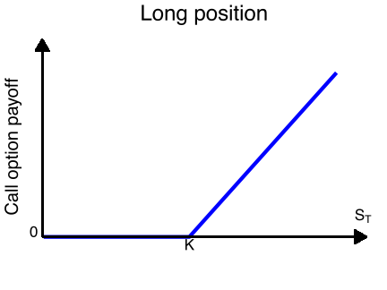{#fig-call-long}

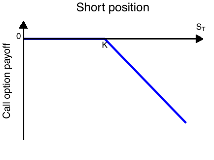{#fig-call-short}

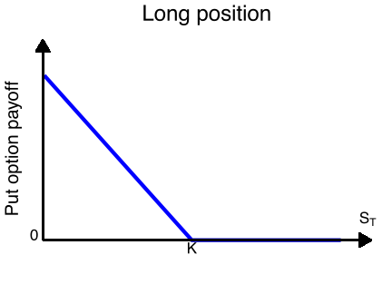{#fig-put-long}

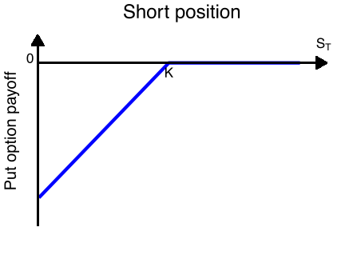{#fig-put-short}

유러피언 옵션 포지션으로부터의 payoff
:::

### 손익 {#sec-option-pnl}

@fig-option-payoff 만 보면 유러피안 옵션의 매수자들은 만기 시의 기초자산 가격에 따라 이득을 보거나 최소한 손해는 보지 않는 것으로 payoff가 형성된다.
따라서, 무차익 거래를 위해서는 옵션 거래 계약 시에 옵션 매수자가 매도자에게 적절한 값을 지불해야 한다.
이를 옵션 가격 혹은 옵션 프리미엄이라고 부른다.
옵션 가격은 시장에서 수요와 공급의 법칙에 의해 결정되지만, 우리는 추후에 몇 가지 옵션 가격 결정 모형들에 대해서 알아볼 것이다.

옵션 거래로 인한 손익은 옵션 가격과 payoff의 합으로 표현된다.
@fig-option-pnl 에서는 옵션의 각 포지션 별로 손익을 나타내었다.
전체적인 형태는 앞의 그림과 같지만, 옵션 가격만큼 $y$ 방향으로 평행 이동한 형태이다.
옵션 매수자의 경우 옵션 프리미엄을 지급한 만큼 손실로 음의 값을 지니고,
옵션 매도자의 경우 옵션 가격을 지급받아 그만큼 양의 값을 지닌다.

::: {#fig-option-pnl layout-ncol=2}
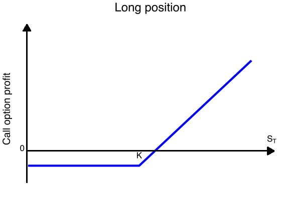{#fig-call-long-pnl}

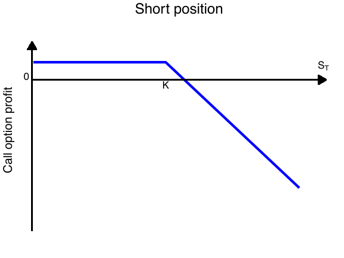{#fig-call-short-pnl}

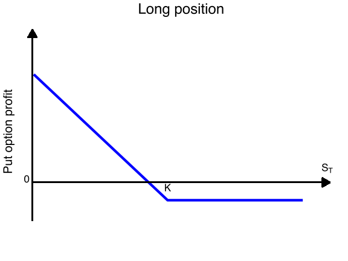{#fig-put-long-pnl}

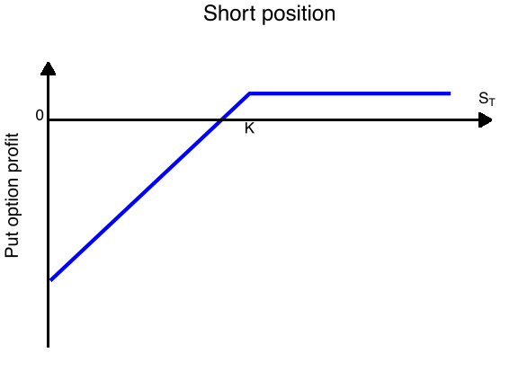{#fig-put-short-pnl}

유러피언 옵션 포지션으로부터의 손익 구조
:::

옵션은 선도나 선물 거래처럼 투기, 혹은 헷징의 목적으로 거래된다.
기초 자산의 가격이 상승할 것이라 예측하면 투기의 목적으로 콜 옵션을 구매할 수 있다.
비슷하게 기초 자산의 가격이 상승할 것이 걱정되면 헷지의 목적으로 콜 옵션을 구매할 것이다.
마찬가지로 기초 자산의 가격이 하락할 것으로 예측되거나 하락의 위험이 걱정된다면 풋 옵션을 구매한다.
옵션 거래는 자산 가격의 변화 뿐만 아니라 변동성의 변화에 대해 대응하기 위해서도 거래된다.
이에 대해서는 잠시 후에 살펴본다.

이자와 거래비용을 무시하면, 옵션 매수자의 최대 손실은 지급한 프리미엄이다.
옵션 매도자는 받은 프리미엄에 비해 큰 손실을 볼 수 있다.
콜 옵션 매도자의 손실은 기초자산 가격이 상승할수록 커지며 이론적으로 한도가 없다.
반면 기초자산 가격이 0 이상이라면, 풋 옵션 매도자의 최대 손실은 행사가격에서 받은 프리미엄을 뺀 금액이다.
@fig-call-short-pnl 와 @fig-put-short-pnl 을 다시 살펴보라.

### 가격도 (moneyness) {#sec-moneyness}

기초 자산의 가격과 옵션의 행사 가격의 관계를 가격도 (moneyness)라고 하며, 크게 내가격 (in the money, ITM), 등가격 (at the money, ATM), 외가격 (out of the money, OTM)으로 구분한다.
현재의 주식 가격을 $S_t$라 하자.
콜 옵션의 경우 $S_t > K$이면 내가격, $S_t=K$이면 등가격, $S_t<K$이면 외가격이라고 한다.
맥락에 따라 $S_t \approx K$이어도 등가격이라고 부를 수 있다.
풋 옵션의 경우 반대로 $S_t < K$이면 내가격, $S_t=K$이면 등가격, $S_t>K$이면 외가격이다.
임의의 $t \leq T$에서 가격도를 정의할 수 있으며,
내가격에 있을 경우 옵션의 가치가 높고 외가격에 있을 경우 가치가 낮다.
경우에 따라 등가격으로부터 멀리 떨어져 있을 경우, 심내가격 (deep in the money), 심외가격 (deep out of the money) 등의 용어를 사용하기도 한다.
아래의 그림에서 왼쪽은 임의의 $t$ 시점에 콜 옵션의 가격도를 나타낸 것이고, 오른쪽은 풋 옵션의 가격도를 나타낸 것이다.

::: {layout-ncol=2}
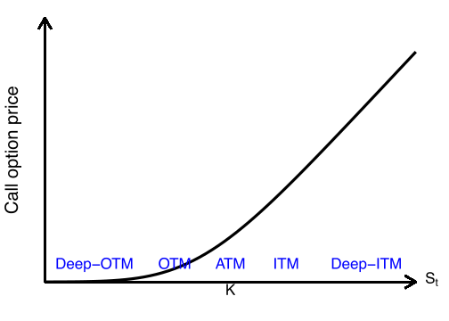

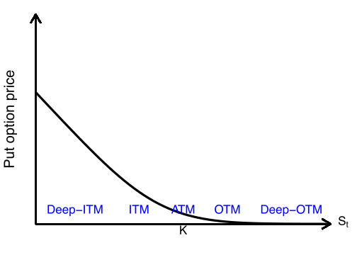
:::

### 내재 가치와 시간 가치 {#sec-option-time-value}

옵션의 가치는 내재 가치 (intrinsic value)와 시간 가치 (time value)의 합이다.
이 중 내재 가치는 옵션의 payoff 공식을 통해 정의된다.
즉, 유러피안 콜 옵션과 풋 옵션의 $t$ 시점에서의 내재 가치는 각각
$$ (S_t - K)^{+}, \quad (K-S_t)^+$$
이다.
따라서 외가격에 있을 경우, 옵션의 내재 가치는 0이다.

하지만 자산 가격이 외가격에 위치하더라도 옵션의 전체 가치가 0인 것은 아니다.
자산 가격의 변화에 따라 향후에 내가격으로 진입할 가능성이 존재하기 때문이다.
이처럼 시간의 흐름에 따라 얻을 수 있는 잠재적인 가치를 시간 가치라고 한다.
유러피안 콜 옵션의 경우 시간 가치는 항상 양수이며, 유러피안 풋 옵션의 경우도 거의 양의 값이지만, 때로는 음수가 될 수도 있다.

@fig-call-time-value 에서 붉은 선은 $t$ 시점에서의 유러피언 콜 옵션의 가치를 나타내고,
파란 점선은 옵션의 내재 가치를 나타낸다.
옵션의 가치와 내재 가치의 차이가 시간 가치이며, 만기가 다가올수록 시간 가치는 0으로 수렴한다.
잠재 능력이 발휘되지 않은 스포츠 유망주가 미래에 대스타가 될 가능성만으로 높은 시장 가치를 형성할 수 있는데, 이것을 옵션의 시간 가치로 비유하여 생각하면 이해하기 편하다.
반면, @fig-put-time-value 에서 풋 옵션의 시간 가치를 보면, 깊은 내가격에서 음수가 될 수도 있다.
콜 옵션의 내가격 영역에서 $S_t$의 상한은 없는 반면, 풋 옵션의 내가격 영역에서 $S_t$의 하한은 0으로 제한되기 때문이다.

::: {#fig-option-time-value layout-ncol=2}
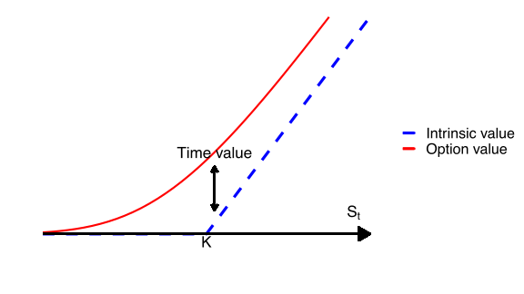{#fig-call-time-value}

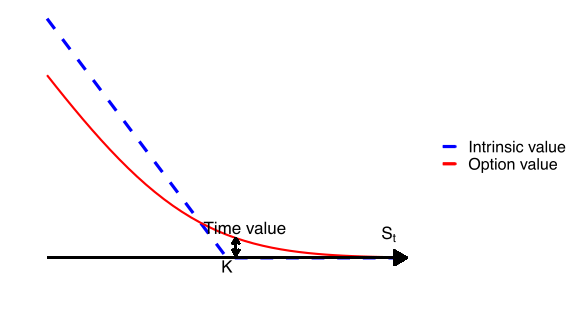{#fig-put-time-value}

유러피언 옵션의 $t$ 시점에서의 가치와 내재 가치 그리고 시간 가치
:::

## 풋-콜 대칭성 (Put-call parity) {#sec-put-call-parity}

이론적으로 유러피안 콜 옵션의 가격이 알려져 있으면 동일한 만기와 행사가격을 가지는 풋 옵션의 가격은 자동으로 결정된다.
이 관계를 풋-콜 대칭성 (put-call parity)라고 한다.
이를 유도하기 위해 동일한 만기 $T$와 행사가격 $K$에 대해 다음의 두 포트폴리오를 생각해보자.

- 포트폴리오 1 : 유러피언 콜 옵션 1개와 $T$ 시점에 $K$를 지급하는 무이표채
- 포트폴리오 2 : 유러피언 풋 옵션 1개와 주식 1주

만기 시점에 $S_T < K$이냐, $S_T > K$이냐에 따라 각 포트폴리오의 가치를 계산해 보자.
만약 $S_T < K$이면 풋 옵션만 행사될 것이고, $S_T > K$이면 콜 옵션만 행사된다.
무이표채와 주식의 가치는 이와는 상관없이 결정된다.

| 포트폴리오 | 구성 자산 | $S_T > K$ | $S_T < K$ |
| --- | --- | --- | --- |
| 포트폴리오 1 | 콜 옵션 | $S_T - K$ | 0 |
| | 무이표채 | $K$ | $K$ |
| | 합계 | $S_T$ | $K$ |
| 포트폴리오 2 | 풋 옵션 | 0 | $K - S_T$ |
| | 주식 | $S_T$ | $S_T$ |
| | 합계 | $S_T$ | $K$ |

위 표에서와 같이 포트폴리오 1과 2의 $T$ 시점에서의 가치는 $S_T > K$일 때는 $S_T$이고, $S_T \le K$일 때는 $K$이다.
두 포트폴리오는 $T$ 시점에 동일한 가치를 지니므로, 현재 시점에서도 동일한 가치를 지녀야 한다.
무이표채의 현재 가격은 $K\mathrm{e}^{-rT}$로 나타낼 수 있으므로,
$$ C_0 + K\mathrm{e}^{-rT} = P_0 + S_0$$
이며, 이 관계를 풋-콜 대칭성 (put-call parity)라고 한다.
만약, 풋-콜 대칭성이 성립하지 않으면, 차익 거래의 기회가 발생한다.

::: {.callout-tip title="예제"}
동일한 만기 $T = 0.2$와 행사가격 $100$를 가지는 유러피안 콜 옵션과 풋 옵션의 가격이 다음과 같다고 한다.
$$ C_0 = 10, \quad P_0 = 12 $$
또한 $S_0 = 95$, $r = 0.05$이라고 할 때, 풋-콜 대칭성이 성립하는지 살펴보면,
$$
\begin{aligned}
&C_0 +  K\mathrm{e}^{-rT} = 10 + 100 \mathrm{e}^{-0.05 \times 0.2} \approx 109 \\
&P_0 + S_0 = 12 + 95 = 107
\end{aligned}
$$
로 $C_0 +  K\mathrm{e}^{-rT} > P_0 + S_0 $이므로 풋-콜 대칭성이 성립하지 않으며, 차익 거래 기회가 발생한다.
콜 옵션을 매도하고 풋 옵션을 매수하는 포지션에서 출발하여 차익 거래 전략을 구성해 보자.
콜 옵션을 매도하고 풋 옵션을 매수하면, 만기 시에 아래 그림과 같은 payoff를 가진다.

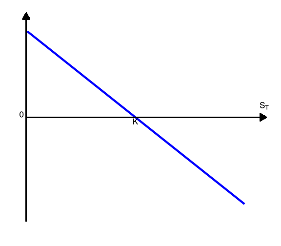{#fig-call-put-payoff width=40%}

이것만으로는 차익 거래를 얻을 수 없지만, payoff의 그래프의 기울기는 $-1$로 $S_T$가 클수록 하락하는 구조이므로,
주식 $S$를 1주 매수하여, (콜 옵션 매도 + 풋 옵션 매수 + 주식 매수)의 payoff의 $S_T$에 대한 기울기를 0으로 맞춘다.
콜 옵션을 매도하고 풋 옵션과 주식을 매수할 때의 초기 순현금흐름은
$$ C_0 - P_0 - S_0 = 10 - 12 - 95 = -97 $$
이다. 따라서 무이표채를 발행하여 97을 차입하면 초기 순현금흐름이 0인 포트폴리오를 구성할 수 있다.

만기에 이르러, 주가가 100보다 작으면 풋 옵션을 행사하여 가지고 있던 주식을 100에 매도한다.
주가가 100보다 크면, 콜 옵션 거래 상대가 콜 옵션을 행사하여, 상대에게 주식을 100에 매도하게 된다.
따라서 어느 경우든지 만기에 100을 수취한다.
(콜 옵션 매도 + 풋 옵션 매수 + 주식 매수)의 payoff의 $S_T$에 대한 기울기가 0이면서 $y$-절편은 100이기 때문이다.
그림으로 나타내면 다음과 같다.

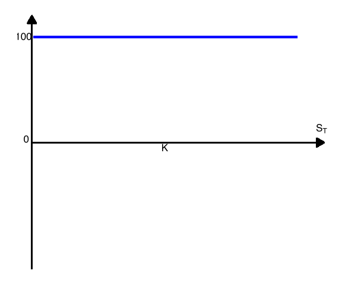{#fig-call-put-stock-payoff width=40%}

한편, 발행한 무이표채는
$$ 97 \times \mathrm{e}^{0.05 \times 0.2} \approx 98$$
의 금액으로 청산한다.
따라서 어떤 경우든지 $100 - 98 = 2$의 이득이 발생하며, 초기 비용이 0이었기 때문에 차익 거래이다.

:::

## 옵션의 종류 {#sec-option-types}

앞서 유러피언 옵션에 대해 살펴보았다.
이 자료의 향후 내용에서는 거의 유러피언 옵션에 대해 공부할 예정이지만,
간략하게 다양한 옵션의 종류에 대해 살펴 본다.

### 아메리칸 옵션

아메리칸 옵션은 유러피언 옵션과 동일한 payoff 구조를 가졌으나,
매수자가 만기 이전에 언제라도 조기 행사 (early exercise)가 가능하다.
오직 만기일에만 행사가 가능한 유러피안 옵션과의 차이점이다.

이론적으로 배당이 없는 기초 자산에 대해 동일한 만기와 행사 가격을 가지는 아메리칸 콜 옵션과 유러피안 콜 옵션의 가격은 똑같다.
다시 말해, 아메리칸 콜 옵션의 경우, $t$ 시점에서  조기 행사가 가능하더라도, 만기일까지 기다려보는 것이 더 좋은 전략이다.
콜 옵션을 조기 행사하는 것은 옵션의 시간 가치를 포기하는 것을 뜻한다.
콜 옵션의 조기 행사로 얻어지는 이득으로 옵션의 시간 가치를 능가하는 수익을 얻어야 조기 행사가 의미가 있다.
하지만, @fig-call-time-value 에서 본 것처럼 콜 옵션의 시간 가치는 상당히 크며,
향후의 어떠한 투자 전략과 비교하더라도, 이 시간 가치를 보유하는 것이 이득이다.

반면, 아메리칸 풋 옵션의 경우 심내가격에 있을 경우 조기 행사를 하는 것이 이득을 볼 수 있다.
@fig-put-time-value 에서처럼 내가격일 경우 시간 가치는 매우 작으며 심지어 음수가 되기도 한다.
따라서 $S_t$가 충분히 작을 경우 아메리칸 풋 옵션을 행사하여 이득을 취하는 것이 유리하다.
수치적 방법을 통해 아메리칸 풋 옵션을 조기 행사하면 유리한 영역을 표시하는 경계선을 찾을 수 있다.
자세한 내용은 이 자료의 범위를 벗어나지만, 아메리칸 풋 옵션의 행사 경계선 (exercise boundary)의 예제를 @fig-option-exercise-boundary 에서 살펴보라.

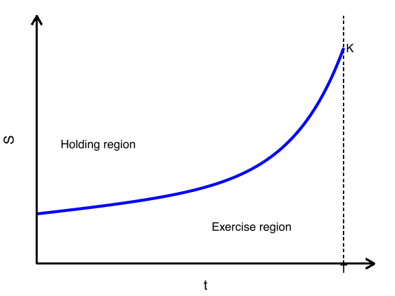{#fig-option-exercise-boundary width=60%}

::: {.callout-tip title="예제"}
아메리칸 콜 옵션 매수자가 $t$ 시점에 조기 행사를 하였다고 하자.
그러면 $S_t - K$의 payoff를 얻는다.
이 금액을 $T$까지 무위험자산에 투자하면 최종 이득은
$$
\mathrm{e}^{r(T-t)} (S_t - K)
$$ {#eq-call-early-exercise}
이다.
이 투자자가 조기 행사를 하는 대신, $S_t$를 공매하였다고 하자.
공매로 얻은 금액을 무위험자산에 투자하면 $T$에 $\mathrm{e}^{r(T-t)} S_t$를 얻는다.
또한, 만기에

- $S_T > K$인 경우 : 옵션을 만기에 행사한다. 즉, $K$의 금액을 지불하여 주식을 매입한다. 매입한 주식으로 공매한 주식을 갚는다.
따라서 최종 이득은 무위험 자산 투자 결과를 합하여, $\mathrm{e}^{r(T-t)} S_t - K$이다.
- $S_T \leq K$인 경우 : 옵션은 행사되지 않는다. 시장에서 주식을 $S_T$에 구입하여 공매한 주식을 갚는다. 무위험 자산 투자 결과를 합하여,  $\mathrm{e}^{r(T-t)} S_t - S_T$의 최종 이득을 얻는다.

두 경우 모두 @eq-call-early-exercise 보다 큰 이득이며, 아메리칸 콜 옵션의 조기 행사는 최적의 선택이 아님을 알 수 있다.
:::

### 아시안 옵션

아시안 옵션의 payoff는 일정 시간 간격으로 관찰된 기초 자산의 평균 가격에 의해 결정된다.
관찰 시점 $0 < t_1 < \cdots t_n = T$로 주어진다면,
아시안 콜 옵션의 payoff는
$$ C_T = \left( \frac{1}{n} \sum_{i=1}^{n} S_{t_i} - K \right)^+ $$
이고, 풋 옵션은
$$ P_T = \left(K - \frac{1}{n} \sum_{i=1}^{n} S_{t_i}  \right)^+ $$
이다.
경우에 따라서는 가격 공식 계산의 편의를 위해 기하 평균을 사용하기도 한다.
유러피안 옵션은 만기의 기초 자산 가격에만 영향을 받지만, 아시안 옵션은 평균적인 자산의 가격의 레벨에 의해 결정되기 때문에,
시장 조작 (market manipulation)의 위험으로부터 상대적으로 안전하다.

### 디지털 옵션

디지털 옵션 (digital option) 혹은 바이너리 옵션 (binary option)은 만기 시에 기초 자산의 가격이 $K$를 넘느냐 넘지 않느냐에 따라, 1 혹은 0의 payoff를 제공하는 옵션을 말한다.
디지털 콜 옵션의 payoff는
$$ C_T = \mathbf{1}_{\{S_T > K\}} $$
이다.
즉, 만기일의 주가가 $K$를 넘어서면 콜 옵션 매수자는 1을 받고, $K$ 이하이면 0을 받는다.
마찬가지로 풋 옵션의 payoff는
$$ P_T = \mathbf{1}_{\{S_T < K\}} $$
이다.

### 배리어 옵션

배리어 옵션 (barrier option)에는 미리 정해놓은 하나 이상의 실수값 배리어가 있어, 만기에 이르는 동안 자산 가격이 이 배리어들을
넘어가느냐 넘어가지 않느냐에 따라 payoff가 달라진다.
예를 들어 노크인 (knock-in) 옵션은 기초 자산의 가격이 미리 정한 배리어에 도달하여야만 옵션이 유효하다.
반면에 노크아웃 (knock-out) 옵션은 기초 자산의 가격이 배리어에 도달하면 옵션 계약은 무효화되어 종료된다.
만기일까지의 남은 기간 중 일부 구간에서만 배리어를 설정할 수도 있고, 시간에 따라 높이가 다른 배리어를 설정할 수도 있다.

### 유러피안 옵션의 조합

유러피안 콜 옵션과 풋 옵션을 조합하여 새로운 payoff를 만들어 내는 것이 가능하다.
매우 다양한 종류의 전략이 있지만 이 자료에서는 스트래들 (straddle)과 스트랭글 (strangle)에 대해 간략히 알아본다.
스트래들은 동일한 행사가와 동일한 만기일을 가지는 유러피안 풋옵션과 콜옵션을 동시에 매수하는 옵션 전략이다.
만기 시점에서의 손익 구조는 @fig-option-combinations 의 왼쪽과 같다.
스트랭글 또한 비슷한 옵션 전략으로 행사가는 다르지만 같은 만기를 지니는 유러피안 콜 옵션과 풋 옵션을 매수하는 전략이다.
만기 시점에서의 손익 구조는 @fig-option-combinations 의 오른쪽과 같다.
이 전략들을 통하여 옵션 투자자는 자산 가격이 크게 오르거나 크게 내리면, 즉 자산 가격의 변동이 심하면, 수익을 올릴 수 있다.
반면, 옵션 매도자는 자산 가격이 만기일에 행사 가격에 비해 크게 다르지 않아야 수익을 올릴 것이다.

::: {#fig-option-combinations layout-ncol=2}
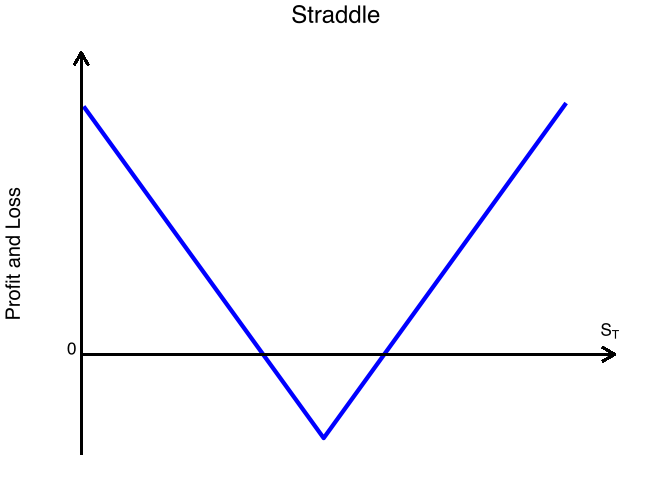

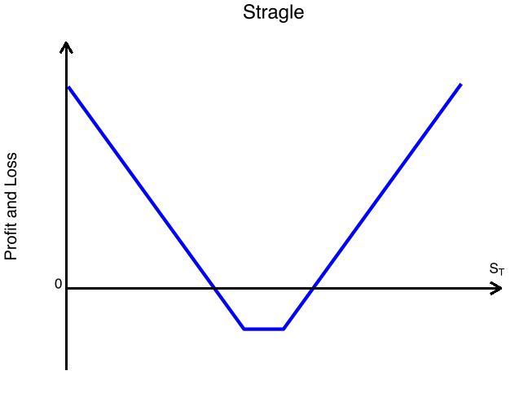

동일한 행사 가격을 가진 옵션들로 구성된 스트래들 (왼쪽)과 다른 행사 가격을 가진 옵션들로 구성된 스트랭글 (오른쪽)의 만기 시점에서의 손익 구조
:::
