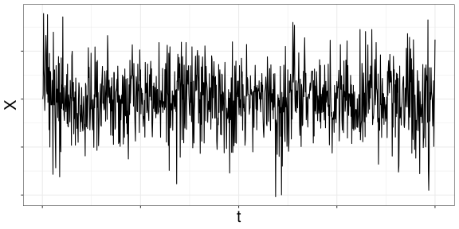
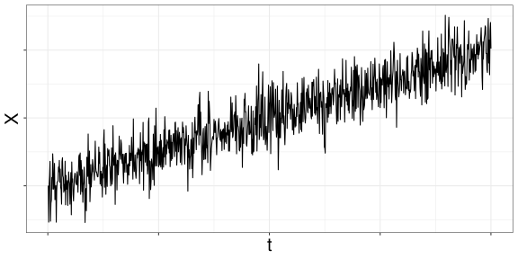
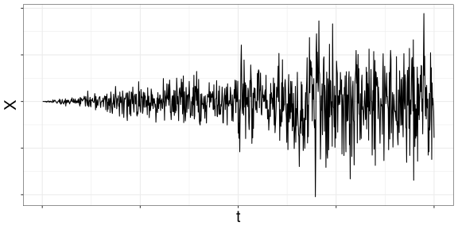
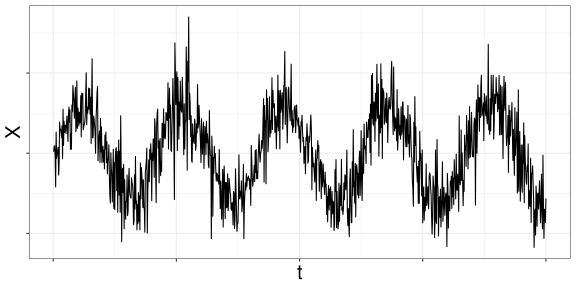
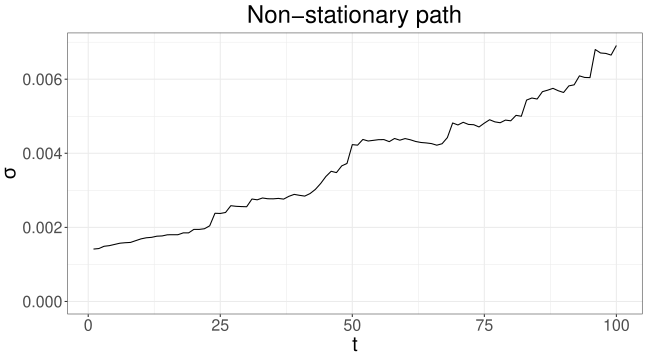
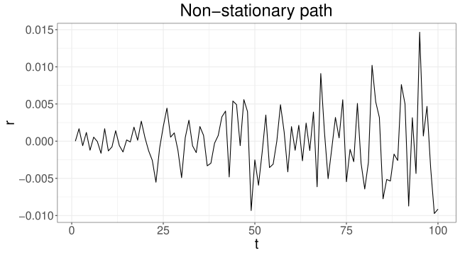

# 변동성

## 개요

수익률의 변동성을 측정하고 모형화하는 방법을 다룬다.

## 학습 목표

- 변동성을 수익률 변동의 척도로 이해한다.
- 역사적 변동성, 실현변동성, 모형 기반 변동성을 비교한다.
- 변동성 군집과 시간가변 변동성을 해석한다.

## 간단한 변동성 추정

금융에서 [변동성](../../concepts/glossary.qmd#volatility)(volatility)은 수익률 분포의 표준편차(혹은 분산)를 뜻한다. 하지만 변동성의 구체적 의미는 맥락에 따라 다르다. 일간, 월간, 연간 변동성을 뜻하기도 하고 순간 변동성을 가리키기도 한다. 과거 금융 시계열 자료로부터 추정하는 역사적 변동성(historical volatility)과, 옵션 등 파생상품의 가격에 내포된 [내재변동성](../../concepts/glossary.qmd#implied-volatility)(implied volatility)으로 나누기도 한다.

변동성 추정에는 몇 가지 어려움이 있다.

- 변동성은 **숨겨진 변수**(latent variable)다. 자산 가격이나 수익률과 달리 직접 관찰할 수 없으므로 별도의 방법으로 추정해야 한다.
- 수익률의 변동성은 **시간에 따라 변하며**(time-varying), **변동성 군집**(volatility clustering) 현상을 보인다. 오늘과 내일의 변동성은 양의 상관관계가 있어서, 오늘 변동성이 높으면 내일도 높을 가능성이 크고 오늘 낮으면 내일도 낮을 가능성이 크다.
- 변동성은 **지속성**(persistency)이 높아서, 높거나 낮은 경향이 비교적 오래 이어진다.

::: {.callout-note}
미래 값을 예측하기 어려운 자산 수익률과 달리, **변동성은 오늘 측정한 값으로 내일을 어느 정도 예측할 수 있다.** 이 장에서 다루는 방법들은 모두 이 성질을 이용한다.
:::

많은 경우 변동성은 시간에 따라 천천히 변한다. 폴란드 태생의 수학자 브누아 망델브로는 이 현상을 다음과 같이 표현했다 [@mandelbort1963variation].

> … 큰 변화 뒤에는 부호와 관계없이 큰 변화가 따르는 경향이 있고, 작은 변화 뒤에는 작은 변화가 따르는 경향이 있다 …

하지만 가끔 변동성은 급격히 변한다. 예를 들어 10%였던 변동성이 30%로 급등하는 경우(혹은 그 반대)가 있다. 이런 현상을 **제도 전환**(regime switching)이라 하며, 예측이 어렵고 리스크 관리를 어렵게 만든다.

시간에 따라 변하는 변동성은 자산 수익률 분포가 정규분포가 아님을 뜻한다. [포트폴리오 이론](../02-modern-portfolio-theory/index.qmd)을 다룰 때는 수익률 분포의 정규성을 가정했지만, 시장에서 관측되는 수익률 분포는 정규분포가 아니다. 일반적으로 정규분포보다 두꺼운 꼬리를 가지고, 비대칭이며, 분포를 결정하는 모수(parameter)가 시간에 따라 변한다. 비정규성의 원인은 여러 가지지만 변하는 변동성도 그중 하나다. 시간에 따라 변하는 모수, 특히 변동성은 두꺼운 꼬리 분포나 비대칭 분포를 만들 수 있다.

이 장에서는 수익률 시계열을 바탕으로 변동성을 추정하는 여러 통계적 방법을 배운다. **시계열**(time series)은 시간 순서로 인덱스를 매겨 나열한 수치 자료를 말한다. 일간 수익률 시계열은 보통 장이 마감될 때 관찰된 종가(closing price)를 기준으로 만든다. 매일 관찰한 어떤 주식의 종가가

$$
S_0,\; S_1,\; \cdots,\; S_n
$$

이라면, 일간 산술수익률 시계열은

$$
R_1 = \frac{S_1 - S_0}{S_0},\; R_2 = \frac{S_2 - S_1}{S_1},\; \cdots,\; R_n = \frac{S_n - S_{n-1}}{S_{n-1}}
$$

이고, 일간 로그수익률은 다음과 같다.

$$
r_1 = \log \frac{S_1}{S_0},\; r_2 = \log \frac{S_2}{S_1},\; \cdots,\; r_n = \log \frac{S_n}{S_{n-1}}
$$

이 장에서는 산술수익률을 $R_i$, 로그수익률을 $r_i$로 구분해 쓴다([기호 정리](../../concepts/notation.qmd) 참고). 일반적으로 두 수익률의 값은 크게 다르지 않지만, 시계열이나 확률과정으로 다룰 때는 로그수익률이 시간에 대해 **가산적**(additive)이어서 편리하다. 1일부터 $n$일까지의 로그수익률은 다음과 같다.

$$
r_{1,n} = \log \frac{S_n}{S_0} = r_1 + \cdots + r_n
$$

중요하지 않은 경우에는 이 둘을 엄밀히 구분하지 않는다.

::: {.callout-tip}
## 예제: 일간 변동성을 연간으로 바꾸기

어떤 자산의 일간 로그수익률이 서로 [독립](../../concepts/probability/independence.qmd)이고 같은 분포를 따른다고 하자. $\mathbb{E}[r_i] = \mu_d$라 할 때, 1년을 250 영업일(business day)로 보면 연간 기대수익률은

$$
\mathbb{E}\left[\sum_{i=1}^{250} r_i\right] = 250\,\mu_d
$$

이다. 비슷하게 $\mathrm{sd}(r_i) = \sigma_d$이면 연간 로그수익률의 표준편차는 다음과 같다.

$$
\mathrm{sd}\left(\sum_{i=1}^{250} r_i\right) = \sqrt{250}\,\sigma_d
$$

산술수익률에서는 등식이 성립하지 않지만, 일간 산술수익률 $R_i$가 독립이고 같은 분포를 따른다면 연간 산술수익률의 기댓값과 표준편차를 각각 $250\,\mathbb{E}[R_i]$, $\sqrt{250}\,\mathrm{sd}(R_i)$로 근사할 수 있다.

[다기간 VaR](../08-var-multiperiod/index.qmd) 장에서 시간제곱근 법칙이라 부른 것이 바로 이 관계다.
:::

### 표본 표준편차 방법

변동성을 추정하는 가장 간단한 방법은 과거 수익률 자료의 표본 표준편차를 계산하는 것이다. 현재 시점을 $n$이라 하고 과거 $m$개의 수익률이 주어졌을 때, 현재 시점의 변동성 $\sigma_n$은 다음과 같이 추정한다.

$$
\sigma_n = \sqrt{\frac{1}{m-1} \sum_{i=1}^{m} (r_{n-i} - \bar r)^2}
$$ {#eq-real-vol}

여기서 $r_{n-i}$는 과거 $n-i$ 시점에 실현된 수익률이고, $\bar r$은 그 평균이다.

$$
\bar r = \frac{1}{m} \sum_{i=1}^{m} r_{n-i}
$$

@eq-real-vol 에서 $m-1$을 $m$으로 바꾸거나 $\bar r = 0$으로 가정해 다음과 같이 간단히 근사하기도 한다.

$$
\sigma_n = \sqrt{\frac{1}{m} \sum_{i=1}^{m} r_{n-i}^2}
$$

표본분산을 계산할 때 $m-1$로 나누면 불편추정량(unbiased estimator)이 되고, $m$으로 나누면 최대우도추정량(maximum likelihood estimator)이 된다.

::: {.callout-warning}
표본 표준편차를 변동성으로 쓰는 방법은 **시간에 따른 변동성의 변화 추세**(trend)를 반영하기 어렵다. 과거 $m$개의 수익률에 모두 같은 가중치를 주기 때문이다. 아래 EWMA 예제에서 이 한계가 어떻게 드러나는지 볼 수 있다.
:::

### Exponential smoothing

**지수 평활**(exponentially weighted moving average, EWMA) 방법은 시간에 따라 변하는 변동성의 특성을 감안한 방식이다. 먼 과거일수록 더 작은 가중치를 주어 평균을 낸다. 시점 $n$에서 수익률의 분산 $\sigma_n^2$을 다음 식으로 계산한다.

$$
\sigma_n^2 = w_0 r_{n-1}^2 + \lambda \sigma_{n-1}^2
$$

여기서 $\lambda$는 상수이고, $w_0$의 값은 뒤에서 정한다. EWMA의 성질을 이해하기 위해 이 식의 **재귀적**(recursive) 성질을 이용해 전개해 보자.

$$
\begin{aligned}
\sigma_n^2 &= w_0 r_{n-1}^2 + \lambda \sigma_{n-1}^2 \\
&= w_0 r_{n-1}^2 + \lambda (w_0 r_{n-2}^2 + \lambda \sigma_{n-2}^2) \\
&= w_0 r_{n-1}^2 + w_0 \lambda r_{n-2}^2 + \lambda^2 (w_0 r_{n-3}^2 + \lambda \sigma_{n-3}^2) \\
&\;\;\vdots \\
&= w_0 r_{n-1}^2 + w_0 \lambda r_{n-2}^2 + w_0 \lambda^2 r_{n-3}^2 + w_0 \lambda^3 r_{n-4}^2 + \cdots
\end{aligned}
$$

$0 < \lambda < 1$이면, 먼 과거의 수익률일수록 $r_{n-\ell}^2$의 가중치 $w_0 \lambda^{\ell-1}$이 작아진다. @tbl-ewma-weights 로 정리하면 다음과 같다.

| 날짜 | 제곱 수익률 | 가중치 |
|:---:|:---:|:---:|
| $n-1$ | $r_{n-1}^2$ | $w_0$ |
| $n-2$ | $r_{n-2}^2$ | $w_0 \lambda$ |
| $n-3$ | $r_{n-3}^2$ | $w_0 \lambda^2$ |
| $n-4$ | $r_{n-4}^2$ | $w_0 \lambda^3$ |
| $\vdots$ | $\vdots$ | $\vdots$ |

: EWMA에서 과거 수익률에 주는 가중치 {#tbl-ewma-weights}

$\lambda$는 통상 0.94처럼 1에 가깝지만 1보다 작은 값을 쓴다. 그러면 알맞은 $w_0$는 무엇일까? 과거 $K$일의 자료를 쓴다면 가중치의 합은

$$
w_0 (1 + \lambda + \lambda^2 + \cdots + \lambda^K)
$$

이다. 이론적으로 무한히 먼 과거까지 쓴다고 가정하면 가중치의 합은 다음과 같다.

$$
w_0 \sum_{k=0}^{\infty} \lambda^k = \frac{w_0}{1 - \lambda}
$$

가중치의 합이 1이 되도록 $w_0 = 1 - \lambda$로 둔다.

::: {.callout-note}
## EWMA 변동성

EWMA를 이용한 현재 분산 $\sigma_n^2$은 $0 < \lambda < 1$에 대해 다음과 같이 계산한다.

$$
\sigma_n^2 = (1 - \lambda)\, r_{n-1}^2 + \lambda\, \sigma_{n-1}^2
$$
:::

실제로는 숨겨진 변수인 $\sigma_{n-1}^2$의 값을 알 수 없으므로, 충분히 많은^[정확한 기준은 없지만 50개 이상을 고려한다.] $K$개의 과거 수익률로 다음과 같이 근사한다.

$$
\sigma_n^2 = (1-\lambda) r_{n-1}^2 + (1-\lambda)\lambda r_{n-2}^2 + (1-\lambda)\lambda^2 r_{n-3}^2 + \cdots + (1-\lambda)\lambda^{K-1} r_{n-K}^2
$$ {#eq-ewma-past}

한 번 계산이 끝나면, 즉 $n$ 시점의 분산이 구해지면 다음 날의 분산은

$$
\sigma_{n+1}^2 = (1 - \lambda)\, r_n^2 + \lambda\, \sigma_n^2
$$

으로 계산하고, 그 이후는 같은 과정을 반복한다.

글로벌 금융기업 J.P. Morgan이 처음 EWMA를 변동성 측정에 도입했을 때 $\lambda = 0.94$를 썼다. 과학적으로 결정된 값은 아니지만 실증 자료에 어느 정도 잘 들어맞아 채택된 값이다. 어떤 학자들은 $\lambda = 0.97$ 정도를 주장하기도 한다.

::: {.callout-warning}
$\lambda$를 결정하는 엄밀한 방법은 없다. EWMA는 변동성을 측정하는 편리한 도구일 뿐, 변동성의 움직임을 설명하는 확률 모형이 아니기 때문이다. 최대우도추정법이나 최소제곱법으로 $\lambda$를 정하기도 하지만 이론적 근거가 충분하지는 않다. 그럼에도 편리함과 간단함 때문에 널리 쓰이는 방법이다.
:::

::: {.callout-tip}
## 예제: 추세가 있는 수익률에서 EWMA 계산

시간 순서대로 관측된 가상의 일간 수익률 50개를 생각하자.

$$
0.05,\; 0.049,\; -0.048,\; \cdots,\; -0.002,\; 0.001
$$

절댓값이 0.05에서 0.001까지 줄어들도록 의도적으로 만든 자료이고, 부호는 무작위로 정했다. 마지막 값이 오늘의 수익률일 때, $\lambda = 0.94$로 EWMA를 써서 내일의 일간 변동성을 계산한다. @eq-ewma-past 에 따르면

$$
\sigma^2 = 0.06 \times 0.001^2 + 0.06 \times 0.94 \times 0.002^2 + \cdots + 0.06 \times 0.94^{49} \times 0.05^2
$$

이고, 계산하면 $\sigma \approx 0.0180$이다.

반대로 절댓값이 커지도록 만든 가상의 수익률

$$
-0.001,\; 0.002,\; -0.003,\; \cdots,\; 0.049,\; -0.05
$$

에서는

$$
\sigma^2 = 0.06 \times 0.05^2 + 0.06 \times 0.94 \times 0.049^2 + \cdots + 0.06 \times 0.94^{49} \times 0.001^2
$$

이고, $\sigma \approx 0.0376$이다.

두 자료는 절댓값의 순서만 다르다. **표본 표준편차로 계산했다면 두 경우 모두 같은 값이 나온다.** EWMA는 최근 수익률에 큰 가중치를 주므로, 변동이 잦아드는 첫 번째 자료에서는 작게, 변동이 커지는 두 번째 자료에서는 크게 추정한다.
:::

## GARCH

### GARCH 모형의 배경과 조건부 분포

[GARCH](../../concepts/glossary.qmd#garch)(generalized autoregressive conditional heteroscedasticity) 모형은 시간에 따라 변하는 변동성을 모형화하며, 수학적으로 완전한 모형이다. 관점에 따라 EWMA의 수학적 완성형으로 볼 수 있다. 이 변동성 모형은 ARCH(autoregressive conditional heteroscedasticity) 모형으로 처음 등장했고 [@engle1982autoregressive], 그 뒤 [@bollerslev1986generalized]가 일반화된 형태로 완성했다. Robert F. Engle은 이 공로로 노벨 경제학상을 받았다.

한편 Engle 교수는 2009~2010년 한국에서 키코(KIKO) 사태로 손해를 입은 파생상품 가입 기업 측과 판매자인 은행 측이 법정 공방을 벌였을 때, 가입 기업의 자문으로 한국 재판에 참여한 이력이 있다. 그러자 은행 측은 또 다른 유명 금융경제학자 Stephen Ross^[[이산 시간 모형](../06-discrete-time-model/index.qmd) 장에서 공부할 이항 나무 옵션 가격 결정 이론의 정립에 공헌했다.]를 증인으로 세워 반대 변론을 펼쳤다.

한편 GARCH 모형을 만든 Bollerslev는 당시 Engle 교수의 연구 보조로 일하던 박사과정 학생이었다. Engle 교수의 동료 연구자 David Lilien이 "ARCH 모형을 ARMA(autoregressive moving average)^[시계열에서 AR(autoregressive) 모형과 MA(moving average) 모형을 일반화한 것.] 시계열처럼 일반적인 모형으로 확장할 수 없을까"라고 묻는 것을 듣고 GARCH 모형을 세우게 되었다고 한다 [@BOLLERSLEV202396].

GARCH 모형에서는 수익률 $r_n$과 분산 $\sigma_n^2$을 **확률과정**으로 간주한다. 즉 수익률뿐 아니라 수익률의 분산이나 표준편차도 시간에 따라 변하는 값이다.

::: {.callout-note}
## 확률과정

확률과정(stochastic process) $X$는 시간으로 인덱스된 일련의 확률변수들이며, 다음과 같이 쓴다.

$$
\{ X_n : n \in T \}
$$

여기서 $X_n$은 $(\Omega, \mathbb{P})$에서 정의된 확률변수이고, $T$는 시간 또는 이산적으로 정의된 시간 인덱스 집합이다.
:::

확률과정은 연속 시간과 이산 시간 모두에서 정의할 수 있으나, 이 장에서는 이산 시간에서 정의된 이산 확률과정만 다룬다.

GARCH 모형을 이해하려면 [조건부 분포](../../concepts/probability/conditional-probability.qmd), 특히 조건부 정규분포를 먼저 알아야 한다. 수익률 $r_n$은 시점 $n$에 관찰 가능한 확률변수다. 한편 $r_n$의 분산을 나타내는 $\sigma_n^2$도 확률변수인데, GARCH 모형에서는 $\sigma_n^2$이 **시점 $n-1$까지의 정보 집합**(information set)으로 표현된다고 가정한다.^[수학적으로는 시그마 대수 $\mathcal{F}_{n-1}$에 대해 가측(measurable)이라고 표현한다.] 즉 $n$ 시점 직전인 $n-1$ 시점에 이르면, 그때까지 관찰한 정보로 $\sigma_n^2$의 값을 계산할 수 있다고 가정한다.

수익률 $r_n$의 조건부 분포가, 주어진 $\sigma_n^2$에 대해 다음 조건부 정규분포를 따른다고 하자.

$$
r_n \mid \sigma_n^2 \sim N(0, \sigma_n^2)
$$

이는 $n-1$ 시점이 되어 $\sigma_n^2$의 값을 알게 되면, $r_n$의 분포를 그 값을 이용한 정규분포로 나타낼 수 있다는 뜻이다.

::: {.callout-tip}
## 예제: 변동성이 주어졌을 때의 조건부 분포

실증 연구 결과 $\sigma_1 = 0.1$, $\sigma_2 = 0.2$임이 밝혀졌다고 하자. $r_n \mid \sigma_n^2 \sim N(0, \sigma_n^2)$을 따른다는 것은 다음을 뜻한다.

$$
r_1 \mid \sigma_1^2 \sim N(0, 0.01), \qquad r_2 \mid \sigma_2^2 \sim N(0, 0.04)
$$
:::

::: {.callout-tip}
## 예제: 변동성이 식으로 주어졌을 때

어떤 이론적 연구 결과 분산이 다음과 같이 나타난다고 하자.

$$
\sigma_n^2 = 0.5 + \frac{1}{n}
$$

그러면 $r_n \mid \sigma_n^2 \sim N(0, \sigma_n^2)$을 따른다는 것은, 예를 들어 $n = 10$에서 다음을 뜻한다.

$$
r_{10} \mid \sigma_{10}^2 \sim N(0, 0.6)
$$
:::

$\sigma_n^2$ 같은 추가 정보가 없을 때의 $r_n$의 분포는 **비조건부 분포**라 부르며, 이는 정규분포가 아니다.

::: {.callout-note}
매 시점의 조건부 분포는 정규분포인데 비조건부 분포는 정규분포가 아니라는 점이 GARCH 모형의 핵심이다. 앞 절에서 "시간에 따라 변하는 변동성은 수익률 분포가 정규분포가 아님을 뜻한다"고 한 것이 바로 이 구조다. 분산이 시점마다 다른 정규분포들이 섞이면 전체로는 꼬리가 두꺼운 분포가 된다. 이 성질은 다음 절에서 확인한다.
:::

### 정의와 기본 성질

모형의 복잡도에 따라 양의 정수 $p$, $q$에 대해 GARCH($p,q$) 모형이 있지만, 여기서는 가장 간단한 GARCH(1,1) 모형을 살펴본다. 그중에서도 수익률 과정은 모형화하지 않고 변동성 $\sigma_n$만 모형화한 형태를 다룬다.

::: {.callout-note}
## GARCH(1,1)

수익률 과정 $r_n$이 GARCH(1,1)를 따른다는 것은, $r_n$과 그 조건부 분산 $\sigma_n^2$이 다음을 만족한다는 뜻이다.^[$(r_n, \sigma_n^2)$이 GARCH(1,1)를 따른다고도 한다.]

$$
\sigma_n^2 = \omega + \alpha r_{n-1}^2 + \beta \sigma_{n-1}^2
$$ {#eq-garch11}

- 주어진 분산 $\sigma_n^2$에 대해 $r_n$의 조건부 분포는 정규분포다.
  $$
  r_n \mid \sigma_n^2 \sim N(0, \sigma_n^2)
  $$
- 표준화된 오차항 과정은 다음으로 정의한다.
  $$
  \varepsilon_n = \frac{r_n}{\sigma_n}
  $$ {#eq-varepsilon}
- $\omega, \alpha, \beta$는 모형 모수이며 양의 값이다.
- 다음 **정상성**(stationarity) 조건 중 하나를 만족한다.
  - 강정상성 조건
    $$
    -\infty < \mathbb{E}\left[\log(\beta + \alpha \varepsilon_0^2)\right] < 0
    $$ {#eq-stationarity1}
  - 약정상성 조건
    $$
    \alpha + \beta < 1
    $$ {#eq-stationarity}
:::

위 정의에서는 편의상 기대수익률을 0으로 가정했으나, 조건부 평균 수익률 과정을 따로 정의하는 경우도 많다. GARCH 모형의 조건에는 어긋나지만, $\omega = 0$, $\alpha = 1 - \lambda$, $\beta = \lambda$로 두면 EWMA 공식과 같아진다는 점에 주목하자.

금융 자산 수익률에서 $\beta$는 1에 가까운 값을 가진다. $\beta$가 1에 가까울수록 **지속성**(persistence)이 크다고 하며, $\beta$가 크면 먼 과거의 경향을, $\alpha$가 크면 최근의 경향을 더 많이 반영한다.^[[현대 포트폴리오 이론](../02-modern-portfolio-theory/index.qmd) 장에서 공부한 $\beta$와는 다른 것이므로 혼동하지 않는다. [기호 정리](../../concepts/notation.qmd)에도 정리해 두었다.]

::: {.callout-note}
## GARCH 과정의 확률적 성질

적절한 조건 아래에서 GARCH 확률과정은 여러 좋은 성질을 가진다. 예를 들어 시간이 충분히 흐르면, 즉 먼 과거의 분산 $\sigma_{n-T}^2$과 현재의 분산 $\sigma_n^2$은 근사적으로 [독립](../../concepts/probability/independence.qmd)이 된다. 20년 전의 변동성이 내일의 변동성에 영향을 준다고 생각하기는 어렵다. 이를 **강혼합 성질**(strong mixing property)이라 한다. 혼합에는 여러 종류가 있는데, 관찰값 사이의 간격이 멀어질수록 공분산이 0에 가까워지면 **공분산 혼합**(covariance mixing)이라 한다.

또한 적절한 조건 아래에서 GARCH 확률과정은 **에르고딕**(ergodic)이다. 에르고딕 확률과정이란, 관찰 기간이 충분하다면 하나의 실현된 경로(path) 안에서 그 확률과정의 모든 분포적 성질을 관찰할 수 있다는 뜻이다. 자세한 내용은 [@lindner2009stationarity]와 [@francq2019garch]를 참고한다.
:::

@eq-stationarity1 의 정상성 조건이란, @eq-garch11 로 정의된 분산 확률과정이 시간이 한참 흘러도 본래의 분포적 성질을 유지할 조건을 뜻한다. 위 정의처럼 표현되는 확률과정은 $\sigma_0$이나 $r_0$ 같은 초기값을 무엇으로 할지 명확하지 않다. 이때 편리한 방법은 이 확률과정이 **무한히 먼 과거로부터 시작했다**고 가정하는 것이다. 이 접근에는 시간이 오래 지나도 평균·분산·공분산 같은 분포 성질이 변하지 않는다는 성질이 필요하며, 이를 정상성이라 한다.

::: {.callout-note}
## 강정상성

확률과정 $X_t$가 **강정상**(strictly stationary, strongly stationary)이라는 것은, 임의의 자연수 $k$와 정수 $h$에 대해 $(X_1, \cdots, X_k)$와 $(X_{1+h}, \cdots, X_{k+h})$가 같은 결합 분포를 가진다는 뜻이다. 즉 시간을 $h$만큼 이동해도 분포의 성질이 변하지 않는다.
:::

::: {.callout-note}
## 약정상성

확률과정 $X_t$가 **약정상**(weakly stationary, wide-sense stationary, second-order stationary)이라는 것은, $X_t$의 평균과 분산이 유한한 상수로 존재하고 $\mathrm{Cov}(X_t, X_{t+h})$가 오직 두 시점 사이의 거리 $h$에만 의존한다는 뜻이다.
:::

예를 들어 @fig-nonstationary1 처럼 시간에 따라 평균이 계속 증가하거나 감소하는 확률과정, @fig-nonstationary3 처럼 주기적으로 움직이는 확률과정, @fig-nonstationary2 처럼 분산이 계속 증가하거나 감소하는 확률과정은 정상과정(stationary process)이 아닐 가능성이 높다.

::: {.callout-warning}
정상 시계열이지만 비정상 시계열처럼 보이도록 인위적으로 만들 수 있다. 따라서 **관찰된 경로 하나만으로는** 정상과정인지 비정상과정인지 완벽히 판단하지 못한다. 아래 예제가 이 점을 보여준다.
:::

::: {#fig-stationarity layout-ncol=2}

{#fig-stationary width=100%}

{#fig-nonstationary1 width=100%}

{#fig-nonstationary2 width=100%}

{#fig-nonstationary3 width=100%}

(아마도) 정상 시계열과 비정상 시계열의 예

:::

::: {.callout-note}
## 그림을 약정상성의 조건으로 읽기

약정상성은 세 가지를 요구한다 — 평균이 일정할 것, 분산이 일정할 것, 공분산이 두 시점 사이의 거리 $h$에만 의존할 것. @fig-stationarity 의 비정상 시계열 세 개는 이 가운데 하나씩을 어긴다.

- **(b)** 값이 시간에 따라 계속 올라간다 → **평균이 상수가 아니다.**
- **(c)** 흔들리는 폭이 시간에 따라 커진다 → **분산이 상수가 아니다.**
- **(d)** 주기적으로 오르내린다 → **평균이 시점에 따라 주기적으로 달라진다.** 어느 시점에서 보느냐에 따라 기대되는 값이 다르다.

**(a)**는 이런 추세가 없어 정상과정처럼 보인다. 다만 캡션에 "(아마도)"를 붙인 이유가 있다 — 그림 하나만으로 정상성을 단정할 수는 없다. 아래 예제가 그 이유를 보여준다.
:::

::: {.callout-tip}
## 예제: 같은 관찰값, 다른 확률과정

다음 시계열 실현값을 관찰했다고 하자.

$$
1,\; -1,\; 1,\; -1,\; 1,\; -1,\; 1,\; -1,\; 1,\; -1,\; 1,\; -1,\; 1,\; \cdots
$$

이 관찰값을 낳은 확률과정은 정상 시계열일 수도 있고 아닐 수도 있다.

$X_t$가 확률 1로 $X_t = (-1)^t$로 정의되었고 위 관찰값이 $X_t$의 실현 결과라면, $\mathbb{E}[X_1] \neq \mathbb{E}[X_2]$이므로 $X_t$는 비정상 시계열이다.

반면 $Y_t$가 다음과 같이 정의되었고

$$
Y_t = \begin{cases}
1,\; -1,\; 1,\; -1,\; 1,\; -1,\; \cdots & \text{확률 } 0.5 \\
-1,\; 1,\; -1,\; 1,\; -1,\; 1,\; \cdots & \text{확률 } 0.5
\end{cases}
$$

위 관찰값이 $Y_t$의 실현 결과라면, $Y_t$는 정상 시계열이다. 같은 관찰값이 두 경우 모두에서 나올 수 있다.
:::

GARCH 모형에서 $\alpha$와 $\beta$가 너무 크게 설정되면(예를 들어 $\alpha + \beta > 1$) 시계열이 정상과정이 되지 못하고, 다음 논의에 따라 분산 과정이 **폭발**(explosive)한다. EWMA처럼 GARCH 모형도 재귀적 형태를 가지므로 다음과 같이 전개할 수 있다.

$$
\begin{aligned}
\sigma_n^2 &= \omega + \beta \sigma_{n-1}^2 + \alpha r_{n-1}^2 \\
&= \omega + \beta (\omega + \beta \sigma_{n-2}^2 + \alpha r_{n-2}^2) + \alpha r_{n-1}^2 \\
&= (1 + \beta)\omega + \beta^2 \sigma_{n-2}^2 + \alpha r_{n-1}^2 + \alpha \beta r_{n-2}^2 \\
&= (1 + \beta)\omega + \beta^2 (\omega + \beta \sigma_{n-3}^2 + \alpha r_{n-3}^2) + \alpha r_{n-1}^2 + \alpha \beta r_{n-2}^2 \\
&= (1 + \beta + \beta^2)\omega + \beta^3 \sigma_{n-3}^2 + \alpha r_{n-1}^2 + \alpha \beta r_{n-2}^2 + \alpha \beta^2 r_{n-3}^2 \\
&\;\;\vdots \\
&= \frac{\omega}{1 - \beta} + \sum_{j=1}^{\infty} \alpha \beta^{j-1} r_{n-j}^2
\end{aligned}
$$ {#eq-garch-ex}

EWMA처럼, $j$가 커질수록 감소하는 가중치 $\alpha \beta^{j-1}$를 과거의 실현 수익률 $r_{n-j}^2$에 곱해 모두 더하는 형태다. $\alpha$와 $\beta$가 커서 가중치 $\alpha \beta^{j-1}$가 $j$에 따라 충분히 빨리 줄지 않으면 $\sigma_n^2$은 발산한다. @fig-non-stationary 는 $\alpha = 0.05$, $\beta = 0.97$로 두어 발산하는 비정상 GARCH 확률과정을 보여준다. 왼쪽에서 $\sigma$가 발산하고, 오른쪽에서 $r$의 절댓값도 발산한다.

::: {#fig-non-stationary layout-ncol=2}

{width=100%}

{width=100%}

GARCH(1,1) 모형에서 $\alpha = 0.05$, $\beta = 0.97$로 만든 비정상 시계열

:::

GARCH 변동성 과정이 정상성 조건 @eq-stationarity1 을 만족하면, GARCH 시계열이 먼 과거($-\infty$)로부터 시작했다고 가정할 수 있고, $\sigma_n^2$의 **비조건부 기댓값**(unconditional expectation)을 계산할 수 있다.

::: {.callout-note title="정리: 비조건부 분산"}

GARCH(1,1) 모형에서 $\sigma_n^2$의 비조건부 기댓값은 다음과 같다.

$$
\mathbb{E}[\sigma_n^2] = \frac{\omega}{1 - \alpha - \beta}
$$ {#eq-uncond-v}
:::

::: {.callout-note title="증명"}

간단히 기대수익률을 0이라 하면, 모든 $j$에 대해 $\mathbb{E}[r_{n-j}^2] = \mathbb{E}[\sigma_{n-j}^2]$이다. @eq-garch-ex 의 양변에 기댓값을 취하면

$$
\mathbb{E}[\sigma_n^2] = \frac{\omega}{1 - \beta} + \sum_{j=1}^{\infty} \alpha \beta^{j-1} \mathbb{E}[\sigma_{n-j}^2]
$$

이고, 정상성 조건을 만족하면 모든 $j$에 대해 $\mathbb{E}[\sigma_{n-j}^2] = \mathbb{E}[\sigma_n^2]$이다. 이를 대입해 정리하면 다음을 얻는다.

$$
\mathbb{E}[\sigma_n^2] = \frac{\omega}{1 - \alpha - \beta}
$$
:::

정상성 조건을 만족하는 GARCH 변동성 모형으로 미래 변동성을 시뮬레이션할 수 있다. 앞의 가정처럼 자산 수익률의 조건부 분포(conditional distribution)가 정규분포를 따른다고 하자. 모형에 따라 정규분포 대신 $t$-분포 등을 가정하기도 한다. 과거 자료로 $\sigma_n^2$을 계산했으면, 컴퓨터로 $N(0, \sigma_n^2)$을 따르는 가상의 $r_n$을 생성할 수 있다. 이 $r_n$으로 $\sigma_{n+1}^2$을 계산하고, 다시 $N(0, \sigma_{n+1}^2)$을 따르는 가상의 $r_{n+1}$을 생성한다. 이 과정을 반복하면 임의의 미래 $M$ 기간에 대한 가상의 수익률을 만들 수 있다. @tbl-garch-sim-steps 가 이 과정을 요약한다.

| 순서 | 작업 | 예 |
|:---:|:---|:---:|
| 1 | @eq-garch-ex 와 과거 수익률 자료로 $\sigma_n^2$ 계산 | $\sigma_n^2 = 0.002$ |
| 2 | 컴퓨터로 $N(0, \sigma_n^2)$을 따르는 확률변수 $r_n$ 생성 | $r_n = 0.001$ |
| 3 | @eq-garch11 과 1, 2의 결과로 $\sigma_{n+1}^2$ 계산 | $\sigma_{n+1}^2 = 0.0022$ |
| 4 | 컴퓨터로 $N(0, \sigma_{n+1}^2)$을 따르는 확률변수 $r_{n+1}$ 생성 | $r_{n+1} = -0.0005$ |
| $\vdots$ | $\vdots$ | $\vdots$ |

: GARCH 모형으로 미래 수익률을 시뮬레이션하는 절차 {#tbl-garch-sim-steps}

[다기간 VaR](../08-var-multiperiod/index.qmd) 장의 GARCH 변동성 모형 절이 이 절차를 그대로 써서 5일 VaR를 구한다.

::: {.callout-warning}
## EWMA는 시뮬레이션에 적합하지 않다

EWMA는 변동성 과정의 모형이 아니므로 시뮬레이션에는 적합하지 않다. @eq-uncond-v 에 $\omega = 0$, $\alpha = 1 - \lambda$, $\beta = \lambda$를 대입하면 $0/0$ 형태가 된다. EWMA로 변동성 과정을 시뮬레이션하면 생성되는 변동성이 시간이 지날수록 0으로 수렴한다.

반면 GARCH 모형은 **평균 복귀**(mean reversion) 성질이 있어, 변동성이 지나치게 작아지거나 커지면 평균 수준인 @eq-uncond-v 로 되돌아가려 한다.

그럼에도 EWMA는 적은 수의 날짜에 대한 시뮬레이션에서는 어느 정도 만족할 만한 결과를 주기 때문에, EWMA 시뮬레이션을 바탕으로 한 역사적 시뮬레이션이 파생상품 거래의 증거금 제도 등 여러 금융 분야에서 활용되기도 한다.
:::

실제로 금융 시장의 변동성은 평균 복귀 현상을 보인다. 평균 복귀 성질이란, 확률과정의 값이 평균보다 높으면 평균을 향해 낮아지려 하고 평균보다 낮으면 평균을 향해 높아지려 하는 성질이다. 변동성 자체는 거래되는 대상이 아니라서 변동성이 특정 방향으로 움직이더라도 여기에 영향력을 행사하기는 어렵다. 그러나 변동성이 높거나 낮은 수준에 있다고 해서 그것이 영원히 지속되리라고는 생각하기 어렵다. 시간이 지나면 정상적인 수준으로 수렴하는 현상을 보인다.

## 관련 페이지

- [다기간 VaR](../08-var-multiperiod/index.qmd)
- [현대 포트폴리오 이론](../02-modern-portfolio-theory/index.qmd)
- [독립성](../../concepts/probability/independence.qmd)
- [기호 정리](../../concepts/notation.qmd)
- [용어 정리](../../concepts/glossary.qmd)
