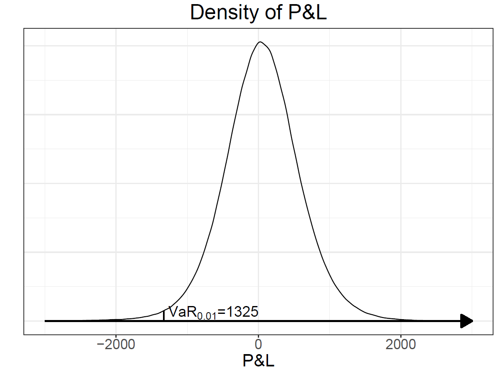

# 다기간 VaR

## 개요

보유 기간이 길어질 때 위험 측도가 어떻게 변하는지 살펴본다.

## 학습 목표

- 다기간 위험 측정의 필요성을 이해한다.
- 시간제곱근 법칙의 의미와 한계를 설명한다.
- 수익률 가정에 따른 VaR 변화를 비교한다.

## 몬테카를로 시뮬레이션

[VaR](../../concepts/glossary.qmd#value-at-risk)를 측정하려면 미래 자산 가치의 분포를 예측해야 한다. 그런데 금융 자산의 수익률 분포는 정규분포처럼 잘 알려진 확률분포와 일치하지 않으며, 정확한 분포를 예측하는 일은 쉽지 않다.

자산 가격의 분포를 묘사하는 한 가지 방법으로 [몬테카를로 시뮬레이션](../../concepts/glossary.qmd#monte-carlo-simulation)(확률 시뮬레이션)을 살펴본다.^[카지노가 있는 모나코의 도시 Monte Carlo의 이름을 따왔다.] 몬테카를로 시뮬레이션은 컴퓨터의 난수 발생기(random number generator)를 이용해 확률분포와 관련된 값을 통계적으로 계산하는 방법이다.

::: {.callout-note}
핵심은 **컴퓨터로 가상의 수익률 또는 가격 경로를 만들어내는 것**이다. 무작위로 생성된 가격들이 가상의 손익 분포를 이루고, 그 분포의 분위수에서 VaR를 읽어낸다.
:::

### IID 수익률

가장 간단한 경우부터 살펴본다. 어떤 자산의 일일 수익률이 서로 [독립](../../concepts/probability/independence.qmd)이고 같은 분포를 따르는(IID, independent and identically distributed) 확률변수라고 가정한다.

분포로는 정규분포, $t$-분포, 로그정규분포 등을 쓸 수 있는데, 여기서는 자유도 4의 $t$-분포를 사용한다. 자유도 4를 고른 특별한 이유는 없고, 정규분포보다 두꺼운 꼬리를 표현하기 위한 선택이다.

어떤 포트폴리오의 향후 $M$일간 VaR에 관심이 있다고 하자. 아래 예제에서는 변동성에 시간제곱근 법칙(square-root-of-time rule)을 사용한다. 어떤 자산의 연간 변동성이 $\sigma$이고 1년을 250거래일로 보면, 일간 변동성을 $\sigma / \sqrt{250}$으로 계산하는 방법이다.

::: {.callout-tip}
## 예제: 5일간 VaR를 위한 가격 경로 생성

어떤 투자자가 0 시점에 자산 또는 포트폴리오를 $X_0 = \$10{,}000$만큼 보유하고 있다. 이 자산의 연간 기대수익률은 대략 0.05, 분산은 0.04로 알려져 있다. 이 투자자는 향후 5일간의 VaR에 관심이 있다.

1년을 250 영업일로 보면 일간 기대수익률과 일간 분산은 각각 대략 다음과 같다.

$$
0.05 / 250 = 0.0002, \qquad 0.04 / 250 = 0.00016
$$

일일 수익률 분포의 모양이 자유도 4의 $t$-분포와 같다고 가정하자. 자유도 4의 $t$-분포의 분산은

$$
\frac{\mathrm{df}}{\mathrm{df} - 2} = \frac{4}{2} = 2
$$

이므로, 자유도 4의 $t$-분포를 따르는 확률변수 $T_1$을 다음과 같이 조정해 1일째 수익률을 만든다.

$$
R_1 = 0.0002 + \sqrt{\frac{0.00016}{2}}\, T_1
$$

이 수익률로 1일째 자산 가격을 시뮬레이션한다.

$$
X_1 = X_0 (1 + R_1)
$$

향후 5일간의 VaR가 필요하므로 같은 과정을 반복한다.

$$
\begin{aligned}
R_2 &= 0.0002 + \sqrt{\tfrac{0.00016}{2}}\, T_2, &\quad X_2 &= X_1(1 + R_2) \\
R_3 &= 0.0002 + \sqrt{\tfrac{0.00016}{2}}\, T_3, &\quad X_3 &= X_2(1 + R_3) \\
R_4 &= 0.0002 + \sqrt{\tfrac{0.00016}{2}}\, T_4, &\quad X_4 &= X_3(1 + R_4) \\
R_5 &= 0.0002 + \sqrt{\tfrac{0.00016}{2}}\, T_5, &\quad X_5 &= X_4(1 + R_5)
\end{aligned}
$$

$T_i$는 컴퓨터의 난수 알고리즘이 생성하며 자유도 4의 $t$-분포를 따른다. 이렇게 얻은 $X_5$는 컴퓨터로 만들어낸 **하나의** 가상 가격으로, 5일 후 자산의 가격을 나타낸다.
:::

위 예제는 시나리오를 하나만 만들었다. 분포를 시뮬레이션하고 VaR를 계산하려면 시나리오를 여러 개 만들어야 한다.

$X_{i,M}$을 $i$번째 시나리오가 만들어낸 $M$일 후의 가상 자산 가격이라고 하자. 시나리오를 $L$개 생성하면

$$
X_{1,M} - X_0,\; X_{2,M} - X_0,\; \cdots,\; X_{i,M} - X_0,\; \cdots,\; X_{L,M} - X_0
$$ {#eq-pnl-scenarios}

라는 가상의 손익(P&L) 분포를 얻고, 이 분포에서 VaR나 ES를 계산할 수 있다.

이 손익 값들을 오름차순으로 정렬해 $\mathrm{PnL}_{(1)}, \cdots, \mathrm{PnL}_{(L)}$이라고 쓰자. 아래첨자의 괄호는 정렬된 자료임을 뜻한다. 그러면 $\mathrm{VaR}_{\alpha}$는 $[\alpha L + 1]$번째 값에 $-1$을 곱한 것이다.

$$
\mathrm{VaR}_{\alpha} = - \mathrm{PnL}_{([\alpha L + 1])}
$$ {#eq-simul-var}

여기서 $[\,\cdot\,]$는 그 값을 넘지 않는 가장 큰 정수, 곧 소수점 아래 버림이다. 예를 들어 10,000번 시뮬레이션했고 $\alpha = 0.01$이면 정렬된 손익 값 중 101번째를 취한다.

조건부 기댓값인 ES는 다음과 같다.

$$
\mathrm{ES}_{\alpha} = - \frac{\sum_{i=1}^{[\alpha L + 1]} \mathrm{PnL}_{(i)}}{[\alpha L + 1]}
$$ {#eq-simul-es}

::: {.callout-note}
## 왜 하필 $[\alpha L + 1]$번째인가

VaR의 정의 때문이다. 손익의 누적분포함수는 시뮬레이션 값들로 계단형 함수처럼 근사되며

$$
F\left(\mathrm{PnL}_{(k)}\right) = \mathbb{P}\left(\mathrm{PnL} \leq \mathrm{PnL}_{(k)}\right) \approx \frac{k}{L}
$$

이다. 전체 $L$개의 시뮬레이션 결과 중 $\mathrm{PnL}_{(k)}$보다 작거나 같은 값을 $k$개 관찰했기 때문이다.

VaR의 정의에 따라 $\alpha < F(x)$인 가장 작은 $x$를 찾아야 하는데,

$$
\frac{k}{L} > \alpha \implies k > \alpha L
$$

이므로 그런 가장 작은 $k$는 $[\alpha L + 1]$이다.

다만 $L$이 충분히 크면 편의상 $[\alpha L]$로 보아도 큰 차이가 없다. 소수점 아래를 버리든 반올림하든 올림하든, 또는 인접한 두 값을 평균 내든, 시뮬레이션이 충분히 이루어졌다면 결과는 거의 같다.
:::

다음 R 코드는 위 과정을 구현한 것이다.

```r
X0 <- 10000; PnLs <- c()
for (i in 1:100000){
  X <- X0
  for (j in 1:5){
    # rt(1, 4) generates a random number with t(4) distribution.
    r <- 0.0002 + sqrt(0.00016 / 2) * rt(1, 4)
    X <- X * (1 + r)
  }
  PnLs[i] <- X - X0
}

VaR <- - quantile(PnLs, 0.01)
ES <- - sum(PnLs[PnLs <= -VaR]) / length(PnLs[PnLs <= -VaR])
# or
ES <- - mean(PnLs[PnLs <= -VaR])
```

99% VaR의 몬테카를로 시뮬레이션 결과는 대략 \$680, ES는 대략 \$864이다. 난수를 쓰므로 실행할 때마다 값이 조금씩 달라진다.

::: {.callout-note}
## 정규분포 가정과 비교하면

[VaR와 ES](../04-var-es/index.qmd) 장에서 같은 설정(보유액 \$10,000, 연간 기대수익률 0.05, 분산 0.04, 5일)을 **정규분포**로 계산하면 99% VaR가 약 \$648이었다.

여기서 자유도 4의 $t$-분포로 시뮬레이션한 결과는 약 \$680으로 더 크다. 꼬리가 두꺼운 분포를 가정하면 극단적 손실의 가능성이 커지므로 VaR도 커진다.

이 예제는 일반 수익률을 사용했지만 로그수익률로 계산해도 비슷한 결과가 나온다.
:::

::: {.callout-warning}
R의 `quantile()` 함수는 분위수를 계산할 때 기본값으로 선형 보간법을 쓴다. @eq-simul-var 로 정의한 시뮬레이션 VaR와는 조금 다르지만, 시뮬레이션 횟수가 충분하면 차이가 거의 없어 편의상 `quantile()`을 사용했다.
:::

### GARCH 변동성 모형

[GARCH](../../concepts/glossary.qmd#garch) 변동성 모형으로 만든 시뮬레이션도 VaR 계산에 쓸 수 있다. 앞 절의 IID 가정과 달리 변동성이 시간에 따라 변하는 상황을 다룬다.

::: {.callout-warning}
GARCH 모형의 계수에도 $\alpha$가 등장하고 유의수준도 $\alpha$로 쓴다. 두 기호가 뜻하는 바가 다르므로 혼동하지 않도록 주의한다. [기호 정리](../../concepts/notation.qmd) 참고.
:::

현재 시점을 $N$이라 하고 향후 $M$일간의 VaR를 구한다고 하자. 이를 위해 가상의 수익률 $r_{N+1}, r_{N+2}, \cdots, r_{N+M}$을 만들어야 한다. 절차는 다음과 같다.

**1단계. GARCH 모수를 추정한다.**

과거에 관찰된 수익률 시계열 $\tilde r_1, \cdots, \tilde r_N$에 최우추정법을 적용해 추정치 $\hat\omega, \hat\alpha, \hat\beta$를 구한다. 추정 방법은 [변동성](../07-volatility/index.qmd) 장에서 다룬다.

**2단계. 현재 시점의 조건부 분산을 추정한다.**

$$
\begin{aligned}
\hat\sigma_N^2 &= \hat\omega + \hat\alpha \tilde r_{N-1}^2 + \hat\beta \hat\sigma^2_{N-1} \\
&= \hat\omega + \hat\alpha \tilde r_{N-1}^2 + \hat\beta (\hat\omega + \hat\alpha \tilde r_{N-2}^2 + \hat\beta \hat\sigma^2_{N-2}) \\
&\;\;\vdots \\
&= \hat\omega (1 + \hat\beta + \cdots + \hat\beta^{N-2}) + \hat\alpha (\tilde r_{N-1}^2 + \hat\beta \tilde r_{N-2}^2 + \cdots + \hat\beta^{N-2} \tilde r_1^2 ) + \hat\beta^{N-1} \hat\sigma_1^2
\end{aligned}
$$

여기서 편의상 다음과 같이 둔다.

$$
\hat\sigma_1^2 = \frac{\hat\omega}{1 - \hat\alpha - \hat\beta}
$$

**3단계. 미래의 변동성과 가상의 수익률을 생성한다.**

$$
\begin{aligned}
\sigma_{N+1}^2 &= \hat\omega + \hat\alpha \tilde r_{N}^2 + \hat\beta \hat\sigma^2_{N}, &\quad r_{N+1} &= \sigma_{N+1} Z_1 \\
\sigma_{N+2}^2 &= \hat\omega + \hat\alpha r_{N+1}^2 + \hat\beta \sigma^2_{N+1}, &\quad r_{N+2} &= \sigma_{N+2} Z_2 \\
&\;\;\vdots & &\;\;\vdots \\
\sigma_{N+M}^2 &= \hat\omega + \hat\alpha r_{N+M-1}^2 + \hat\beta \sigma^2_{N+M-1}, &\quad r_{N+M} &= \sigma_{N+M} Z_M
\end{aligned}
$$

$Z_1, \cdots, Z_M$은 표준정규분포를 따르는 서로 [독립](../../concepts/probability/independence.qmd)인 확률변수로, 컴퓨터로 무작위 생성한다.

**4단계. 가상의 자산 가격을 만든다.**

생성한 수익률이 산술수익률이면

$$
X_{N+M} = X_N (1 + r_{N+1})(1 + r_{N+2}) \cdots (1 + r_{N+M})
$$

이고, 로그수익률이면 다음과 같다.

$$
X_{N+M} = X_N \exp\left( r_{N+1} + r_{N+2} + \cdots + r_{N+M} \right)
$$

**5단계. 시나리오를 여러 개 만든다.**

지금까지 만든 가격은 첫 번째 시나리오의 결과이므로 $X_{1,N+M}$으로 쓴다. 충분히 많은 $L$개의 시나리오에 대해 3~4단계를 반복해 가상의 자산 가격과 손익 분포를 만든다.

$$
X_{1,N+M} - X_N,\; X_{2,N+M} - X_N,\; \cdots,\; X_{L,N+M} - X_N
$$

**6단계. VaR와 ES를 구한다.**

손익을 오름차순으로 정렬해 $\mathrm{PnL}_{(1)}, \cdots, \mathrm{PnL}_{(L)}$이라 두고, 앞 절의 @eq-simul-var 와 @eq-simul-es 를 그대로 적용한다.

::: {.callout-tip}
## 예제: GARCH(1,1)로 5일 VaR 구하기

어떤 금융 자산의 일일 수익률이 GARCH(1,1) 모형을 따르고 모수가 다음과 같이 추정되었다.

$$
\hat\omega = 10^{-7}, \quad \hat\alpha = 0.05, \quad \hat\beta = 0.9
$$

현재 시점의 조건부 분산은 $\hat\sigma_N^2 = 2 \times 10^{-6}$, 직전 수익률은 $\tilde r_N = 0.002$였다. 이 자산에 \$10,000를 투자했을 때 5일 후의 $\mathrm{VaR}_{0.01}$을 구한다.

이런 문제는 수식으로 풀기 어려워 시뮬레이션이 사실상 필수적이다. 아래 코드로 계산하면 결과는 대략 \$76.5이다.

조건부 분산이 $\hat\sigma_N^2 = 4 \times 10^{-6}$으로 더 컸다면 $\mathrm{VaR}_{0.01}$은 대략 \$102.5가 된다. 아래 코드에서 `v_N`만 바꿔 확인할 수 있다. 현재의 변동성이 클수록 앞으로의 위험도 크게 추정된다는 뜻이다.
:::

아래 코드는 산술수익률을 사용했으나 로그수익률로 해도 큰 차이는 없다.

```r
Xs <- c()
omega <- 10^(-7); alpha <- 0.05; beta <- 0.9

# 본문에서 가정한 현재 시점(N)의 값
v_N <- 2e-6      # sigma_N^2, 비교 사례는 4e-6으로 바꾼다
r_N <- 0.002     # tilde r_N
X_N <- 10000

for (i in 1:100000){
  X <- X_N
  v <- v_N; r <- r_N   # 시나리오마다 현재 시점 값에서 시작
  for (j in 1:5){
    v <- omega + alpha * r^2 + beta * v
    r <- sqrt(v) * rnorm(1)
    X <- X * (1 + r)
  }
  Xs[i] <- X
}

PnL <- Xs - X_N
VaR <- - quantile(PnL, 0.01)  # 99% VaR
ES <- - mean(PnL[PnL <= -VaR]) # 99% ES
```

앞 절과 마찬가지로 난수를 쓰므로 실행할 때마다 값이 조금씩 달라진다.

## 역사적 시뮬레이션

### 간단한 역사적 시뮬레이션

앞 절까지는 수익률 분포를 정규분포나 $t$-분포처럼 특정 확률분포로 가정했다. [역사적 시뮬레이션](../../concepts/glossary.qmd#historical-simulation)은 그러지 않고 **실제로 관찰된 수익률 분포**를 그대로 쓰는 방법이다. 분포를 가정하지 않으므로 비모수적 방법에 해당한다.

컴퓨터의 무작위성을 전혀 쓰지 않는 것은 아니다. 과거에 실현된 수익률을 무작위로 재배치해 시뮬레이션에 사용한다. 과거에 나타났던 수익률이 비슷한 확률로 미래에도 발생하리라는 가정에 기댄 방법이며, 수익률의 실증 분포(empirical distribution)를 시뮬레이션에 이용하는 것으로 볼 수 있다.

::: {.callout-note}
이 방법의 장점은 수익률 분포에 대한 수학적 가정을 최소화하면서, 실제 시장에서 관찰되는 분포의 성질을 충분히 반영해 미래 분포를 만들 수 있다는 점이다.

앞 절처럼 특정 분포를 가정했다면, 그 가정이 실제 분포와 잘 맞는지 따로 검정해야 한다. 역사적 시뮬레이션에는 그 단계가 없다.
:::

과거에 총 $N$개의 수익률 자료가 관찰되었다고 하고, 이를 집합으로 표현한다.

$$
A = \{\tilde r_1,\; \tilde r_2,\; \cdots,\; \tilde r_N \}
$$

이 자료로 여러 개의 가상 시나리오를 만들어 VaR를 계산한다. 향후 $M$ 기간의 수익률이 필요하다면, 집합 $A$의 원소 중 임의의 $M$개를 뽑으면 된다. **뽑을 때 중복을 허용한다.**

그렇게 뽑은 $N+1$ 시점부터 $N+M$ 시점까지의 가상 수익률을 다음과 같이 쓴다.

$$
r_{1,N+1},\; r_{1,N+2},\; \cdots,\; r_{1,N+M} \in A
$$

::: {.callout-tip}
## 아래첨자 읽는 법

$r_{1,N+2}$의 아래첨자 $(1, N+2)$는 두 값의 짝이다.

- 앞의 **1**은 시나리오 번호다. 첫 번째 시나리오라는 뜻이다.
- 뒤의 **$N+2$**는 이 값이 $N+2$ 시점의 가상 수익률로 쓰인다는 뜻이다.

이들은 모두 집합 $A$에서 무작위로 뽑은 값이다. $A$가 과거의 수익률 자료임을 생각하면, 역사적 시뮬레이션은 결국 **과거가 다시 반복된다**는 원리에 기댄 방법이다.
:::

현재 시점 $N$의 자산 가치를 $X_N$이라 할 때, 뽑은 가상 수익률로 $M$ 기간 후의 가상 자산 가치를 만든다.

$$
X_{1,N+M} = X_N (1 + r_{1,N+1}) \cdots (1 + r_{1,N+M})
$$

로그수익률이라면 다음과 같다.

$$
X_{1,N+M} = X_N \exp\left( r_{1,N+1} + \cdots + r_{1,N+M} \right)
$$

여기까지가 가상의 자산 가격 **하나**를 만든 것이다.

시뮬레이션을 완성하려면 이 과정을 시나리오 $i$에 대해 반복해야 한다. $i$번째 시나리오에서 뽑은 $M$개의 수익률

$$
r_{i,N+1},\; r_{i,N+2},\; \cdots,\; r_{i,N+M} \in A
$$

로부터

$$
X_{i,N+M} = X_N (1 + r_{i,N+1}) \cdots (1 + r_{i,N+M})
$$

를 만든다. 로그수익률이면 식을 그에 맞게 바꾼다.

이를 충분히 많은 $L$개의 시나리오에 대해 반복하면

$$
X_{1,N+M},\; X_{2,N+M},\; \cdots,\; X_{L,N+M}
$$

을 얻는다. 이것이 역사적 시뮬레이션으로 만든 $N+M$ 시점 자산 가격의 가상 분포다. 여기서 $X_N$을 빼면

$$
X_{1,N+M} - X_N,\; X_{2,N+M} - X_N,\; \cdots,\; X_{L,N+M} - X_N
$$

가상의 손익 분포가 된다. 이를 오름차순으로 정렬한 $\mathrm{PnL}_{(1)}, \cdots, \mathrm{PnL}_{(L)}$에 @eq-simul-var 와 @eq-simul-es 를 적용하면 VaR와 ES를 얻는다.

아래 코드는 `rugarch` 패키지에 들어 있는 1987~2009년 S&P 500 수익률 자료를 사용한다. 코드를 간결하게 하려고 로그수익률로 가정했고 초기 자본은 \$10,000이다.

```r
library(rugarch)
data(sp500ret)
r <- sp500ret[[1]]
Xs <- c(); X_N <- 10000

for (i in 1:100000){
  X <- X_N
  # next five days
  future_rs <- sample(r, 5, replace = TRUE)
  Xs[i] <- X * exp(sum(future_rs))
}

PnLs <- Xs - X_N
VaR <- - quantile(PnLs, 0.01)
ES <- - mean(PnLs[PnLs <= -VaR])
```

99% VaR는 대략 \$687, ES는 대략 \$954이다. 난수를 쓰므로 실행할 때마다 값이 조금씩 달라진다.

::: {.callout-warning}
## 역사적 시뮬레이션의 한계

미래 분포가 과거와 크게 다르지 않으리라는 관점에서 이 방법은 언뜻 타당해 보인다. 그러나 [@alexander2008market4]는 다음과 같이 지적한다.

> 역사적 VaR 모형을 적용할 때 부딪히는 어려움은, 긴 기간의 자료에는 시장 위험 요인이 서로 다르게 움직인 여러 국면이 섞여 있다는 점이다. (…) 모든 과거 자료를 똑같이 다루면, 산출된 VaR는 지금 시장이 처한 상황을 반영하지 못한다.

또 하나, 이 방법으로 계산한 향후 최대 손실액은 **자료를 모은 기간에 관찰된 최대 손실액을 넘어설 수 없다.** 과거에 없던 규모의 손실은 시나리오에 나타나지 않기 때문이다.

다음 절의 FHS는 이 단점을 보완하는 방법이다.
:::

### Filtered historical simulation

FHS(filtered historical simulation)는 역사적 시뮬레이션에 변동성의 변화를 반영한 방법이다. 앞 절에서 살펴본 GARCH 같은 변동성 모형은 시장의 변동성 변화를 포착할 수 있고, 역사적 시뮬레이션과 결합하면 더 나은 방법으로 발전할 수 있다.

GARCH 모형을 바탕으로 한 FHS를 소개한 [@barone1998don]는 다음과 같이 언급했다.

> 역사적 시뮬레이션은 시나리오 분석에 자연스러운 틀이 될 수 있다. 그러나 현재의 시장 상황을 반드시 반영해야 한다.

역사적 시뮬레이션은 매우 자연스러운 접근법이지만, 현재의 시장 상태를 반영할 수 있는 변동성 모형과 결합하면 더 좋은 결과를 얻을 수 있다는 뜻이다. EWMA 모형을 바탕으로 한 비슷한 방법이 같은 시기에 [@boudoukh1998best]에서 소개되었다.

::: {.callout-note}
변동성 모형은 모수적 모형이고 역사적 시뮬레이션은 비모수적 방법이다. 둘을 결합한 [FHS](../../concepts/glossary.qmd#fhs)를 준모수적 방법(semiparametric method)이라고도 부르는 이유다.
:::

FHS는 표준화된 수익률, 즉 오차항

$$
\varepsilon_n = \frac{r_n}{\sigma_n}
$$

을 바탕으로 시뮬레이션을 진행한다. 여기서 $\sigma_n$은 GARCH 모형처럼 적절한 변동성 모형으로 추정한 $n$ 시점의 변동성이다.

::: {.callout-note}
앞 절의 역사적 시뮬레이션은 과거 수익률 $\tilde r_n$을 그대로 뽑아 썼다. FHS는 그 대신 **변동성으로 나눈 값**을 뽑는다.

변동성이 컸던 시기의 큰 수익률과 잔잔했던 시기의 작은 수익률이 같은 척도 위에 놓이므로, 국면이 서로 다른 기간의 자료를 한데 모아 쓸 수 있다. 그렇게 뽑은 값에 **현재의** 변동성을 다시 곱해 미래 수익률을 만든다. 이것이 "현재의 시장 상황을 반영한다"는 말의 뜻이다.
:::

절차는 다음과 같다.

**1단계. GARCH 모수를 추정한다.**

시장에서 관찰한 과거 수익률 $\tilde r_1, \cdots, \tilde r_N$으로 GARCH 모형의 모수를 추정해 $\hat\omega, \hat\alpha, \hat\beta$를 얻는다. 추정 방법은 [변동성](../07-volatility/index.qmd) 장에서 다룬다.

**2단계. 과거의 변동성을 재구성한다.**

먼저 $\hat\sigma_1$에 적절한 값을 가정한다. 재귀식으로 계산되는 값이 아니라 출발점으로 두는 값이다. 예를 들어 다음과 같이 둔다.

$$
\hat\sigma_1 = \sqrt{\frac{\hat\omega}{1 - \hat\alpha - \hat\beta}}
$$

이를 출발점으로 삼아, 추정된 모형으로 과거 $n = 2, \cdots, N$에 대해 $\hat\sigma_n$을 차례로 재구성한다. 이들을 추정된 변동성이라고 부른다.

$$
\hat\sigma_n^2 = \hat\omega + \hat\alpha \tilde r_{n-1}^2 + \hat\beta \hat\sigma_{n-1}^2
$$

**3단계. 표준화 수익률을 계산해 모은다.**

재구성한 $\hat\sigma_n$과 관찰된 $\tilde r_n$으로 $n = 1, \cdots, N$에 대해 표준화 수익률을 구한다.

$$
\hat\varepsilon_n = \frac{\tilde r_n}{\hat\sigma_n}
$$

이들을 모은 집합이 시뮬레이션의 바탕이 된다.

$$
A = \{ \hat\varepsilon_1,\; \cdots,\; \hat\varepsilon_N \}
$$

앞 절에서는 과거 수익률 자체가 집합 $A$였다. FHS에서는 그 자리를 표준화 수익률이 대신한다.

**4단계. 표준화 수익률을 뽑아 시나리오를 만든다.**

$A$의 원소 중 임의의 $M$개를 **중복을 허용해** 선택한다.

$$
\varepsilon_{1,N+1},\; \cdots,\; \varepsilon_{1,N+M} \in A
$$

앞에서와 마찬가지로 아래첨자 앞의 1은 시나리오 번호이고, 뒤의 $N+1$은 그 값이 $N+1$ 시점의 가상 표준화 수익률로 쓰인다는 뜻이다.

**5단계. 미래의 변동성과 수익률을 생성한다.**

뽑은 표준화 수익률에 GARCH 모형으로 만든 변동성을 곱해 가상의 수익률을 만든다.

$$
\begin{aligned}
\sigma_{N+1}^2 &= \hat\omega + \hat\alpha \tilde r_N^2 + \hat\beta \hat\sigma_N^2, &\quad r_{1,N+1} &= \sigma_{N+1} \times \varepsilon_{1,N+1} \\
\sigma_{1,N+2}^2 &= \hat\omega + \hat\alpha r_{1,N+1}^2 + \hat\beta \sigma_{N+1}^2, &\quad r_{1,N+2} &= \sigma_{1,N+2} \times \varepsilon_{1,N+2} \\
&\;\;\vdots & &\;\;\vdots \\
\sigma_{1,N+M}^2 &= \hat\omega + \hat\alpha r_{1,N+M-1}^2 + \hat\beta \sigma_{1,N+M-1}^2, &\quad r_{1,N+M} &= \sigma_{1,N+M} \times \varepsilon_{1,N+M}
\end{aligned}
$$

::: {.callout-tip}
## 첫 줄만 시나리오 번호가 없는 이유

$\sigma_{N+1}^2$은 마지막으로 **실제 관찰된** 수익률 $\tilde r_N$과 추정된 분산 $\hat\sigma_N^2$만으로 계산된다. 시나리오마다 달라질 여지가 없으므로 모든 시나리오에서 같은 값이고, 그래서 시나리오 번호를 붙이지 않는다.

$\sigma_{1,N+2}^2$부터는 앞 시점의 **가상** 수익률 $r_{1,N+1}$이 들어가므로 시나리오마다 달라진다.
:::

**6단계. 가상의 자산 가격을 계산한다.**

로그수익률이라면 다음과 같다.

$$
X_{1,N+M} = X_N \exp\left( r_{1,N+1} + \cdots + r_{1,N+M} \right)
$$

산술수익률이라면 다음과 같다.

$$
X_{1,N+M} = X_N (1 + r_{1,N+1}) \cdots (1 + r_{1,N+M})
$$

**7단계. 시나리오를 여러 개 만들어 VaR와 ES를 구한다.**

충분히 많은 $L$개의 시나리오에 대해 4~6단계를 반복해 가상의 자산 가격을 얻는다.

$$
X_{1,N+M},\; \cdots,\; X_{i,N+M},\; \cdots,\; X_{L,N+M}
$$

각 값에서 $X_N$을 뺀 가상의 손익을 오름차순으로 정렬한 뒤, @eq-simul-var 와 @eq-simul-es 를 적용해 VaR와 ES를 추정한다.

아래 코드는 앞 절과 같은 S&P 500 자료를 쓰되, GARCH 추정치는 이미 구해진 값을 사용했다.

```r
library(rugarch)
data(sp500ret)
r <- sp500ret[[1]]
omega <- 1.36 * 10^(-6); alpha <- 0.0867; beta <- 0.9052
X_N <- 10000

# generate v and epsilon
v <- omega / (1 - alpha - beta)
epsilon <- r[1] / sqrt(v[1])
for (n in 2:length(r)){
  v[n] <- omega + alpha * r[n-1]^2 + beta * v[n-1]
  epsilon[n] <- r[n] / sqrt(v[n])
}

# generate scenarios
Xs <- c()
N <- length(v)
for (i in 1:100000){
  X <- X_N
  for (j in 1:5){
    v[N+j] <- omega + beta * v[N+j-1] + alpha * r[N+j-1]^2
    r[N+j] <- sqrt(v[N+j]) * sample(epsilon, 1)
  }
  X <- X * exp(sum(r[(N+1):(N+5)]))
  Xs[i] <- X
}

PnLs <- Xs - X_N
VaR <- - quantile(PnLs, 0.01)
ES <- - mean(PnLs[PnLs <= -VaR])
```

99% VaR는 대략 \$1,325, ES는 대략 \$1,746이다.

@fig-fhs 는 이 코드로 만든 손익 분포와 그 위에서 읽은 $\mathrm{VaR}_{0.01}$의 위치를 보여준다.

{#fig-fhs width=65%}

::: {.callout-note}
## FHS의 장점

- 역사적 시뮬레이션의 비모수적 성격과 GARCH 같은 모수적 변동성 모형의 장점을 함께 가진다.
- 변동성과 표준화 수익률을 조합하므로, 수익률만으로 만든 시나리오보다 다양한 결과를 얻을 수 있다.
- 규모가 큰 포트폴리오에서도 비교적 빠르게 시뮬레이션할 수 있다.
- 여러 자산에 적용할 때 자산 간 상관관계를 모형에 따로 넣지 않아도 된다. 표준화 수익률에 이미 내포된 상관관계가 미래 시나리오에서도 그대로 구현된다.
- 실증 분석 결과 전반적으로 잘 들어맞는다고 알려져 있다.
:::

::: {.callout-warning}
## 역사적 시뮬레이션 계열의 한계

FHS를 포함해 역사적 시뮬레이션에 속하는 방법들은 다음 한계를 공유한다.

- 자료를 모은 기간이 잔잔했다면 VaR가 작게, 변동이 심했다면 크게 나온다. 시장의 급격한 변화를 반영하려면 시간이 충분히 흘러야 할 수 있다.
- 특히 ES는 과거의 극단값 하나가 이후의 위험 측도에 지나치게 큰 영향을 줄 수 있다.
- 과거에 일어나지 않았지만 미래에 일어날 수 있는 사건은 측정 과정에 넣을 수 없다.
:::

## 가이드라인

은행 등 금융기관은 리스크를 측정하기 위해 [내부모형](../../concepts/glossary.qmd#internal-model)을 설계하고, 그 모형을 바탕으로 VaR 같은 위험 측도를 계산한다. 은행은 이 내부모형을 어느 정도 유연하게 조정할 수 있다.

다음은 전통적 VaR 내부모형접근법과 2009년 Basel II 시장위험 개정(통상 Basel 2.5라고 부른다)의 주요 기준이다 [@Basel2009]. 개별 은행이나 [감독 당국](../../concepts/glossary.qmd#supervisory-authority)은 더 엄격한 기준을 적용할 수도 있다.

1. VaR는 매일 계산한다.
2. 99% VaR를 이용한다.
3. 최소 보유 기간은 10거래일로 한다. 더 짧은 기간의 VaR를 10거래일 기준으로 환산하는 경우에는 그 방법의 합리성을 감독 당국에 설명해야 한다.
4. 과거 표본 기간은 최소 1년으로 한다.
5. 시장 자료는 적어도 한 달에 한 번 이상 갱신하며, 시장 가격에 중대한 변화가 있으면 이를 더 신속하게 반영한다.^[1996년과 2005년 시장위험 규정에서는 최소 3개월마다 갱신하도록 했으나, 2009년 Basel II 시장위험 개정에서 월별 갱신으로 강화되었다.] 감독 당국은 변동성이 크게 증가하는 기간에는 그 기간을 충분히 반영해 VaR를 계산하도록 요구할 수 있다.
6. 특정 모형을 따로 지정하지는 않는다. 은행은 자체 판단에 따라 역사적 시뮬레이션, 몬테카를로 시뮬레이션, 공분산 행렬 등 다양한 방법을 이용할 수 있다.
7. 은행은 각 위험 범주 안의 경험적 상관관계를 측정하고 반영할 재량을 가진다. 위험 범주 사이의 상관관계를 반영하려면 감독 당국의 인정이 필요하다.
8. 옵션 또는 옵션과 유사한 포지션에 고유한 위험을 정확하게 포착해야 한다. 즉, 옵션 포지션의 기초자산 변동성 등 세부 사항을 파악하고 있어야 한다.
9. 2009년 Basel II 시장위험 개정에서 스트레스 VaR(sVaR)가 추가되었다. 스트레스 VaR는 현재 포트폴리오에 상당한 손실이 발생했을 연속 12개월의 역사적 스트레스 자료를 적용해 산출하며, 적어도 매주 계산한다.

::: {.callout-note}
## 이 장의 내용과 어떻게 이어지는가

3번 기준이 이 장의 출발점이다. 규제는 10거래일 VaR를 요구하면서 "더 짧은 기간의 VaR를 환산하는 경우"를 함께 언급한다. 하루 VaR를 10일로 늘리는 가장 단순한 방법이 앞에서 본 시간제곱근 법칙이고, "그 방법의 합리성을 설명해야 한다"는 단서는 그 환산이 자동으로 정당화되지 않는다는 뜻이다. 이 장에서 다룬 몬테카를로 시뮬레이션, 역사적 시뮬레이션, FHS는 환산에 기대지 않고 다기간 분포를 직접 만드는 방법들이다.

6번 기준은 그 방법들을 은행이 골라 쓸 수 있다고 말한다. 대신 선택한 모형이 실제로 잘 맞는지는 [백테스팅](../09-backtesting/index.qmd)으로 검증받는다.
:::

바젤 자본규제는 금융기관의 안정성과 건전성을 높이는 것을 목표로 1988년 Basel I에서 시작해 2004년 Basel II, 글로벌 금융위기 이후의 Basel III로 확장되었다. Basel III의 핵심 요소로는 더 높은 최소 [자기자본 요건](../../concepts/glossary.qmd#capital-requirement), 레버리지 비율의 도입, 단기 유동성 위험에 대한 유동성 커버리지 비율(Liquidity Coverage Ratio, LCR), 장기·구조적 유동성 위험에 대한 순안정자금조달비율(Net Stable Funding Ratio, NSFR), 경기대응완충자본(countercyclical capital buffer)의 도입 등이 있다.

위 기준은 전통적 VaR와 Basel 2.5 내부모형 체계에 관한 것이다. 이후 FRTB(Fundamental Review of the Trading Book, 트레이딩 계정 규제의 근본적 개편) 시장위험 규제에서는 시장위험 자본요건 산정의 핵심 위험 측도가 스트레스 상황에 보정된 97.5% 단측 [Expected Shortfall(ES)](../04-var-es/index.qmd)로 바뀌고, 위험요인별 유동성 기간이 도입되었다 [@Basel2019]. 다만 내부모형의 [백테스팅](../09-backtesting/index.qmd)에는 일일 VaR가 계속 사용된다.

자세한 사항은 [@Crouhy2014]를 참고한다.

## 관련 페이지

- [VaR와 ES](../04-var-es/index.qmd)
- [변동성](../07-volatility/index.qmd)
- [Backtesting](../09-backtesting/index.qmd)
- [독립성](../../concepts/probability/independence.qmd)
- [용어 정리](../../concepts/glossary.qmd)
