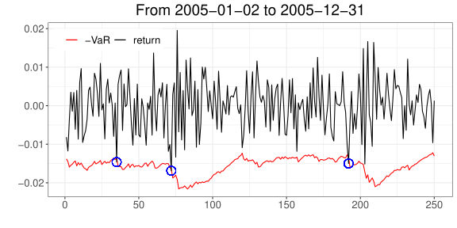
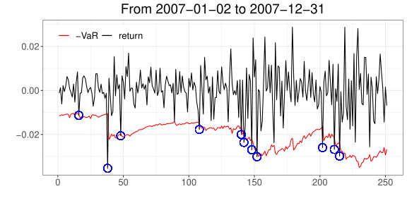

# Backtesting

## 개요

VaR 모형의 예측 결과를 실제 손실 자료와 비교하여 평가하는 방법을 다룬다.

## 학습 목표

- VaR 초과손실의 의미를 이해한다.
- Backtesting의 기본 논리를 설명한다.
- 간단한 검정 결과를 해석한다.

## Backtesting VaR

[백테스트](../../concepts/glossary.qmd#backtesting)(backtesting)는 시간이 지남에 따라 특정 포트폴리오에 적용된 리스크 측도의 예측 성능을 평가하는 과정이다. 포트폴리오의 손익(P&L) 자료가 충분히 쌓이면, 통계적 방법을 이용해 사용한 [VaR](../../concepts/glossary.qmd#value-at-risk) 측정 방법이 실제 리스크를 얼마나 잘 반영했는지 평가할 수 있다.

### 왜 필요한가

하루 동안의 95% VaR를 예로 들 수 있다. 95% VaR에서는 약 5%의 날짜에 실제 손실이 VaR를 초과할 것으로 예상된다. 따라서 1년(약 250 영업일) 동안 대략 12~13일 정도는 VaR를 넘는 손실이 발생할 것으로 기대할 수 있다.

::: {.callout-note}
## ES가 아니라 VaR로 검정하는 이유

Basel III에서는 시장위험 자본요건 산출에 VaR 대신 Expected Shortfall(ES)을 사용한다. 다만 backtesting은 여전히 VaR를 기준으로 수행한다.
:::

::: {.callout-note}
만약 실제로 초과 손실이 20일 발생했다면 VaR가 잘못 계산된 걸까? 15일이면 괜찮은 걸까? 이런 질문에 답하기 위한 통계적 검정 기법이 백테스팅이다.
:::

실제 손실이 예측한 손실과 일관되는지 확인하는 이 과정은, VaR 계산 모형이 올바르게 작동하는지 아니면 수정이 필요한지 판단하는 기준을 제공한다. 잘못된 결과의 원인은 잘못된 가정, 잘못 추정된 모수, 부적합한 모형 선택, 프로그램 오류 등 다양할 수 있다.

바젤 은행 감독 위원회는 1996년 은행이 내부적으로 계산한 VaR를 자기자본 요건 산정에 제한적으로 사용하도록 승인하면서^[실제 바젤 I 규정은 1988년에 이루어졌는데, 이때는 자기자본 요건에 대한 기준이 마땅치 않았기 때문에 추후 보충된 내용이다.] 다음과 같이 설명했다.

> 내부 모형 기반 접근법을 채택한 많은 은행들은, 위험 측정 시스템의 품질과 정확성을 가늠하기 위해 일일 손익을 모형이 산출한 위험 측도와 정기적으로 비교한다. "백테스팅"이라 불리는 이 과정은, 여러 금융기관이 자체 위험 측정 모형을 개발하고 도입하는 과정에서 유용함이 확인되었다...
>
> 바젤 위원회는 백테스팅이 다양한 상황을 포괄하면서도 일관된 방식으로, 내부 모형 접근법에 적절한 유인을 반영할 수 있는 가장 좋은 기회를 제공한다고 본다.
>
> — Basel Committee (1996)

### 세 가지 통계적 검정

백테스팅에 관한 통계적 검정은 크게 세 가지로 나눌 수 있다.

- **[커버리지 검정](../../concepts/glossary.qmd#커버리지-검정-coverage-test)(coverage test)**: VaR를 초과하는 빈도가 사전에 정한 유의수준과 일치하는지 확인한다.
- **[분포 검정](../../concepts/glossary.qmd#분포-검정-distribution-test)(distribution test)**: 적합도(goodness-of-fit) 검정을 통해 예측한 분포와 실제 자산의 분포가 일치하는지 확인한다.
- **[독립성](../../concepts/probability/independence.qmd) 검정(independence test)**: 모형에서 독립으로 가정한 부분이 실제로 독립적으로 나타났는지 확인한다.

### 가설 검정 복습

본격적으로 살펴보기 전에, 가설 검정과 관련된 정의를 복습한다.

::: {.callout-note}
- **[제1종 오류](../../concepts/glossary.qmd#제1종-오류-type-i-error)(Type I error)**: 귀무가설이 참일 때 귀무가설을 기각하는 오류
- **[제2종 오류](../../concepts/glossary.qmd#제2종-오류-type-ii-error)(Type II error)**: 귀무가설이 거짓임에도 귀무가설을 기각하지 않는 오류
- **제1종 오류율**: 제1종 오류를 범할 확률
- **제2종 오류율**: 제2종 오류를 범할 확률
:::

백테스트에서의 [귀무가설](../../concepts/notation.qmd)($H_0$)은 다음과 같이 표현할 수 있다.

$$
H_0 : \text{VaR를 계산하는 데 사용한 모형의 가정이 옳다.}
$$

이를 VaR 계산과 연관지어 살펴보면 다음과 같다.

- **제1종 오류**: VaR 계산 모형이 실제로 현실과 일치함에도, 우연히 정상 범주를 벗어난 관찰값이 많이 발견되어 모형을 잘못 기각하는 경우
- **제2종 오류**: 모형의 가정이 실제와 맞지 않음에도, 자료에서 특이점을 발견하지 못해 모형이 잘못되었다고 기각하지 못하는 경우

## Coverage test

VaR를 넘어서는 손실의 실제 빈도가 모형이 예측하는 빈도와 일관되는지 검정한다. 손익에 대한 충분한 관찰 기간이 있고 각 시점에서 VaR를 계산할 수 있다면 적용할 수 있으며, 모수적·비모수적 방법 모두에 적용할 수 있다.

VaR가 매일 계산된다고 하고, 유의수준 $\alpha$에서 시점 $t$의 손실에 대해 계산한 값을 $\mathrm{VaR}_{\alpha,t}$라고 하자. 이 값은 시점 $t$ 직전에 계산된, 시점 $t$의 예상 최대 손실이다. 시점 $t$에 실제 발생한 손실을 $L_t$라고 하면, $L_t$가 $\mathrm{VaR}_{\alpha,t}$를 넘어설 수도, 넘어서지 않을 수도 있다. VaR 계산이 정확하다면 대략 $100\alpha\%$의 확률로 실제 손실이 VaR를 넘어설 것이다.

::: {.callout-note}
## 최대 손실인데 왜 넘어설 수 있는가

여기서 "예상 최대 손실"은 절대 넘지 않는 상한을 뜻하지 않는다. [VaR](../../concepts/glossary.qmd#value-at-risk)는 손실분포의 분위수로 정의되므로([VaR와 ES](../04-var-es/index.qmd) 참고), 손실분포가 연속적이라면

$$
\mathbb{P}(L_t > \mathrm{VaR}_{\alpha,t}) = \alpha
$$

가 성립한다. 일반적인 분포에서는 이 초과확률이 $\alpha$ 이하일 수 있다.

즉 초과가 발생하는 것 자체는 모형의 실패가 아니라, 애초에 $\alpha$ 정도의 비율로 일어나도록 설계된 결과다. $\alpha = 0.01$이라면 100일 중 1일 정도는 넘어서는 것이 정상이다.

정확히 말하면 $\mathrm{VaR}_{\alpha,t}$는 "최악의 $\alpha$에 해당하는 경우를 제외했을 때의 최대 손실", 곧 신뢰수준 $1-\alpha$에서의 최대 손실이다. 그래서 Coverage test는 초과가 일어났는지가 아니라 **초과 빈도가 $\alpha$와 맞는지**를 검정한다.
:::

Coverage test에서는 $L_t > \mathrm{VaR}_{\alpha,t}$인 사건이 발생하는 비율이 미리 정한 $\alpha$에 비해 지나치게 많지 않은지 살펴본다. 이를 위해

$$
I_t = \begin{cases} 1, & L_t > \mathrm{VaR}_{\alpha,t} \\ 0, & \text{그 외} \end{cases}
$$

를 정의하면 $I_t$는 베르누이 시행이다. 총 $n$개의 손익 자료를 관찰했을 때, 이 중 VaR를 넘어서는 총 손실 횟수를 나타내는 확률변수

$$
X = \sum_{t=1}^n I_t
$$

는 이항분포 $\mathrm{B}(n, \alpha)$를 따른다. 즉,

$$
\mathbb{P}(X = k) = \binom{n}{k} \alpha^k (1-\alpha)^{n-k}.
$$

VaR 산출에 사용한 모형이 잘 맞는지 검정하기 위해 다음 귀무가설을 생각한다.

$$
H_0 : X \sim \mathrm{B}(n, \alpha)
$$

대립가설은 단측 검정을 고려한다.

$$
H_1 : X \sim \mathrm{B}(n, \alpha'), \quad \alpha' > \alpha.
$$

귀무가설의 기각 여부는 제1종 오류율과 제2종 오류율을 함께 고려해 결정한다. $n$번의 관찰 기간 동안 VaR를 넘어서는 손실이 $m$개 이상 발생하면 $H_0$를 기각하는 검정 규칙을 생각하면, 이때의 제1종 오류율은

$$
\mathbb{P}(X \geq m) = \sum_{k=m}^n \binom{n}{k}\alpha^k(1-\alpha)^{n-k} = 1 - \sum_{k=0}^{m-1}\binom{n}{k}\alpha^k(1-\alpha)^{n-k}
$$ {#eq-type1}

이다. 이와 대응해, $H_1$이 참($\alpha' > \alpha$)이라고 가정했을 때 $m$개 미만의 예외만 발생해 $H_0$를 기각하지 못할 확률인 제2종 오류율은

$$
\mathbb{P}(X < m) = \sum_{k=0}^{m-1}\binom{n}{k}(\alpha')^k(1-\alpha')^{n-k}
$$ {#eq-type2}

이다.

::: {.callout-tip}
@eq-type1 의 값은 R의 `pbinom`(이항분포의 누적분포함수)으로 간단히 구할 수 있다.

```r
# pbinom: 이항분포의 누적분포함수
1 - pbinom(m - 1, n, alpha)
```
:::

### 수치표로 확인하기

@tbl-coverage-h0-true 는 위 논의를 $n = 250$, $\alpha = 0.01$에 대해 정리한 것이다. 예외 개수 $m$이 가장 왼쪽 열에 나열되어 있다. 250번의 관찰 동안 VaR를 넘어서는 손실이 $m$개 이상 발생하면 $H_0$를 기각한다는 규칙을 정했다고 하자.

이때 $H_0$가 참임에도, 다시 말해 VaR 모형이 정확함에도 $H_0$를 기각할 확률인 제1종 오류율이 Type 1 열에 기록되어 있다. 이는 @eq-type1 로 계산한 값이다. Exact 열에는 $H_0$가 참이라는 가정에서 예외 개수가 정확히 $m$일 확률

$$
\mathbb{P}(X = m) = \binom{n}{m}\alpha^m (1-\alpha)^{n-m}
$$

이 기록되어 있다.

| 예외 개수 $m$ | Exact | Type 1 |
| ---: | ---: | ---: |
| 0 | 8.10% | 100.00% |
| 1 | 20.50% | 91.90% |
| 2 | 25.70% | 71.40% |
| 3 | 21.50% | 45.70% |
| 4 | 13.40% | 24.20% |
| 5 | 6.70% | 10.80% |
| 6 | 2.70% | 4.10% |
| 7 | 1.00% | 1.40% |
| 8 | 0.30% | 0.40% |
| 9 | 0.10% | 0.10% |
| 10 | 0.00% | 0.00% |
| 11 | 0.00% | 0.00% |
| 12 | 0.00% | 0.00% |
| 13 | 0.00% | 0.00% |
| 14 | 0.00% | 0.00% |
| 15 | 0.00% | 0.00% |

: $H_0$가 참일 때($\alpha = 0.01$)의 예외 개수별 확률 {#tbl-coverage-h0-true}

아래 네 표(@tbl-coverage-002 ~ @tbl-coverage-005)도 250번의 관찰 동안 예외가 $m$개 이상이면 $H_0$를 기각한다는 규칙을 따르는 것은 같다. 다만 이번에는 $H_0$가 거짓이고 $H_1$이 참, 즉 $X \sim \mathrm{B}(n, \alpha')$이라고 가정한다. 가능한 모든 $\alpha'$에 대해 계산할 수는 없으므로 $\alpha' = 0.02, 0.03, 0.04, 0.05$의 네 경우만 표로 정리했다.

예를 들어 $\alpha' = 0.02$는 내가 계산한 VaR의 유의수준이 사실 0.01이 아니라 0.02 수준이라는 뜻으로 해석할 수 있다. 즉 $H_0$가 거짓(VaR 모형이 잘못되었음)인데도 $m$개 미만의 예외만 발생해 귀무가설을 기각하지 못할 확률이며, @eq-type2 로 계산한다. 한편 Exact 열은

$$
\mathbb{P}(X = m) = \binom{n}{m}(\alpha')^m (1-\alpha')^{n-m}
$$

이다.

::: {layout-ncol=2}

| $m$ | Exact | Type 2 |
| ---: | ---: | ---: |
| 0 | 0.60% | 0.00% |
| 1 | 3.30% | 0.60% |
| 2 | 8.30% | 3.90% |
| 3 | 14.00% | 12.20% |
| 4 | 17.70% | 26.20% |
| 5 | 17.70% | 43.90% |
| 6 | 14.80% | 61.60% |
| 7 | 10.50% | 76.40% |
| 8 | 6.50% | 86.90% |
| 9 | 3.60% | 93.40% |
| 10 | 1.80% | 97.00% |
| 11 | 0.80% | 98.70% |
| 12 | 0.30% | 99.50% |
| 13 | 0.10% | 99.80% |
| 14 | 0.00% | 99.90% |
| 15 | 0.00% | 100.00% |

: 실제 수준이 $\alpha' = 0.02$인 경우 {#tbl-coverage-002}

| $m$ | Exact | Type 2 |
| ---: | ---: | ---: |
| 0 | 0.00% | 0.00% |
| 1 | 0.40% | 0.00% |
| 2 | 1.50% | 0.40% |
| 3 | 3.80% | 1.90% |
| 4 | 7.20% | 5.70% |
| 5 | 10.90% | 12.80% |
| 6 | 13.80% | 23.70% |
| 7 | 14.90% | 37.50% |
| 8 | 14.00% | 52.40% |
| 9 | 11.60% | 66.30% |
| 10 | 8.60% | 77.90% |
| 11 | 5.80% | 86.60% |
| 12 | 3.60% | 92.40% |
| 13 | 2.00% | 96.00% |
| 14 | 1.10% | 98.00% |
| 15 | 0.50% | 99.10% |

: 실제 수준이 $\alpha' = 0.03$인 경우 {#tbl-coverage-003}

| $m$ | Exact | Type 2 |
| ---: | ---: | ---: |
| 0 | 0.00% | 0.00% |
| 1 | 0.00% | 0.00% |
| 2 | 0.20% | 0.00% |
| 3 | 0.70% | 0.20% |
| 4 | 1.80% | 0.90% |
| 5 | 3.60% | 2.70% |
| 6 | 6.20% | 6.30% |
| 7 | 9.00% | 12.50% |
| 8 | 11.30% | 21.50% |
| 9 | 12.70% | 32.80% |
| 10 | 12.80% | 45.50% |
| 11 | 11.60% | 58.30% |
| 12 | 9.60% | 69.90% |
| 13 | 7.30% | 79.50% |
| 14 | 5.20% | 86.90% |
| 15 | 3.40% | 92.10% |

: 실제 수준이 $\alpha' = 0.04$인 경우 {#tbl-coverage-004}

| $m$ | Exact | Type 2 |
| ---: | ---: | ---: |
| 0 | 0.00% | 0.00% |
| 1 | 0.00% | 0.00% |
| 2 | 0.00% | 0.00% |
| 3 | 0.10% | 0.00% |
| 4 | 0.30% | 0.10% |
| 5 | 0.90% | 0.50% |
| 6 | 1.80% | 1.30% |
| 7 | 3.40% | 3.10% |
| 8 | 5.40% | 6.50% |
| 9 | 7.60% | 11.90% |
| 10 | 9.60% | 19.50% |
| 11 | 11.10% | 29.10% |
| 12 | 11.60% | 40.20% |
| 13 | 11.20% | 51.80% |
| 14 | 10.00% | 62.90% |
| 15 | 8.20% | 72.90% |

: 실제 수준이 $\alpha' = 0.05$인 경우 {#tbl-coverage-005}

:::

위 표들의 값은 [바젤은행감독위원회 규제 문서](https://www.bis.org/basel_framework/chapter/MAR/99.htm)에 정리된 250개 독립 관측치 기준 수치이다.

::: {.callout-tip}
## 표 읽는 법

$H_0$를 기각하는 규칙이 "예외 개수 $m \geq 7$"이라고 하자.

**$H_0$가 참인 경우(@tbl-coverage-h0-true)**: VaR 모형이 올바를 때 $\alpha = 0.01$ 수준에서 계산한 VaR를 넘어서는 손실이 250일 중 정확히 7일일 확률은 Exact 열에서 1.00%이다. $m \geq 7$에서 기각한다고 하면 제1종 오류를 범할 확률은 Type 1 열에서 1.40%이다. 이 값은 $m \geq 7$인 Exact 확률을 모두 더하거나, 100%에서 $m < 7$인 Exact 확률을 모두 빼서 얻을 수 있다.

**$H_0$가 거짓인 경우(@tbl-coverage-004)**: 실제 수준이 $\alpha' = 0.04$일 때, 250일 중 예외가 $m = 7$일일 확률은 Exact 열에서 9.00%이다. 여기에 $m \geq 7$의 기각역을 적용하면 제2종 오류를 범할 확률은 12.50%이다. $m \leq 6$이면 $H_0$를 기각하지 않는다는 뜻이므로, 이 값은 같은 표에서 $m = 0, 1, \cdots, 6$의 Exact 확률을 모두 더한 것과 같다.
:::

### Basel 규제 기준

위 확률값을 바탕으로 바젤은행감독위원회(2019)는 $\alpha = 0.01$에서 250개 관측치에 대한 백테스트의 예외 개수를 다음과 같이 구분했다.

| Backtesting zone | 예외 개수 | 최소 자본 권장 배율 |
| --- | --- | --- |
| Green | 0 - 4 | 1.5 |
| Amber | 5 - 9 | 1.7 - 1.92 |
| Red | 10개 이상 | 2.0 |

: Backtesting zone과 자본 권장 배율 {#tbl-basel-zone}

Green zone은 이름 그대로 내부모형의 신뢰를 유지할 수 있는 백테스트 결과이다. 반면 Red zone은 VaR 계산에 사용한 모형이 잘못되었을 가능성이 높다는 뜻으로, 내부모형 신뢰 상실로 간주하며 모형의 가정이나 모수 추정법을 전면 재검토할 필요가 있다. 또한 내부모형이 Red zone으로 자주 떨어지면 감독 당국이 내부모형 사용을 제한하거나 표준 접근법 사용을 강제할 수 있다.

Amber zone은 모형이 옳을 수도, 그렇지 않을 수도 있다고 판단되는 구간이다. 이 경우 감독 당국은 특별한 조치를 취하기 전에 은행으로부터 모형에 대한 정확한 정보를 제시받아 검토하기를 권장하며, 자본요구액은 점진적으로 증가한다. 백테스팅 결과에 따라 은행의 자본 요건은 계산된 VaR에 권장 배율을 곱한 값으로 추천된다.

::: {.callout-tip}
## 예제: zone 판정

어떤 회사가 자산 A를 매입했다. 자산 A의 일일 수익률 분포가 독립인 정규분포 $N(0.001, 0.025^2)$을 따른다고 가정하면, 수익률 기준 일일 1% VaR는

$$
-0.001 + z_{0.01} \times 0.025 \approx 0.0572
$$

이다. 이 기준에 따르면 과거 250일의 일일 수익률에서 $-5.72\%$를 넘어서는 손실이 5개 미만이면 green zone, 5개 이상 10개 미만이면 amber zone, 10개 이상이면 red zone에 속한다.
:::

::: {.callout-warning}
통계적 검정의 특성상 green zone에 속하더라도 VaR 산출 방법이 잘못되었을 수 있고(제2종 오류), red zone에 속하더라도 VaR 계산 방법이 옳을 가능성이 있다(제1종 오류). 이 점을 항상 염두에 두어야 한다.
:::

### 백테스팅 구현

[FHS](../../concepts/glossary.qmd#fhs-filtered-historical-simulation)(filtered historical simulation)를 바탕으로 한 VaR 계산 방법을 확장하면 백테스팅 과정을 구현할 수 있다. [GARCH](../../concepts/glossary.qmd#garch) 모형과 FHS로 매일 VaR를 산출하고, 실제 수익률의 분포를 조사해 VaR를 넘어서는 손실이 몇 번 발생했는지 확인하는 과정이다.

```r
library(rugarch)
data(sp500ret)
total <- sp500ret[[1]]

logLike <- function(p, r){
  v <- p["omega"] / (1 - p["alpha"] - p["beta"])
  logL <- 0
  for(i in 2:length(r)){
    v[i] <- p["omega"] + p["alpha"] * r[i-1]^2 + p["beta"] * v[i-1]
    logL <- logL - 0.5 * log(v[i]) - 0.5 * r[i]^2 / v[i]
  }
  - logL
}

starting <- 5000 # 2007-01-02
end <- 5250      # 2007-12-31
VaR <- c()

for(j in starting:end){
  # estimation performed daily
  r <- total[(j-1000):(j-1)]
  res <- optim(c(omega=0.00001, alpha=0.1, beta=0.8), logLike, r=r)
  omega <- res$par["omega"]; alpha <- res$par["alpha"]
  beta <- res$par["beta"]

  # generate epsilon and variance
  v <- omega / (1 - alpha - beta)
  epsilon <- r[1] / sqrt(v[1])
  for (i in 2:length(r)){
    v[i] <- omega + alpha * r[i-1]^2 + beta * v[i-1]
    epsilon[i] <- r[i] / sqrt(v[i])
  }

  Xs <- c()
  n <- length(v)
  for (m in 1:100000){
    epsilon_scenario <- sample(epsilon, 1)
    v[n+1] <- omega + beta * v[n] + alpha * r[n]^2
    r[n+1] <- epsilon_scenario * sqrt(v[n+1])
    Xs[m] <- r[n+1]
  }
  VaR[j - starting + 1] <- - quantile(Xs, 0.01)  # 99% VaR
}
```

::: {.callout-warning}
이 코드는 251일 각각에 대해 GARCH 모수를 새로 추정하고, 매일 10만 번의 시뮬레이션을 수행한다. 전체 계산량이 크므로 실행에 상당한 시간이 걸린다. 동작을 확인해 보려면 `starting`과 `end`의 간격이나 시뮬레이션 횟수를 줄여서 먼저 시험해 보는 것이 좋다.
:::

### 실행 결과

@fig-backtest-2005 와 @fig-backtest-2007 은 위 프로그램을 `rugarch` 패키지에 포함된 S&P 500 수익률 자료(`sp500ret`)에 적용한 결과이다. 각 그림에서 회색 선은 실제 일일 수익률, 붉은 선은 매일 산출한 99% VaR의 음수값이며, 파란 점은 손실이 VaR를 넘어선 날이다.

::: {layout-ncol=2}

{#fig-backtest-2005}

{#fig-backtest-2007}

:::

2005년 자료에서는 VaR를 넘어서는 초과 손해가 총 3번 발생해 green zone에 해당한다. 반면 2007년 자료에서는 총 11번 발생해 red zone에 해당한다. 2007년 이후 금융 위기가 발생했음을 상기하면, 이 시기에 red zone이 나온 것은 우연이 아닐 것이다.

## 관련 페이지

- [용어 정리](../../concepts/glossary.qmd)
- [독립성](../../concepts/probability/independence.qmd)
- [VaR와 ES](../04-var-es/index.qmd)


